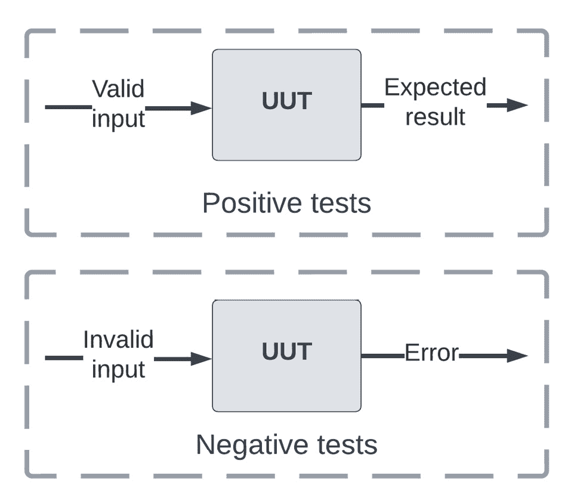
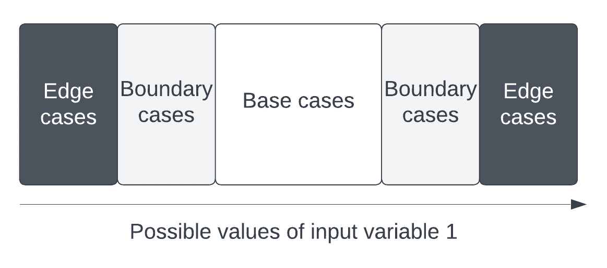
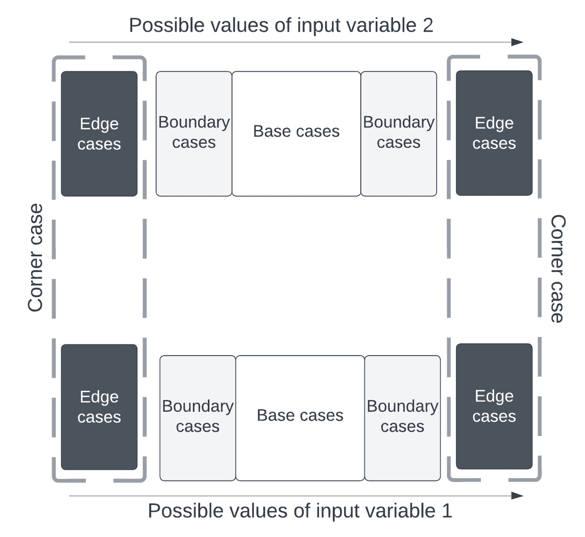
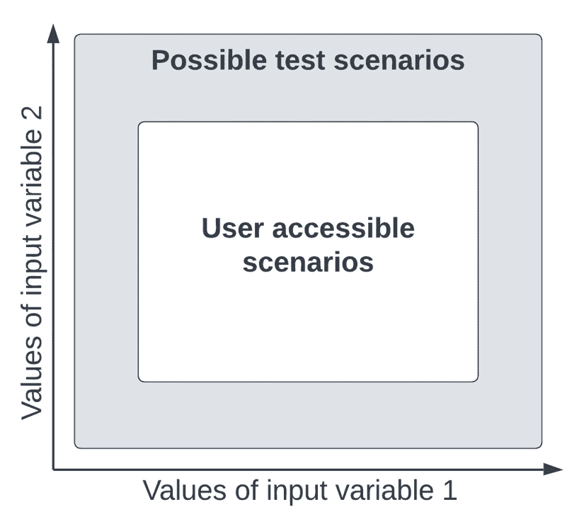
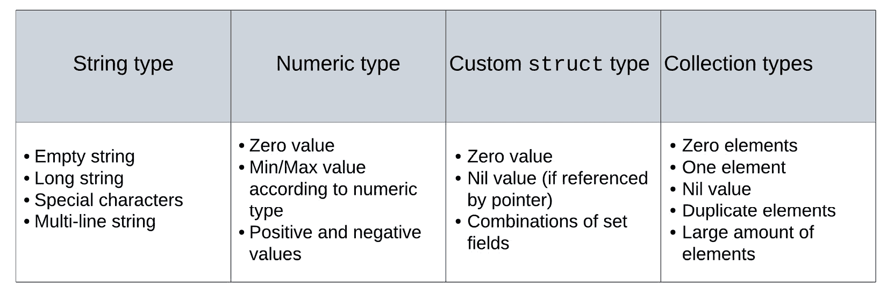
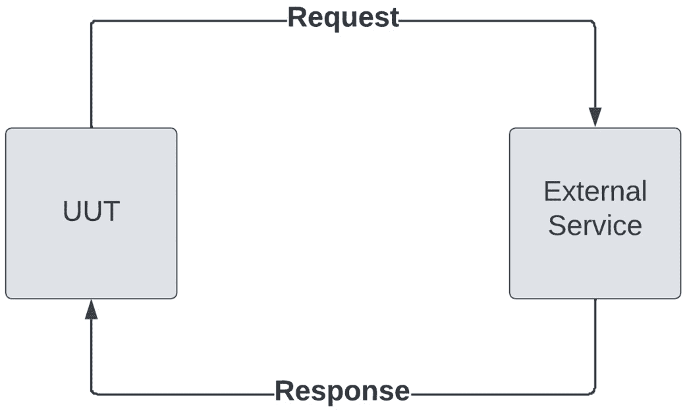
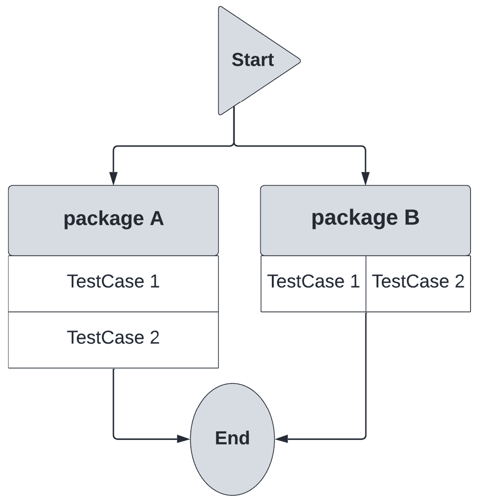
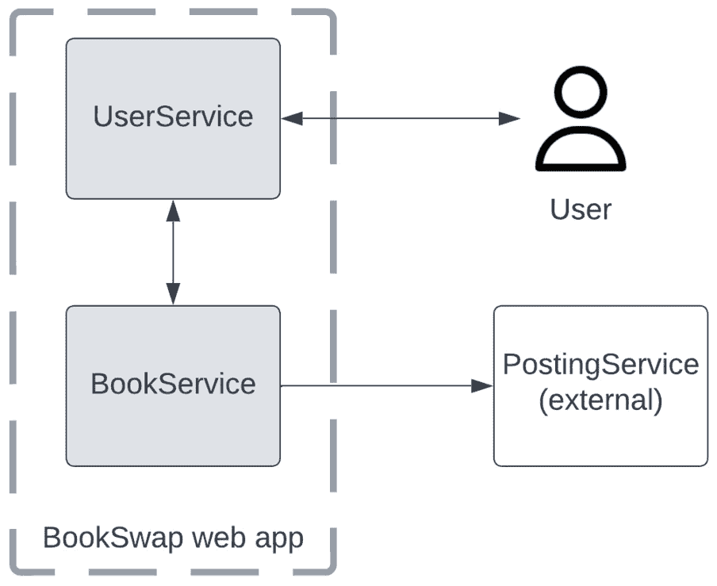

# 第四章：构建高效的测试套件

在上一章中，我们学习了如何使用第三方库来补充 Go 的`testing`包的功能。这些库使得模拟**被测试单元**（**UUT**）的依赖项和在测试中创建断言变得更加容易。根据**SOLID**设计原则，模拟是构建能够轻松编写测试代码的优质实现代码的基本构建块。

在实践中，开发者会识别其需求和实现中的边缘情况，确保良好的**代码覆盖率**百分比，这一点我们在*第二章*，“单元测试基础”中讨论过。在本章中，我们将学习如何创建测试套件。

在 Go 中进行测试套件构建的一种流行技术是**表格驱动测试**。我们将学习如何构建覆盖边缘情况并使用各种输入对 UUT 进行测试的表格，确保 UUT 有稳定的实现。我们还将利用我们之前探索的一些技术，例如测试设置、子测试和模拟。

Go 语言最流行的用途之一是构建 Web 应用程序，在本章中，我们将探讨如何构建和测试这类应用程序。我们将从迄今为止我们所看到的简单计算器示例过渡到一个新的用例：`BookSwap`应用程序。这项服务将允许用户创建他们想要交换的书籍列表，让其他人可以借阅。

此示例将涉及使用 Go 的`net/http`包构建 REST API，并学习如何测试它。在处理用户输入时，覆盖边缘情况尤为重要，因此我们将使用迄今为止所介绍的技术来测试`BookSwap` API。

本章将涵盖以下主要内容：

+   边缘情况是什么以及如何识别它们

+   如何测试依赖外部服务的 Web 应用程序和 API

+   流行的 Go 测试技术——表格驱动测试

+   `BookSwap`用例应用程序

# 技术要求

您需要安装**Go 版本 1.19**或更高版本才能运行本章中的代码示例。安装过程在官方 Go 文档[`go.dev/doc/install`](https://go.dev/doc/install)中有描述。

本书包含的代码示例在[`github.com/PacktPublishing/Test-Driven-Development-in-Go/chapter04`](https://github.com/PacktPublishing/Test-Driven-Development-in-Go/chapter04)公开可用。

# 测试多个条件

到目前为止，我们已经介绍了如何构建和编写测试。然而，开发者需要知道他们代码的哪些方面需要测试，以及如何测试它们。记住，我们在**测试金字塔**中越往底层，测试就越便宜、越快。因此，对于开发者来说，了解如何尽可能低地在他们的堆栈中执行代码是很重要的。在本章中，我们将重点关注将边缘情况作为我们开发者**测试策略**的一部分。

如在*第一章*《掌握测试驱动开发》中所述，自动化测试应基于我们实施的系统要求。一般来说，系统要求将侧重于成功场景和系统功能扩展的规范。围绕这些要求设计您的测试策略，主要目的是确保您的系统满足其功能需求。

您的测试策略的次要目的应该是验证系统在故障情况下的行为和鲁棒性，例如错误/意外的输入、瞬态错误或缓慢的响应。开发者需要确保他们的系统能够优雅地处理各种运行条件。

我们将学习如何识别这些条件，并应用我们迄今为止学到的测试技术，以制定使我们对我们解决方案有信心的测试策略，无论输入和系统运行的条件如何。

*图 4.1*展示了测试的双重性质，包括正向和负向测试，以确保我们的系统中功能实现和错误处理都正确：



图 4.1 – 两种测试类型

以下是两种测试类型：

+   **正向测试**，使用有效的输入对 UUT 进行测试，并验证 UUT 返回预期的结果。此类测试确保应用程序根据功能需求正确运行。正向测试包括以下内容：

    +   UUT 处理有效输入的方式

    +   UUT 在预期场景中的行为

    +   UUT 满足系统要求的方式

+   **负向测试**，使用无效输入对 UUT 进行测试，并验证 UUT 返回错误。此类测试确保应用程序能够优雅地处理无效输入，提供有意义的错误信息，并避免崩溃。负向测试包括以下内容：

    +   UUT 处理无效输入的方式

    +   UUT 在意外场景中的行为

    +   UUT 在系统要求之外的运行行为

每个这些测试都由不同类型的测试场景组成，这些场景的复杂度根据输入变量的值及其组合而变化。

负向测试的重要性

对于生产系统，正向测试和负向测试同等重要。错误处理是用户体验的重要组成部分。我们希望用户在出现错误时能够收到有意义的消息，以及在出现减速或故障时能够成功恢复。

**快乐路径测试**或**快乐流程测试**是对默认成功场景的验证，没有任何错误或异常。覆盖默认和要求特定的场景确保系统在理想情况下表现良好。然而，作为开发者，我们需要了解的不仅仅是系统的理想行为。

*图 4.2* 描述了我们系统给定输入参数的不同类型的测试用例。不同类型的测试用例涵盖了所有可能的输入参数值范围：



图 4.2 – 给定输入变量的测试用例类型

一个好的测试策略应该涵盖给定输入变量的以下四种主要类型的测试用例：

+   **基本案例**出现在操作参数的预期值。例如，给定一个表示名称的输入参数，它的基本案例将是一个短的有效字符串值。这些情况通常在系统需求中定义，并构成了快乐路径测试策略的场景。

+   **边缘情况**出现在操作参数的极端。例如，给定一个字符串输入参数，它的某些边缘情况可能是一个空字符串值、多行字符串或包含特殊字符的字符串。

+   **边界情况**出现在边缘情况的两侧，接近操作参数的极端值。这些情况对于断言必须具有特定值的值尤为重要。例如，给定一个表示水温测量应用中水温的数值输入参数，我们可以在水的冰点和沸点周围对其进行边界测试。

如这些示例所示，边缘情况通常基于输入/用户参数的数据类型以及它们的目的。我们将在下一节中探讨其他类型的参数以及如何识别它们的极端/边缘值。

系统通常会操作多个输入变量。输入变量及其边缘情况的组合会导致不同的系统行为。

*图 4.3* 展示了最终类型的测试用例，它测试了输入变量的多个边缘情况的特定场景：



图 4.3 – 边界情况

**边界情况**出现在多个操作参数的极端或边缘情况。两种输入变量之间的任何边缘情况的组合都会导致边界情况。例如，给定多个字符串输入参数，我们可以通过这些参数的任何边缘情况的组合来达到边界情况。

*图 4.4* 展示了两个输入变量的测试用例组合：



图 4.4 – 测试策略中结合两个输入变量

随着我们系统输入参数数量的增加，边缘情况的组合数量也会增加，导致必须测试的大量边缘情况。为了最小化测试编写和维护的工作量，识别从所有可能的测试场景中用户可访问的场景子集非常重要。这些应该在测试策略中优先考虑，并且随着项目的成熟，测试可以进一步扩展。

边缘情况和角落情况之间的区别

*边缘情况* 和 *角落情况* 这两个术语经常可以互换使用。一个记住差异的简单方法是，边缘情况推动参数的极端，而角落情况通过将用户推到角落配置来组合这些极端。

## 识别边缘情况

对于变量和算法的边缘情况，没有特定的明确程序来识别。这就是软件测试人员和工程师的经验发挥重要作用的地方，因为他们可以通过检查直观地识别代码和需求中的边缘情况。然而，我们可以提出一些需要注意的建议。

*图 4**.5* 展示了基于变量类型的特殊情况：



图 4.5 – 不同变量类型的特殊情况

变量类型的特殊情况如下：

+   字符串类型变量有以下特殊情况：

    +   空字符串或零字符字符串——“`""`”。

    +   一个长字符串，超过了基线有效字符串预期的长度——“`a very very very very` `long string`”。

    +   包含特殊字符的字符串，包括 Unicode 字符和特殊重音字符——“`a $``p€¢iał string!`”。

    +   包含换行分隔符的多行字符串——“`a multi \n line string`”。记住，Go 允许使用反引号定义原始字符串字面量，这也可以包含其他特殊字符。

+   数字类型变量有以下特殊情况：

    +   零值——“`0`”。

    +   最小值和最大值根据数值类型。例如，`int8` 类型有最小值 `-128` 和最大值 `127`，而 `uint8` 类型有最小值 `0` 和最大值 `255`。这些值根据给定类型的内存分配增加。

    +   正负数值可能也需要根据 UUT 的逻辑进行特殊处理。

+   自定义 `struct` 类型有以下特殊情况：

    +   自定义结构体的零值，没有初始化——“`a :=` `MyType{}`”。

    +   如果通过指针传递，该类型的空值——“`var` `a *MyType`”。

    +   给定类型的初始化和非初始化字段的组合—`a := MyType{ field1: "Value"}`。测试这些组合可以揭示是否应该将任何字段添加到初始化/构造函数中。虽然 Go 不提供构造函数的默认实现，但通常声明包作用域的函数来初始化实例并返回它—`func NewMyType(v string) *MyType`。

+   集合类型封装了 Go 的内置集合类型—数组、切片和映射：

    +   零元素或空集合—`c := []int{}`。

    +   单元素或单个元素的集合—`c := []int{0}`。

    +   空值或未分配内存的集合—`var c []int`。

    +   重复元素—`c := []int{0, 0}`。

    +   包含大量元素的集合—`var c [999]int`。

每种变量类型的特殊情况应该指导你决定哪些边缘情况你应该尝试覆盖，但你应该扩展你的边缘情况以覆盖任何系统要求的边界和边缘情况。

当制定测试用例时，你应该将 UUT 分解成小的逻辑块，识别它们的输入和边缘情况，然后构建测试套件以相应地验证这些情况。我们将在本章后面学习如何使用表驱动测试轻松编写测试套件。

## 外部服务

现在我们已经了解了如何根据类型和系统要求识别输入参数的边缘情况，我们现在可以将注意力转向使用外部服务进行测试。如第三章中所述，“模拟和断言框架”，UUT 的任何直接依赖都应该被模拟，这样我们就可以在隔离的情况下测试 UUT。

由于 Go 包为我们提供了一个简单的方式来构建小型、自包含的 API，我们可以将所有依赖视为外部服务。这些依赖可以分为两类：

+   **内部系统依赖**位于我们正在测试的系统内部，无论是否在同一服务内部。我们对这些依赖有完全的控制权。

+   **外部系统依赖**位于我们正在测试的系统外部，提供额外的功能，如数据库或第三方功能。我们无法完全控制这些依赖。

总是模拟外部系统依赖

由于我们无法控制系统依赖，针对它们的实时/真实版本进行测试可能会给我们的测试套件引入脆弱性和额外成本。除了数据库之外，你应该始终模拟你的外部系统依赖。我们将在第五章中进一步探讨数据库测试，“执行集成测试”。

当涉及到外部系统依赖的边缘情况时，这些 API 通常会通过某种网络连接与我们系统连接。它们的边缘情况受到这种连接的严重影响。

*图 4**.6* 展示了 UUT 和外部服务之间集成中可能出现的错误：



图 4.6 – UUT 和外部服务之间通信中可能出现的错误

当交换的每一部分都在网络上进行时，请求和响应都需要能够容忍延迟和重试：

+   外部服务可能会出错并响应内部服务错误。在这种情况下，UUT 需要处理完全中断并返回默认响应。

+   请求可能需要很长时间才能被传递到外部服务。在这种情况下，UUT 需要等待预定义的时间内的响应，然后认为请求失败。然后，UUT 可能会决定重试此请求以获取任何资源。

+   来自外部服务的响应可能根本不会到达。在这种情况下，UUT（被测单元）需要重试整个请求周期，并在应用程序逻辑中处理这种重复的流程。

错误是编写代码和运行应用程序的必然部分，尤其是那些依赖于外部服务功能的应用程序。

现代系统将依赖于许多类型的外部 API，这些 API 可以通过 REST API、RPC 调用，甚至通过事件总线异步通信。这些集成的测试关注点是相似的，因为 UUT 和外部服务之间的通信将是集成中最容易出现错误的部分。

幂等性作为设计原则

在 API 设计中，幂等操作可以在不改变初始结果的情况下重复调用。将所有操作设计为幂等是一种良好的实践，以确保在错误恢复的情况下可以重试操作。

## 错误处理复习

到目前为止，我们已经讨论了如何识别可能的边缘情况并为它们编写测试，但弹性和错误处理始于 UUT 的实现。这对于 Go 开发者来说尤其如此，因为语言设计要求显式处理错误情况。让我们通过简要总结 Go 中的错误处理来补充我们对边缘情况识别和错误情况测试的讨论。

错误处理在编写 Go 代码中起着至关重要的作用。Go 团队选择了使用内置的 `error` 类型进行显式错误处理，以避免异常和 `try-catch-finally` 风格的代码块，这些代码块可能导致脆弱且易于出错的代码。

`error` 类型是一个简单的接口：

```go
type error interface {
  Error() string
}
```

此接口还使我们能够轻松创建自己的自定义错误类型，只需实现 `Error() string` 方法即可。错误就像任何其他值一样返回，最常见的是使用 **多重返回值**，并且它们被处理得就像任何其他返回值一样。

例如，我们已经看到在无效数学表达式中，`Parser` 计算器返回了一个错误：

```go
func (p *Parser) ProcessExpression(expr string) error
```

错误类型的零值是`nil`。最常见的情况是，`nil`错误值表示在执行过程中没有发生问题。

在代码中首先通过调用可能失败的表达式来处理错误是一种常见的做法：

```go
if err := parser.ProcessExpression(*expr); err != nil {
  log.Fatal(err)
}
```

在这个例子中，我们初始化`err`变量与调用错误函数同时进行，将变量的作用域限制在`if`语句块中。

注意，我们检查的是错误的存在，而不是其不存在。在`err != nil`的情况下，我们简单地通过调用`log.Fatal`函数来终止应用程序。这是我们在 Go 中处理错误的典型方式。

使用`error`类型显式处理错误有以下优点：

+   **确保错误情况得到处理，避免任何后续的恐慌或空指针**：在函数代码顶部首先处理错误，可以减少在函数代码后续部分对有效数据的检查。这有助于简化代码执行流程。

+   **使我们可以轻松地看到在测试策略中需要覆盖哪些错误场景**：函数签名将显示哪些方法和函数可以产生错误，迫使调用代码显式地处理它们。

+   `error`类型为所有 Go 代码库提供了一个统一的方式来表示错误状态，这使得构建和返回面向用户的错误变得容易。

然而，一些开发者发现错误检查代码块重复且冗长。常见的批评是，他们需要处理所有错误，即使这些错误相对不太可能发生。可以通过使用`_`运算符忽略错误返回值，或者不将返回值分配给任何变量，但这种做法通常是不被鼓励的。

你可以自己形成对 Go 的显式错误处理的看法，但在这本书中，我们将使用它，因为它是我们编写 Go 的约定和标准实践。

首先处理错误但将其作为最后一个参数返回

在具有多个返回值的函数中，请记住错误类型通常是最后一个返回值。然后你应该首先处理错误情况，在异常情况下返回，并保持你的代码最小化缩进。

# 表格驱动测试的实际应用

现在我们已经讨论了识别边缘情况和处理错误的基础，我们可以开始探讨如何构建覆盖各种场景的测试套件。在 Go 中，一种流行的技术是使用**表格驱动测试**。这种技术使用我们迄今为止学到的基本原理来构建覆盖各种场景的测试套件。

让我们从简单的例子开始，演示测试编写过程。我们将实现一个新的`Divide`数学运算，该运算执行以下操作：

+   将结果格式化为两位小数的字符串返回

+   当除数为 0 时返回错误

从先前的要求中，我们可以为这个新操作制定以下签名：

```go
func Divide(x, y int8) (*string, error)
```

我们记得`int8`的最小值是`-128`，最大值是`127`。

如前所述，我们利用多个返回值来鼓励在调用代码中显式处理错误。根据功能需求和从前面的*识别边缘情况*部分学到的经验，我们可以确定以下测试用例：

+   `x`和`y`

+   `x`和`y`的两种负值

+   `x`和`y`的最大值和`y`的正值、`x`的最小值和`y`的正值、`x`的零值和`y`的非零值、`x`的正值和`y`的零值、`x`和`y`、`x`和`y`的最大值、`x`和`y`的最小值

在*第二章* *单元测试基础*中，我们学习了如何编写测试和通过子测试实现不同的场景。这涉及到声明共享的测试设置并为每个情况声明一个子测试。例如，第一个测试用例的实现可能如下所示：

```go
func TestDivide(t *testing.T) {
  t.Run("positive x, positive y", func(t *testing.T) {
    x, y := int8(8), int8(4)
    r, err := table.Divide(x, y)
    assert.Nil(t, err)
    assert.Equal(t, "2.00", *r)
  })
}
```

如我们从代码片段中高亮显示的行中可以看出，以下组件是会根据我们正在运行的测试用例而变化的：

+   测试用例的名称，这将使我们的测试输出易于阅读

+   根据我们正在运行的测试用例，将改变值的输入

+   根据我们正在运行的测试用例，预期的结果值和错误值

如前一个代码片段所示，有相当多的样板代码可以在测试用例之间重用：

+   测试函数的声明以及任何所需的 UUT（单元待测项）设置

+   子测试的声明及其嵌套的测试函数

+   调用`Divide`函数及其输入值

由于与`*testing.T`对象的交互是测试实现中最冗长的一部分，因此使用表格驱动测试作为测试用例的更简短、更简单的替代方案。我们将在下一节中详细了解这一点。

实现表格驱动测试有一个非常简单的配方。我们将使用前一个章节中的`Divide`函数示例来演示每个步骤。

## 第 1 步 - 声明函数签名

我们首先声明之前提出的函数签名，并编写足够的代码以使代码编译：

```go
package table
func Divide (x, y int8) (*string, error) {
     return nil, nil
}
```

函数的签名返回一个字符串指针和一个错误。在实际应用中，我们期望这两个值中只有一个会是`nil`：

+   在正常流程中，结果字符串将非`nil`，错误值将`nil`

+   在异常流程中，结果字符串将`nil`，错误值将非`nil`

因此，通过将两个值都设置为`nil`，我们可以保证不会有意外通过测试用例。这有助于我们开始**红-绿-重构**（**TDD**）过程的红色阶段。

## 第 2 步 - 声明我们的测试用例的结构

编写测试代码的第一步是声明一个自定义类型来包装我们的测试用例。这种结构的目的在于保存测试用例的输入和预期输出。通常，这种类型是在函数测试的作用域内声明的，但它也可以在测试之间共享。

我们`Divide`函数的测试用例看起来是这样的：

```go
func TestDivide(t *testing.T) {
  type testCase struct {
    x, y    int8
    wantErr error
    want    *string
  }
}
```

这种自定义类型是一个简单的`struct`类型，它围绕`x`和`y`（函数的两个输入和两个预期结果——格式化的结果和可能的返回错误）包装。请注意，在 Go 中，习惯于将预期结果命名为`want`或带有`want`前缀。这与其他语言不同，其他语言的命名约定以单词`expected`开头。

## 第 3 步 – 创建我们的测试用例集合

现在我们有了表达测试用例的方法，我们可以开始创建一个包含我们想要测试的所有函数测试用例的集合。基于我们在上一节中为`Divide`函数确定的两个基本用例，我们可以创建以下`tests`集合：

```go
tests := map[string]testCase{
  "pos x, pos y":   {x: 8, y: 4, want: "2.00"},
  "neg x, neg y":   {x: -4, y: -8, want: "0.50"},
}
```

我们更喜欢使用`map`为测试用例添加相应的名称，这允许我们将名称作为键，将测试用例作为值。另一种解决方案是使用切片并将测试用例的名称作为`testCase`类型的字段保存。

注意，我们在之前的测试用例中没有为`wantErr`字段提供值，因为基本用例不需要验证错误。错误类型的零值是`nil`，因此不设置值将等同于声明一个快乐路径测试用例。

我们可以通过使用匿名`struct`类型来进一步优化我们的`tests`映射实现，以减少样板代码并保持`testCase`类型的范围小：

```go
tests := map[string]struct {
  x, y int
  wantErr error
  want string
}{
  "pos x, pos y": {x: 8, y: 4, want: "2.00"},
  "neg x, neg y": {x: -4, y: -8, want: "0.50"},
}
```

这可以进一步缩短测试声明，但不会允许我们在测试之间共享`testCase`类型。

## 第 4 步 – 执行每个测试

在我们的测试表就绪后，我们将执行每个测试用例作为一个子测试。我们将使用`range`语句遍历测试映射，这将返回测试用例的名称和测试用例实例本身。然后，我们将测试名称作为子测试名称传递，并在测试设置和执行期间使用测试用例：

```go
for name, tc := range tests {
   t.Run(name, func(t *testing.T) {
         // Test execution
   })
}
```

这一步允许我们在整个测试套件中用一个单独的块设置与测试运行器的交互。记住，每个子测试都是一个自己的函数，因此我们可以单独失败测试或使用我们在*第二章*，“单元测试基础”中探索的`testing.T`辅助程序停止整个测试套件的执行。

## 第 5 步 – 实现测试断言

一旦我们设置了`tests`映射及其与测试运行器的交互，我们就可以根据在`testCase`类型中定义的输入和输出开始实现测试逻辑：

```go
for name, tc := range tests {
  t.Run(name, func(t *testing.T) {
    x, y := int8(tc.x), int8(tc.y)
    r, err := table.Divide(x, y)
    if tc.wantErr != nil {
      assert.Equal(t, tc.wantErr, err)
      return
    }
    assert.Nil(t, err)
    assert.Equal(t, tc.want, *r)
  })
}
```

根据从`tests`映射中检索到的`tc`测试用例值，我们使用其`x`和`y`的值来调用`Divide`函数。然后，我们验证`tc`测试用例中的错误值和结果值。注意，正如我们在错误处理中所做的那样，我们首先验证错误值，并在错误情况下从测试中返回。

## 第 6 步 – 运行失败的测试

我们已经成功地在五个简单步骤中实现了表驱动测试套件！测试运行和断言的基本知识已经到位，因此我们现在可以运行测试并看到它们失败。我们现在可以使用`go test`命令运行测试，就像我们迄今为止所做的那样：

```go
$  go test -run TestDivide ./chapter04/table -v
--- FAIL: TestDivide (0.00s)
  --- FAIL: TestDivide/pos_x,_pos_y (0.00s)
```

如我们从输出中可以看到，所有测试都在自己的子测试中运行，并将给定的场景名称传递给测试运行器。`-v`标志是`verbose`标志，它将显示所有运行的测试的完整输出。

## 第 7 步 – 实现基础情况

我们现在开始实现`Divide`函数的 happy path 测试用例。我们将编写两行简单的代码，这将允许测试用例的基础测试通过：

```go
func Divide(x, y int8) (*string, error) {
  r := float64(x) / float64(y)
  result := fmt.Sprintf("%.2f", r)
  return &result, nil
}
```

这两行代码将处理正常的程序流程。然后我们重新运行我们迄今为止编写的所有基础情况测试，并看到它们通过：

```go
$  go test -run TestDivide ./chapter04/table -v
--- PASS: TestDivide (0.00s)
  --- PASS: TestDivide/pos_x,_pos_y (0.00s)
  --- PASS: TestDivide/neg_x,_neg_y (0.00s)
```

一旦这些测试通过，我们就进入了红-绿-重构 TDD 过程的绿色阶段。

## 第 8 步 – 扩展测试用例集合

由于基础测试用例通过，现在是时候扩展我们的测试用例集合以包括错误情况。根据我们在上一节中为`Divide`函数确定的 10 个测试用例，我们可以将以下情况添加到`tests`集合中：

```go
tests := map[string]struct {
  x, y int
  wantErr error
  want string
}{
  "pos x, pos y":   {x: 8, y: 4, want: "2.00"},
  "neg x, neg y":   {x: -4, y: -8, want: "0.50"},
  "equal x, y":     {x: 4, y: 4, want: "1.00"},
  "max x, pos y":   {x: 127, y: 2, want: "63.50"},
  "min x, pos y":   {x: -128, y: 2, want: "-64.00"},
  "zero x, pos y":  {x: 0, y: 2, want: "0.00"},
  "pos x, zero y":  {x: 10, y: 0, wantErr:
    errors.New("cannot divide by 0")},
  "zero x, zero y": {x: 0, y: 0, wantErr:
    errors.New("cannot divide by 0")},
  "max x, max y":   {x: 127, y: 127, want: "1.00"},
  "min x, min y":   {x: -128, y: -128, want: "1.00"},
}
```

在实践中，我们会逐个扩展每个边缘和角落情况，确保每个都通过。然而，为了简洁起见，我们将一次性添加它们所有。

## 第 9 步 – 扩展功能代码

如预期的那样，当使用典型的`go test`命令运行时，新的错误边缘情况将失败，这促使我们实现功能代码。我们将`Divide`函数扩展以处理用户要求中描述的错误情况：

```go
func Divide(x, y int8) (*string, error) {
  if y == 0 {
    return nil, errors.New("cannot divide by 0")
  }
  r := float64(x) / float64(y)
  result := fmt.Sprintf("%.2f", r)
  return &result, nil
}
```

如同往常一样，错误情况在函数顶部处理，保持代码的最小缩进。注意，我们使用`errors.New`函数初始化错误，该函数接受一个消息。我们也可以用其他方式初始化错误。

最后一步是使用`go test`命令运行我们完全实现的表驱动测试套件：

```go
$ go test -run TestDivide ./chapter04/table -v
--- PASS: TestDivide (0.00s)
  --- PASS: TestDivide/zero_x,_pos_y (0.00s)
  --- PASS: TestDivide/max_x,_max_y (0.00s)
  --- PASS: TestDivide/max_x,_pos_y (0.00s)
  --- PASS: TestDivide/min_x,_pos_y (0.00s)
  --- PASS: TestDivide/equal_x,_y (0.00s)
  --- PASS: TestDivide/min_x,_min_y (0.00s)
  --- PASS: TestDivide/pos_x,_zero_y (0.00s)
  --- PASS: TestDivide/zero_x,_zero_y (0.00s)
  --- PASS: TestDivide/pos_x,_pos_y (0.00s)
  --- PASS: TestDivide/neg_x,_neg_y (0.00s)
PASS ok      github.com/PacktPublishing/Test-Driven-Development-in-Go/chapter04/table        0.298s
```

如我们从输出中可以看到，所有测试都在自己的子测试中成功运行，并将给定的场景名称传递给测试运行器。我们的第一个表驱动测试套件已经成功实现。这是你在编写 Go 代码时经常会使用的一种常见测试技术，因此掌握其方法是重要的。

## 并行化

默认情况下，每个包中的所有测试都将按顺序运行，但来自多个包的测试将并行运行。随着测试数量的增加，给定包的顺序测试执行时间也会增加。

*图 4**.7* 展示了顺序和并行测试运行的行为：



图 4.7 – 顺序与并行测试运行

测试运行的生命周期如下：

+   测试开始运行。不同包中的测试并行运行——`包 A`中的测试可以与`包 B`中的测试同时运行。这使我们能够减少运行时间。

+   默认情况下，同一包中的测试用例按顺序运行。这可以通过`包 A`中的测试用例来演示——`TestCase 1`需要完成，`TestCase 2`才能运行。

+   同一包中的测试用例可以被配置为并行运行。这可以通过`包 B`中的测试用例来演示——`TestCase 1`可以与`TestCase 2`同时运行。

我们可以并行运行的测试数量受测试运行器可用资源的限制，但并行化测试运行是减少测试运行时间的好方法，这可以进一步减少 CI/CD 管道中的反馈周期。

`*testing.T` 类型提供了 `t.Parallel()` 方法，允许我们指定哪些测试可以与同一包中其他标记为并行的测试并行运行。由于我们的表驱动测试的子测试是独立运行的，我们需要将每个子测试标记为并行，而不仅仅是顶层测试。

标记某些测试以进行并行化特别有用，尤其是与包含独立运行测试用例的表驱动测试一起使用。我们可以通过两行简短的代码轻松调整我们的表驱动测试以并行运行：

```go
for name, rtc := range tests {
  tc := rtc
  t.Run(name, func(t *testing.T) {
    t.Parallel()
    x, y := int8(tc.x), int8(tc.y)
    r, err := table.Divide(x, y)
    if tc.wantErr != nil {
      assert.Equal(t, tc.wantErr, err)
      return
    }
    assert.Nil(t, err)
    assert.Equal(t, tc.want, *r)
     })
}
```

我们将当前测试用例分配给本地 `tc` 变量以捕获测试用例范围变量。这是必需的，因为子测试现在将在底层的 goroutine 中运行。我们需要将当前测试用例的当前值复制到子测试闭包中，而不是变化的范围返回值。

我们所做的第二个更改是在子测试中添加了对 `t.Parallel()` 的调用，将每个子测试标记为允许并行运行。

默认情况下，可以并行运行的二进制文件数量等于 CPU 的数量。这个变量可以通过`go test`命令上的`–parallel`标志来覆盖。

在将我们的表驱动测试标记为并行后，我们可以再次使用 `go test` 运行我们的测试：

```go
$  go test -run TestDivide ./chapter04/table -v
=== RUN   TestDivide
=== RUN   TestDivide/pos_x,_pos_y
=== PAUSE TestDivide/pos_x,_pos_y
=== RUN   TestDivide/neg_x,_neg_y
=== PAUSE TestDivide/neg_x,_neg_y
=== CONT  TestDivide/pos_x,_pos_y
=== CONT  TestDivide/neg_x,_neg_y
--- PASS: TestDivide (0.00s)
  --- PASS: TestDivide/pos_x,_pos_y (0.00s)
  --- PASS: TestDivide/neg_x,_neg_y (0.00s) 
ok      github.com/PacktPublishing/Test-Driven-Development-in-Go/chapter04/table        0.223s
```

测试运行的输出已被缩短。正如我们从交错输出中可以看到的，测试现在以交错方式并行运行：运行、暂停和继续。

## 表驱动测试的优缺点

这将我们带到了对表驱动测试探索的结尾。让我们通过对其优缺点的简要讨论来结束。表驱动测试最适合涵盖具有不同输入和输出的各种测试用例的场景。

### 优势

表驱动测试有以下优点：

+   提供了一种简洁的方式来定义和运行多个测试用例，从而减少了样板代码

+   通过简单地修改测试用例集合，可以轻松地添加和删除新的测试。

+   由于所有测试用例都使用相同的周围代码运行，我们可以轻松地重构测试设置和断言代码。

### 缺点

下面是表格驱动测试的一些缺点：

+   由于所有测试用例都是相同地运行的，可能很难创建甚至小的测试设置和断言代码的变体。

+   表格驱动测试不适用于需要不同测试设置和拆卸逻辑的测试用例。它们还使得使用必须表现不同的模拟变得困难。

+   一些开发者认为表格驱动测试难以阅读。虽然测试用例的名称允许我们为每个测试命名，但代码本身并不易读，尤其是与编写测试的**行为驱动开发**（**BDD**）风格相比。

当正确实施时，表格驱动测试是测试您代码在各种场景和边缘情况下的绝佳方式。它们帮助我们创建一种统一的测试运行方式，这也使得维护和重构测试代码变得容易。许多开发者提倡从一开始就实施表格驱动测试，即使您在开始时没有很多测试用例。随着您的代码成熟，您将有一个简单的方法来添加新的测试用例。

如果测试设置有较大的变化，您可以使用不同的测试和专门的子测试来分组您的测试。

# 用例 - `BookSwap`应用程序

Go 语言最流行的用例之一是构建 Web 应用程序。因此，了解如何构建和测试 Web 应用程序非常重要。我们将学习如何构建我们的第一个用例 Web 应用程序：`BookSwap`应用程序。我们将在本章和下一章中探索和测试`BookSwap`应用程序。

这个简单的应用程序允许用户注册并登记他们可用的书籍。其他用户可以注册应用程序并查看其他用户的可用书籍。然后他们可以请求从其他用户那里借阅一本书。`BookSwap`应用程序随后生成一个订单并将其发送到发布服务进行包装和运输。

*图 4.8*展示了`BookSwap`应用程序的概述：



图 4.8 – 书籍交换 Web 应用程序概述

`BookSwap` Web 应用程序有一些简单的组件：

+   用户与`UserService`服务端点进行交互。它公开了一些简单的端点，提供了应用程序所需的所有功能：

    +   `GET /`返回一个欢迎信息和应用程序中所有可用的书籍列表。此端点将作为应用程序的主页，将显示所有可交换的可用书籍。为了完整性，`GET /books`端点也将返回可用书籍列表。

    +   `POST /users` 创建一个新的用户。用户将收到一个唯一的 `userID` 值，他们需要记住这个值以进行后续交互。为了简化，我们不会处理用户认证或任何安全问题。

    +   `GET /users/{id}` 返回给定用户的书籍列表。此端点将作为给定用户的个人资料页面。

+   `UserService` 服务依赖于 `BookService`。它管理 `BookSwap` 网络应用程序中所有可用的书籍的详细信息和服务状态。它公开以下端点：

    +   `POST /books` 在 `BookSwap` 服务上创建一个新的书籍列表。此请求将包含书籍的详细信息以创建 JSON 请求体。

    +   `POST /books/{id}?user={userId}` 为特定书籍和给定用户创建一个新的请求。这将创建一个请求将给定的书籍发送给新用户。

+   `BookService` 依赖于外部发布服务，该服务处理邮件标签的创建并发出包装请求。一旦 `PostingService` 处理了订单请求，我们就可以标记书籍为已交换并更新其 `ownerID` 值。

您可以在我们的 GitHub 仓库中探索 `BookSwap` 应用程序的完整实现。该应用程序使用标准库中的 `net/http` 包实现。在本章中，我们将探索 `BookSwap` 网络应用程序的一些相关部分，这些部分展示了我们在本章中学到的内容。

## 测试 BookService

我们将使用一个非常简单的数据类型来表示书籍，该类型使用 JSON 标签来格式化其内容，以便在 REST API 上显示，这些 API 提供 JSON 数据：

```go
type Book struct {
  ID         string `json:"id"`
  Name       string `json:"name"`
  Author     string `json:"author"`
  OwnerID    string `json:"owner_id"`
  Status     string `json:"status"`
}
```

虽然 REST API 不必操作 JSON 数据，但 `application/json` 数据格式是最常用的。书籍有 `OwnerID` 和 `Status`，这显示了书籍是否可用于交换。

`BookService` 是一个非常简单的服务，用于管理书籍。它需要能够使用六个简单的方法检索和管理书籍：

```go
// NewBookService initializes a BookService given its
// dependencies.
func NewBookService(initial []Book, ps PostingService) *BookService
// Get returns a given book or error if none exists.
func (bs *BookService) Get(id string) (*Book, error)
// Upsert creates or updates a book.
func (bs *BookService) Upsert(b Book) Book
// List returns the list of available books.
func (bs *BookService) List() []Book
// ListByUser returns the list of books for a given user.
func (bs *BookService) ListByUser(userID string) []Book
// SwapBook checks whether a book is available and, if
// possible, marks it as swapped.
func (bs *BookService) SwapBook(bookID, userID string)(*Book, error)
```

`NewBookService` 方法使用给定的书籍列表和一个 `PostingService` 服务初始化 `BookService`。`Get` 方法尝试根据给定的 ID 查找书籍，如果没有找到则返回错误。`Upsert` 方法创建一个新的书籍条目或如果已找到给定 ID 则更新条目。`List` 操作返回所有可借阅的书籍。`ListByUser` 过滤给定所有者的所有书籍，使我们能够为给定用户的首页提供动力。`SwapBook` 是一个函数，它围绕可用性进行包装，检查并更新给定书籍在交换请求中的所有者 ID。

`BookService` 将使用其 ID 作为键在映射中保存书籍条目：

```go
type BookService struct {
     books map[string]Book
     ps    PostingService
}
```

映射将简化查找操作，这对于 `BookSwap` 应用程序是必需的。`Get` 和 `List` 操作预计将是最受欢迎的，因为它们将出现在首页和个人资料页面上。

让我们看看我们如何为`BookService`的`Get`操作制定表格驱动测试。我们声明了一个测试，其中包含两个相应的子测试——一个用于初始书籍数量，一个用于空书籍映射：

```go
func TestGetBook(t *testing.T) {
  t.Run("initial books", func(t *testing.T) {
   // Books are available in the BookService
  })
  t.Run("empty books", func(t *testing.T) {
    // No books in the BookService
  })
}
```

对于这两种情况，我们使用两个不同的子测试，因为它们需要不同的测试设置。正如我们讨论的那样，表格驱动测试不适用于需要不同设置条件的场景。我们首先创建一个示例书籍并创建一个新的`BookService`实例：

```go
eb := db.Book{
  ID: uuid.New().String(),
  Name: "Existing book",
  Status: db.Available.String(),
}
bs := db.NewBookService([]db.Book{eb}, nil)
```

这个起点将在这个子测试中的所有测试用例中共享。请注意，我们传递一个`nil`值作为`PostingService`服务，因为这些测试将不会对其进行测试。然后，我们在第一个子测试中实现一个包含三个场景的表格驱动测试：

```go
tests := map[string]struct {
  id string
  want db.Book
  wantErr error
}{
  "existing book": {id: eb.ID, want: eb},
  "no book found": {id: "not-found", wantErr:
    errors.New("no book found")},
  "empty id": {id: "", wantErr: errors.New("no book
    found")},
}
```

三种情况包括寻找现有书籍、寻找在`BookService`中找不到的书籍，以及寻找空 ID。然后，我们遍历测试用例并按照测试用例的输入和预期运行断言：

```go
for name, tc := range tests {
  t.Run(name, func(t *testing.T) {
    b, err := bs.Get(tc.id)
    if tc.wantErr != nil {
     assert.Equal(t, tc.wantErr, err)
     assert.Nil(t, b)
     return
    }
    assert.Nil(t, err)
    assert.Equal(t, tc.want, *b)
  })
}
```

正如我们在*表格驱动测试实战*部分所做的那样，我们遍历测试用例的映射，并首先处理错误情况。请记住验证所有期望的返回值。

在名为`"empty books"`的第二个子测试中，我们运行了一个单独的测试并在不同的 UUT 实例上执行了所需的验证：

```go
t.Run("empty books", func(t *testing.T) {
     bs := db.NewBookService([]db.Book{})
     b, err := bs.Get("id")
     assert.Equal(t, errors.New("no book found"), err)
     assert.Nil(t, b)
})
```

我们本可以也为第二个子测试实现表格驱动测试，但我们选择在这里只包含一个测试，以保持代码片段简洁。

最后，我们使用`go test`命令运行我们的测试，以确保它们通过：

```go
$ go test -run TestGetBook ./chapter04/db -v
=== RUN   TestGetBook
--- PASS: TestGetBook (0.00s)
  --- PASS: TestGetBook/initial_books (0.00s)
  --- PASS: TestGetBook/initial_books/existing_book (0.00s)
  --- PASS: TestGetBook/initial_books/no_book_found (0.00s)
  --- PASS: TestGetBook/initial_books/empty_id (0.00s)
  --- PASS: TestGetBook/empty_books (0.00s)
PASS 
ok      github.com/PacktPublishing/Test-Driven-Development-in-Go/chapter04/db   0.217s
```

注意，输出显示了两个不同子测试的嵌套。这使我们能够构建详细的测试层次结构。我们将在接下来的几章中继续探索和测试`BookSwap`应用程序的其他部分，因此将有足够的时间去探索它。

# 摘要

在本章中，我们探讨了如何识别边缘情况并编写覆盖多个条件的测试套件。我们从如何识别具有输入参数和外部服务的系统的边缘情况开始，回顾了 Go 的显式错误处理方法。然后，我们学习了如何实现表格驱动测试。这种流行的技术允许我们用最少的样板代码测试多个场景。它还允许并行运行测试用例，使我们能够对测试用例的运行进行优化。最后，我们介绍了我们的新用例——BookSwap 网络应用程序。这个示例应用程序将是下一章的重点，我们将学习如何测试 Go 最受欢迎的用例之一：构建网络应用程序。

在*第五章*《执行集成测试》中，我们将开始考虑如何使用 TDD 测试**端到端**（**E2E**）应用程序，包括数据库测试。我们还将学习如何使用 Docker 进行相同的应用程序设置和简单的拆卸。

在*第十章*，*测试边缘情况*中，我们将探讨其他测试技术，例如模糊测试和属性驱动测试，这些技术可以使边缘情况验证更加容易。

# 问题

1.  边缘情况是什么？角落情况是什么？

1.  什么是幂等操作？

1.  解释 Go 的显式错误处理。

1.  什么是表驱动测试？它有哪些优点？

1.  Go 如何并行化测试运行？

# 进一步阅读

+   *《构建微服务 第二版：设计细粒度系统》*，*山姆·纽曼* 著，由 *O’Reilly* 出版。

+   *错误处理和 Go 在 Go 博客上*。可在 [`go.dev/blog/error-handling-and-go`](https://go.dev/blog/error-handling-and-go) 查阅。

# 第二部分：使用 TDD 进行集成和端到端测试

在 TDD 和 Go 测试的基础知识已经建立之后，这部分内容将我们的关注点从单独测试组件扩展到更广泛的内容。我们探讨了集成测试的重要性，并学习了如何使用 `httptest` 和 `ginkgo` 编写测试来测试 `BookSwap` 网络应用程序。然后，我们通过添加数据库并使用 Docker 容器化应用程序来扩展其功能，这使我们能够创建相同的测试设置。一旦应用程序扩展为一个单体应用程序，我们就使用 `GoDog` 通过 BDD 风格的特性来实现端到端测试。然而，重构是开发过程中的一个重要部分，通常应用于将单体应用程序拆分为微服务架构。我们通过使用 Pact 开源测试工具实现的合同测试来检查微服务集成。

本部分包含以下章节：

+   *第五章**，执行集成测试*

+   *第六章**，BookSwap 网络应用程序的端到端测试*

+   *第七章**，Go 中的重构*

+   *第八章**，测试微服务架构*
