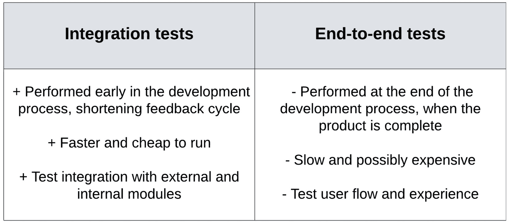

# 5

# 执行集成测试

在前面的章节中，我们讨论了更广泛的话题，即使用**测试驱动开发**（**TDD**）编写和测试代码，但我们的实现重点一直放在单元测试上。正如我们之前详细讨论的那样，单元测试位于测试金字塔的底部，因为它们数量最多，因为它们测试应用程序的所有不同独立部分或单元。

我们之前讨论的概念使我们能够编写单元测试，以隔离测试这些单元，并在各种场景中进行测试。在*第三章*，*模拟和断言框架*中，我们学习了如何利用框架轻松创建模拟，这使我们能够实例化对其依赖项有完全控制的单元。正如*第四章*，*构建高效的测试套件*中讨论的那样，我们学习了如何利用流行的表格驱动测试技术轻松编写各种情况的测试，包括边缘和角落情况。

无论我们编写单元测试多么出色，它们都有局限性，即它们只能验证其有限的范围。换句话说，单元测试验证每个单元是否正常工作，但并不能验证它们是否能够正确集成并协同工作。不同团队开发的单元之间的集成往往可能是错误和故障的原因，因此验证它们是否按预期独立和协同工作非常重要。

现在，我们将把注意力转向实现集成测试套件，这将使我们确信，当多个单元协同工作时，重要的功能将按预期工作。我们将探讨如何容器化我们的应用程序，确保我们的测试模拟我们的生产环境并按预期执行。

在本章中，我们将涵盖以下主题：

+   单元测试的局限性

+   Go 中集成测试的实现

+   行为驱动测试编写简介

+   数据库测试的重要性

+   使用 Docker 进行容器化

# 技术要求

您需要安装**Go 版本 1.19**或更高版本才能运行本章中的代码示例。安装过程在官方 Go 文档中有描述，请参阅[`go.dev/doc/install`](https://go.dev/doc/install)。

本书包含的代码示例在[`github.com/PacktPublishing/Test-Driven-Development-in-Go/chapter05`](https://github.com/PacktPublishing/Test-Driven-Development-in-Go/chapter05)上公开提供。

# 使用集成测试补充单元测试

单元测试是小型、快速的测试，用于验证单个组件的行为。在 Go 中，UUT 通常是指包，它暴露了一个 API，这些快速测试可以对其进行验证。这些独立的单元组合起来形成**组件**，它们是系统的可识别部分。通常，组件具有明确定义的责任并提供一组相关功能。组件的单元协同工作以提供组件的功能。

工程师在开发阶段高度依赖单元测试，它们是 TDD（测试驱动开发）的重要支柱，其中测试实践要求测试代码与实现代码一起编写。然而，它们有一些局限性，使得测试金字塔的剩余测试变得至关重要。因此，作为 TDD 实践者，我们不能仅仅关注单元测试。

## 单元测试的限制

由于其局限性，使用单元测试验证功能在工程社区中一直是争论的主题。*图 5.1* 展示了它们的优缺点总结：


图 5.1 – 单元测试的优点和缺点

这里是单元测试的优点：

+   **支持重构**：单元测试使得重构代码变得更加容易，因为它们可以快速验证现有功能。它们降低了与代码更改相关的风险，这可能导致现有功能被破坏。

+   **早期错误检测**：单元测试在集成到现有产品并进行全面测试之前，在开发阶段验证实现。这也确保了错误不会传播到其他团队或意外发布。早期错误检测还可以缩短开发时间并降低项目成本。

+   **更容易调试**：当测试范围有限时，检测和修复错误变得更加容易。由于 UUT 是与其依赖项隔离测试的，我们知道任何失败的测试都是由测试设置或 UUT 的实现引起的。

+   **更好的代码设计**：设计不良的代码难以测试，并且可以指出开发者代码必须重写或重构的地方。在实践中，单元测试通过将测试关注点带到开发阶段来促进更好的代码设计。

+   **实现旁边的文档**：单元测试充当组件功能和行为的详细文档。由于测试与 Go 中的代码一起存在，它们为开发者提供了访问权限，而无需使用另一个文档系统。

而这些是它们的缺点：

+   **增加代码量**：单元测试增加了开发者必须早期编写的代码量。这对于需要原型设计或没有明确要求的任务来说是个问题。开发者不希望编写大量随后需要与实现一起更改的代码。

+   **增加重构工作量**：虽然单元测试确保重构没有破坏任何现有功能，导致回归，但在需求变化的情况下，测试本身必须进行重构。这可能会增加重构工作的成本。

+   **难以识别现实场景**：随着代码库的增长和功能的复杂化，测试组件的所有执行路径将变得困难，甚至不可能。然而，由于单元测试是基于代码而不是用户需求编写的，开发者可能难以识别哪些场景是现实的，应该被覆盖。

+   **测试用户界面（UI）的困难**：使用单元测试来测试 UI 是困难的。通常，它们验证业务逻辑，因为它们传统上没有可用于 UI 验证的库。

集成测试是补充单元测试的好方法，因为它们解决了之前提到的单元测试的一些缺点和局限性。接下来，我们将学习如何为我们的 Go 包实现和运行它们。

单元测试被认为是良好的实践

虽然它们确实存在一些缺点，但社区共识是它们应该作为开发实践的一部分来使用。了解它们的局限性突出了我们需要覆盖的其他测试需求，以实现系统的全面验证。

## 实现集成测试

集成测试和端到端测试经常被互换使用，但它们在测试金字塔中各自都有范围和目的。*图 5.2* 展示了测试金字塔，并突出了集成测试和端到端测试在范围和速度上的差异：


图 5.2 – 集成测试和端到端测试的区别

集成测试和端到端测试之间的速度差异是由于它们覆盖的功能：

+   **集成测试**涵盖一个或多个组件，确保各个组件作为一个整体运行良好。虽然特定组件的逻辑通过其单元测试得到验证，但集成测试的目的是测试组件之间的接缝处的条件。

+   **端到端测试**复制了用户对系统的使用。它们需要启动测试系统下的所有服务和依赖项。然后，使用辅助框架编写模拟用户行为的测试。这些测试验证系统在真实世界条件下的正确运行。

因此，如果端到端测试覆盖的功能比集成测试更多，并且可以自动化，为什么我们还要费心实现集成测试？*图 5.3* 展示了端到端测试的一些缺点以及集成测试如何解决这些问题：



图 5.3 – 端到端测试的挑战

测试金字塔中的所有测试共同工作，以解决彼此的不足。特别是，集成测试和端到端测试协同工作：

+   通常，端到端测试是在**开发过程的末尾**进行的，一旦系统相对稳定，可以称为端到端。另一方面，集成测试可以在单个组件准备好后立即进行，在开发周期的早期，从而**缩短反馈循环**，使开发者能够更早地检测到项目中的错误。

+   由于它们需要更多的设置和资源，端到端测试运行起来可能**慢且可能昂贵**。因此，工程师可能会在发布时运行它们，而不是针对单个代码提交。另一方面，集成测试需要的设置要少得多，因此它们**更快且更便宜**。它们通常包含在代码提交检查中。

+   如前所述，端到端测试的焦点是在真实场景中验证**测试用户流程和体验**。另一方面，集成测试侧重于在多种场景下与外部和内部模块的**集成**，例如负面测试和部分中断。这些在端到端测试中可能难以设置，需要配置整个系统。

集成测试的实现方式与单元测试相同

我们使用相同的机制进行集成测试。我们利用设置函数和模拟以及表格测试来编写具有更大范围的测试。此外，集成测试具有与单元测试相同的测试签名。

集成测试的设置比单元测试稍微复杂一些，因为必须配置和启动多个组件，其中一些是外部的。*图 5**.4*显示了我们可能使用的典型技术和配置示例：


图 5.4 – 集成测试的示例配置

需要配置的集成测试的各个部分如下：

+   **被测试组件**部分被初始化。被测试组件比 UUT 大，但仍然是一个独立的组件，定义在单个模块内。集成测试的范围是确保多个单元按预期工作，但它们始终包含在单个被测试模块内。

+   如果需要，我们将使用给定的种子/起始位置初始化**数据库**组件，其中包含测试数据。由于数据库复杂，很少进行模拟，通常在启动被测试组件之前启动并填充。数据库的起始位置通常指定为**SQL 文件**或**JSON 文件**。

+   Docker 使得配置**真实组件**更加容易，常用于系统配置。我们将在本章的“使用 Docker 启动和关闭环境”部分稍后探讨如何利用 Docker 的强大功能。

+   通常，被测试的组件将需要依赖项才能启动和正确运行。这些依赖项可能是项目内部的，也可能是组织的外部依赖项，例如第三方服务。这些外部依赖项将被模拟，使我们能够使用各种输入和条件测试我们的组件。

让我们看看我们`BookSwap`应用程序的一个示例集成测试，该应用程序在*第四章*中介绍，*构建高效的测试套件*。我们将编写一个针对`GET /`端点的集成测试，该端点将返回欢迎信息和可用书籍列表。它还将使我们能够探索测试 Web 应用程序。

注册以响应此请求的 HTTP 处理器相对简单：

```go
// Handler contains the handler and all its dependencies.
type Handler struct {
 bs *db.BookService
 us *db.UserService
}
// Index is invoked by HTTP GET /.
func (h *Handler) Index(w http.ResponseWriter, r *http.Request) {
 // Send an HTTP status & a hardcoded message
 resp := &Response{
  Message: "Welcome to the BookSwap service!",
  Books:    h.bs.List(),
 }
 writeResponse(w, http.StatusOK, resp)
}
```

`Handler`的实现突出了以下实现细节：

+   我们创建了一个包含所有必需依赖项的自定义`Handler`类型。在`BookSwap`应用程序的情况下，我们保存了`BookService`的一个实例和`UserService`的一个实例。

+   处理器为它所服务的每个端点都有一个方法。我们创建了一个接受`ResponseWriter`和`Request`的处理方法。这个签名是`http.HandlerFunc`的典型特征，它是一个适配器，允许将 Go 函数用作 HTTP 处理器。

+   我们调用`BookService`的`List`函数来获取书籍列表并构建响应。然后将这个自定义响应写入`ResponseWriter`，这使得我们能够轻松地将 Go 结构体反序列化为 HTTP 响应。

我们处理器的设置代码相当简单，将类似于您为 HTTP 响应编写的任何代码。但我们应该如何测试它呢？我们可以对`BookService`进行单元测试，确保它正常工作，但我们还需要测试处理器构建的响应是否符合预期。是时候编写我们的第一个集成测试了。

Go 标准库中的`httptest`包([`pkg.go.dev/net/http/httptest`](https://pkg.go.dev/net/http/httptest))允许我们轻松测试 HTTP 处理器和客户端。此包包含以下功能：

+   使用`httptest.Server`类型启动具有特定`http.HandlerFunc`的服务器。

+   使用`httptest.NewRequest`函数创建传入的请求以传递给处理器。

+   使用`httptest.ResponseRecorder`类型记录响应，以便在测试代码中进行断言。该记录器符合`http.ResponseWriter`类型，可以在处理代码中替代使用。

我们`GET /` HTTP 处理器的简单集成测试如下：

```go
func TestIndexIntegration(t *testing.T) {
 // Arrange
 book := db.Book{
  ID: uuid.New().String(),
  Name: "My first integration test",
  Status: db.Available.String(),
 }
 bs := db.NewBookService([]db.Book{book}, nil)
 h := handlers.NewHandler(bs, nil)
 svr := httptest.NewServer(http.HandlerFunc(h.Index))
 defer svr.Close()
 // Act
 r, err := http.Get(svr.URL)
 // Assert
 require.Nil(t, err)
 assert.Equal(t, http.StatusOK, r.StatusCode)
 body, err := io.ReadAll(r.Body)
 r.Body.Close()
 require.Nil(t, err)
 var resp handlers.Response
 err = json.Unmarshal(body, &resp)
 require.Nil(t, err)
 assert.Equal(t, 1, len(resp.Books))
 assert.Contains(t, resp.Books, book)
}
```

`TestIndexIntegration`测试相对简单，因为它不需要任何复杂的请求构建或响应验证：

1.  测试的签名就像任何其他单元测试一样。它以`Test`前缀开始，并接受一个`*testing.T`类型的单个参数。

1.  接下来，我们使用单个书籍作为起始位置创建一个`BookService`实例。测试的目的在于确保`BookService`能够与处理器集成并按预期返回响应。

1.  我们使用实例化的`BookService`创建一个新的处理器。然后，我们将处理器传递给`httptest.NewServer`函数，该函数创建并启动一个服务器实例以服务我们的处理器。我们延迟调用`Close`函数，因为这个服务器应该在测试执行结束时关闭。这完成了我们的测试的`Arrange`部分。

1.  我们的测试中的`Act`部分非常简单。我们使用`http.Get`方法调用服务器的 URL。这与我们的客户端将使用的方法相同，测试并不知晓它正在调用一个特殊、模拟的服务器。

1.  最后，我们可以在测试的`Assert`部分对响应和可能的错误进行断言。我们验证没有错误返回，并且响应具有`200 OK` HTTP 状态码。

1.  然后，我们读取响应体并将其反序列化到我们的自定义响应类型中。这使得我们更容易验证响应，但我们也可以将响应体的内容作为字符串进行验证。

1.  最后一个断言验证在`Arrange`部分创建的书籍实例包含在自定义响应中。然后测试结束，并运行对服务器`Close`函数的延迟调用，清理测试设置的服务器资源。

`httptest`包允许我们无缝地使用客户端将使用的相同库和函数来验证 HTTP 处理器和集成测试的行为。这使我们能够编写强大的集成测试。

## 运行集成测试

集成测试可以像我们迄今为止运行的其他任何单元测试一样运行——通过使用`go test`命令：

```go
$ go test -run TestIndexIntegration ./chapter05/handlers -v
=== RUN   TestIndexIntegration
--- PASS: TestIndexIntegration (1.712s)
PASS
ok      github.com/PacktPublishing/Test-Driven-Development-in-Go/chapter05/handlers     1.712s
```

测试运行成功，因为它具有典型单元测试的签名。然而，请注意，这个集成测试在我的机器上运行了近 2 秒。这是特定测试运行的测量值，但我已经记录了高达 4 秒的运行时间，仅针对这个简单的`GET`请求。随着特定应用程序集成测试数量的增加，它们有可能严重减慢我们的测试套件，即使我们使用`t.Parallel()`运行它们，正如我们在*第四章*，“构建高效的测试套件”中学到的。

很好地，我们可以将单元测试和较慢的集成测试分开。这样，我们可以为所有提交运行单元测试，为代码发布运行集成测试。没有完美的、内置的方式来向测试运行器指示哪些是集成测试，但我们可以探索一些选项。

### 简短模式

`go test`命令有一个内置的标志`-short`，我们可以通过使用`testing.Short()`函数来访问它。此标志允许我们通过在测试代码中添加一个简短的片段来标记长时间运行的测试以跳过：

```go
func TestIndexIntegration(t *testing.T) {
 if testing.Short() {
  t.Skip("Skipping TestIndexIntegration in short mode.")
 }
 // testing code continues
} 
```

`t.Skip`方法将确保这个长时间运行的测试将被跳过。然后我们可以通过在测试命令中添加`–short`标志来以简短模式运行测试：

```go
$ go test -run TestIndexIntegration ./chapter05/handlers -v -short
=== RUN   TestIndexIntegration
    handlers_test.go:19: Skipping TestIndexIntegration in short mode.
--- SKIP: TestIndexIntegration (0.00s)
PASS
```

如预期，长时间运行的测试被跳过了。

这种方法的重大缺点是它要求用户具有特殊知识才能实现快速运行的测试套件，而这应该是默认行为。没有内置的`–long`标志可以用来执行所有（包括长时间运行的）测试。

### 命名约定

另一个选项是使用命名约定，这不需要在测试中添加任何特殊的代码函数。例如，你可以在团队中达成一致，单元测试将以`Unit`后缀结尾，集成测试以`Integration`后缀结尾。根据文件长度和内容，我们可以创建单独的集成和单元测试文件。单元和集成测试都可以使用专用的测试包，以`_test`后缀命名，以保持源代码和测试代码依赖的分离。

然后，我们可以使用`–run`标志，这在*第二章*中进行了探讨，即*单元测试基础*，来指示测试运行器根据测试名称运行测试子集。我们使用`go test -run Unit ./...`命令运行所有单元测试，该命令将递归遍历文件夹以搜索包含单词`Unit`的任何测试。类似地，集成测试将使用`go test -v -run Integration ./...`命令运行。

不幸的是，这种方法与简短模式有相同的重大缺点，因为在不添加`–run`标志的情况下运行默认的`go test`命令将导致运行所有测试，包括较慢的集成测试。

### 环境变量

最后一个选项是创建一个环境变量来弥补缺少相应标志的不足。同样，我们不得不在我们的测试中添加一个简短的代码片段来验证这个环境变量：

```go
func TestIndexIntegration(t *testing.T) {
 if os.Getenv("LONG") == "" {
  t.Skip("Skipping TestIndexIntegration in short mode.")
 }
 // testing code continues
}
```

我们使用`os.Getenv`方法读取环境变量，如果变量未定义，则返回空。如果这个变量为空，我们将跳过集成测试，允许测试套件的默认行为只运行快速测试，跳过集成测试。

运行集成测试很简单：

```go
$ LONG=true go test -run TestIndexIntegration ./chapter05/handlers -v
=== RUN   TestIndexIntegration
--- PASS: TestIndexIntegration (0.00s)
PASS
ok      github.com/PacktPublishing/Test-Driven-Development-in-Go/chapter05/handlers     0.779s
```

注意，这个命令版本只能在`CMD`终端上运行。或者，你可以在你的终端中将`LONG`环境变量设置为"`true`"，然后设置此变量后单独运行前面的`go test`命令。

我们将使用环境变量解决方案继续前进。测试套件的预期默认行为是运行快速运行的单元测试。此解决方案允许我们将专用知识排除在预期默认行为之外，并使得在需要时运行集成测试变得容易。它还很好地与 Docker 等容器化技术集成，我们将在本章后面探讨。

# 行为驱动测试

我们现在已经学会了如何通过集成测试来补充单元测试，从而扩大我们正在测试的组件的范围。端到端测试具有最大的范围，因为它们测试了我们的整个系统。它们通常与**行为驱动设计**（**BDD**）一起讨论，BDD 是 TDD 的一个分支，它侧重于根据用户需求编写人类可读的测试。

## BDD 的基础

BDD 实践者的第一步是在不同的利益相关者之间建立共享的词汇：业务利益相关者、领域专家以及各种其他工程职能。

基于这个共享且易于理解的词汇表，用户需求随后被转换为**用户验收测试**（**UATs**）。这些测试是端到端测试，确保所有新版本都涵盖了系统需求。

测试通常编写在之前实现的`GET /`端点上，看起来像这样：

+   **故事：查看书籍列表** ****

+   **Given** 一个用户

+   `GET /` 根端点

+   **Then** 将可用的书籍列表返回给用户

测试规范读起来像普通的英语，并确立了测试用例的主要方面：

+   测试用例的主要行为者是谁

+   他们的预期行为是什么

+   用户将从执行的操作中获得什么

注意，测试用例没有指定应用程序的任何实现细节，而是专注于*应用程序的行为*。测试用例将应用程序视为一个**黑盒**。这种简单性是行为驱动开发（BDD）的力量所在，因为测试规范不是只有工程师和测试专业人员才能编写的东西。

BDD 是关于弥合差距

对共享语言和易于阅读的测试的强调确保了技术利益相关者和非技术利益相关者之间的差距得到弥合。这避免了在实施系统预期行为时的误解和延迟。

*图 5**.5*突出了使用 BDD 编写测试的一些优点和缺点：


图 5.5 – 编写 BDD 测试的优点和缺点

以下 BDD 的优点：

+   **单一事实来源**：BDD 最大的优点是它允许团队有一个单一的事实来源，用于应用程序的预期行为。此外，我们有一个统一的词汇来表达业务中的这一行为。

+   **测试作为文档**：虽然单元测试也可以作为应用程序的文档，但 BDD 测试更容易阅读和理解，因为它们侧重于可读性。

+   **具体行为**：通过它们的 Given-When-Then 结构，BDD 测试鼓励编写针对特定行为的测试用例。这通常有助于缩小在项目初期建立的大型和可能模糊的用户需求。

+   **更广泛的参与度**：团队或业务中的任何人都可参与到这些测试规范的制定中，这使得早期发现任何错误或功能疏忽变得更加容易。

下面是它的缺点：

+   **耗时**：在项目开始时将多个利益相关者聚集在一起建立测试用例可能会很耗时。此外，在项目生命周期内维护这些测试也可能很耗时。

+   **需要承诺**：不同的利益相关者需要承诺在项目开始时承担指定和讨论这些测试用例的工作。

+   **依赖于良好的 BDD 实践**：除非与正确的利益相关者正确地一起指定，否则 BDD 测试可能会变得模糊且难以实施。因此，测试的成功指定依赖于业务中良好的 BDD 实践。

现在我们已经了解了一些 BDD 测试的优势以及如何编写它们，我们可以将注意力转向在 Go 中实现它们。

## 使用 Ginkgo 实现 BDD 测试

在 *第三章*，*模拟和断言框架* 中，我们学习了如何使用 `testify` 开源测试库创建模拟和编写断言。这使我们能够创建简化的单元测试并轻松创建模拟。然而，需要一个更具表达力的测试库来轻松生成 BDD 风格的测试。

`ginkgo` ([`github.com/onsi/ginkgo`](https://github.com/onsi/ginkgo)) 项目始于 2013 年，旨在满足这一需求。它是一个建立在 Go 的 `testing` 包之上的测试框架，旨在帮助我们编写表达式的 BDD 测试。它与 `gomega` ([`github.com/onsi/gomega`](https://github.com/onsi/gomega)) 匹配器库一起使用，该库暴露了我们可以用于测试的断言匹配器。这个框架得到了社区的混合支持，因为它将 Ruby 风格的测试方式引入了 Go。然而，它目前是编写 BDD 风格测试的默认方式，并且是我们 TDD 旅程的一个重要部分。

`Ginkgo` 库支持 Go 模块，并且可以使用 `go install` 命令轻松安装，就像 `testify` 一样：

```go
$ go install github.com/onsi/ginkgo/v2/ginkgo
```

Ginkgo 安装位置

`install` 命令将在您的 `$GOBIN` 路径中安装 `ginkgo` CLI，因此请在安装之前确保它已正确设置。默认情况下，`$GOBIN` 路径是 `$GOPATH/bin`。

`go get` 命令随后会获取 `gomega` 断言库：

```go
$ go get github.com/onsi/gomega/...
```

Ginkgo 测试位于 `_test.go` 文件中，就像常规单元测试一样，但它们被组织在测试套件中。套件可以比作我们之前实现的表格测试，其中我们将测试按相似的功能和场景分组。

使用 `ginkgo` `bootstrap` 命令在当前目录下生成测试套件：

```go
$ cd chapter05/handlers && ginkgo bootstrap        
Generating ginkgo test suite bootstrap for handlers in:
        handlers_suite_test.go 
```

文件命名根据当前目录中声明的包命名。生成的文件包含包声明和套件声明的某些基本代码。请注意，如果套件已存在，此命令将失败。

`bootstrap`命令是生成此样板代码的便捷方式，并确保所有测试文件都具有相同的基本结构，跨所有项目。它还确保我们的套件命名一致，因此是一个强大的标准化工具。

测试术语

`ginkgo`将使用与`ginkgo`测试相同的术语。

生成的`chapter05/handlers/handlers_suite_test.go`包含以下代码：

```go
package handlers_test
import (
 "testing"
 . "github.com/onsi/ginkgo/v2"
 . "github.com/onsi/gomega"
)
func TestHandlers(t *testing.T) {
 RegisterFailHandler(Fail)
 RunSpecs(t, "Handlers Suite")
}
```

此文件包含与`ginkgo`运行器交互所需的必要信息：

1.  套件测试文件声明在对应此目录的`handlers_test`包内部。单独的`_test`包确保我们只测试源包导出的功能。这对于编写只断言 API 外部行为的集成测试至关重要。

1.  使用点(`.`)运算符导入`ginkgo`和`gomega`库。这允许我们访问测试和断言功能，而无需在每个函数前加上包名。这可以被禁用，但 BDD 社区不鼓励这样做，因为测试应该尽可能自然地阅读。

1.  测试的签名与预期相符。测试签名接受一个`*testing.T`类型的单个参数。这是我们的生成套件的入口点。

1.  测试包含对`Ginkgo`测试运行器的两次调用。我们不会过多地讨论这些函数的内部结构，但，由于所有测试库都是开源的，您可以自己查找它们的功能。对`RunSpecs`的调用指示测试运行器开始运行套件并执行所有现有规格。

套件仅作为规格开始执行的人口点，这些规格通常定义在单独的测试文件中。

我们将`ginkgo`定义为与我们在`第五章/handlers/handlers_index_test.go`中的`Implementing integration tests`部分之前看到的`Index`端点集成测试等效：

```go
var _ = Describe("Handlers integration", func() {
 var svr *httptest.Server
 var book db.Book
 BeforeEach(func() {
  book = db.Book{
   ID: uuid.New().String(),
   Name: "My first integration test",
   Status: db.Available.String(),
  }
  bs := db.NewBookService([]db.Book{book}, nil)
  ha := handlers.NewHandler(bs, nil)
  svr = httptest.NewServer(http.HandlerFunc(ha.Index))
 })
 AfterEach(func() {
  svr.Close()
 })
 Describe("Index endpoint", func() {
  Context("with one existing book", func() {
   It("should return book", func() {
    r, err := http.Get(svr.URL)
Expect(err).To(BeNil())
    Expect(r.StatusCode).To(Equal(http.StatusOK))
    // … assertions continue
   })
  })
 })
})
```

我们`Index`集成测试的 Ginkgo 等效似乎与我们习惯看到的代码有很大不同。它的重点是轻松阅读的**spec 树**中设置测试的各个方面：

+   我们使用闭包来设置我们的规格层次结构。`Describe`函数允许我们创建`Describe`节点。

+   `BeforeEach`函数创建在测试之前运行的**设置节点**。它们用于提取公共设置，使我们能够简化测试。

+   `AfterEach`函数创建在测试之后运行的设置节点。它们允许我们在规格运行后进行清理，确保关键资源被正确清理。

+   我们可以根据需要在内层节点中进一步定义容器节点，以组织我们的规格及其场景。

+   `Context` 函数是 `Describe` 的别名，它允许我们向我们的 spec 添加额外信息以帮助人们理解它们。它还创建容器节点，但可以用来组织信息。

+   `It` 函数允许我们定义**主题节点**。这些节点包含被测试主题的断言，并且不能包含任何其他嵌套节点。

+   主题节点内的断言是用 `gomega` 断言库编写的。这些可以像 `testify` 的断言一样嵌套，但采用人类可读的形式。所有断言都必须以 `Expect` 函数开始，它包装了一个实际值。

*图 5**.6* 展示了 spec 树结构的视觉表示：


图 5.6 – spec 树的结构

所有测试都以一个 `Describe` 容器节点开始。然后，这个顶级节点可以包含多个 `BeforeEach` 设置节点、多个 `AfterEach` 节点、其他 `Context` 容器节点和多个 `It` 主题节点。正如我们在处理程序集成测试中看到的那样，这些节点被安排来构建一个反映我们的测试场景的层次结构。

嵌套规则

spec 树由嵌套的容器节点组成。设置节点可以嵌套在其中。就像延迟函数的行为一样，最内层的函数将首先运行。然后，其他函数将按相同的方式向外继续运行。

一旦我们生成了套件并用 spec 填充了它，我们就可以通过使用 `ginkgo` 命令来运行它：

```go
$ ginkgo -v ./chapter05/handlers
Running Suite: Handlers Suite
===================================================================
Handlers integration Index endpoint with one existing book
  should return book
 SUCCESS! -- 1 Passed | 0 Failed | 0 Pending | 0 Skipped
PASS
```

就像我们之前使用的 `go test` 命令一样，`ginkgo` 也支持 `./...` 操作符，它将遍历子目录并查找要运行的套件。

从输出中我们可以看到，容器节点和主题节点用于为 spec 套件构建有意义的名称。Ginkgo 允许我们构建具有有意义的测试输出的测试集合。我们将在未来的章节中继续探讨它。

# 理解数据库测试

在测试的世界里，数据库在文献中经常被忽视。大多数应用程序通常假设内存数据存储，就像我们到目前为止在 `BookSwap` 应用程序中所做的那样。然而，了解我们在验证数据库时面临的困难和可用技术是很重要的。

数据库通常被视为我们的系统中的外部系统或黑盒。它们提供特定的行为，通常是复杂的系统，通常不能失败。*图 5**.6* 描述了不同格式之间的典型数据转换：


图 5.7 – 典型系统的数据格式

在典型的应用程序中，数据格式会多次改变。用户请求通常以**JSON**格式进入我们的系统。然后**API 层**将这些请求转换为内部应用程序模型，并将它们发送到堆栈的下一层，即**服务层**区域。最后，**服务层**使用**SQL**或数据库预期的任何格式将这些数据持久化到数据库中。通常，**NoSQL 数据库**会将数据以**JSON**格式保存并持久化。

我们应该编写测试来覆盖我们数据库系统的以下方面：

+   **启动和可用性**：应用程序应该等待数据库变得可用，并且应该以高效的方式进行。

+   **持久化和查询**：一旦数据存储在数据库中，它应该被正确存储和检索。这是通过业务逻辑完成的，并且应该验证其正确实现。

+   **性能测试**：这种非功能性测试对于数据库非常重要，因为数据库通常为应用程序中的所有请求提供动力。典型的验证包括使用大文件或结果计数进行负载测试，使用多个远程用户运行测试，以及任何关于数据库有效载荷列/字段值的边缘情况。

我们系统的这些关键方面应该通过测试得到覆盖，特别是在数据格式变化和转换发生的地方。这些格式转换可能是错误和中断的原因。例如，一个字段可能在数据库级别是一个强制性的非空值，但在更高的堆栈级别可能缺失。

模拟数据库

可能会诱使人们认为模拟适合围绕复杂的外部行为进行包装，但社区普遍不鼓励这种作为工程反模式的做法。端到端和集成测试应该验证并针对它们在生产中使用的数据库运行，以避免功能性和性能上的差异。

## 有用的库

幸运的是，Go 生态系统提供了一些优秀的库，使我们能够轻松地将数据库集成到我们的应用程序中。以下是一些在将数据库集成到 Go 应用程序时你会发现有用的 Go 库：

+   `go-testfixtures` ([`github.com/go-testfixtures/testfixtures`](https://github.com/go-testfixtures/testfixtures))：一个开源库，它使得编写功能数据库测试变得容易。它使用**Ruby on Rails**的方式通过固定文件设置数据样本。

+   `golang-migrate` ([`github.com/golang-migrate/migrate`](https://github.com/golang-migrate/migrate))：一个开源库，它使得设置数据库启动位置变得容易，而无需我们编写自己的数据格式和文件。它支持多种 SQL 和 NoSQL 数据库。

+   `go-txdb` ([`github.com/DATA-DOG/go-txdb`](https://github.com/DATA-DOG/go-txdb)): 这是一个开源库，可以在事务中运行数据库查询。一旦测试完成，事务就会回滚，数据不会持久化。这允许我们在真实数据库之上独立运行我们的测试。

+   `gorm` ([`github.com/go-gorm/gorm`](https://github.com/go-gorm/gorm)): 这是一个流行的开源库，提供了**对象关系映射**（ORM）。这个面向开发者的库使得将数据库类型转换为有用的自定义结构体变得更加容易。

+   `bun` ([`github.com/uptrace/bun`](https://github.com/uptrace/bun)): 这是 `go-pg` ([`github.com/go-pg/pg`](https://github.com/go-pg/pg)) 项目的全新重写版本。该项目为多个 SQL 数据库提供 ORM 功能。

关于是否使用 SQL 或 NoSQL 数据库的文献非常丰富，涉及广泛的建议。我们在这里不会开始这个讨论，但 SQL 数据库仍然是最受欢迎的数据库解决方案。我们将专注于在未来的讨论中如何实现和测试 SQL 数据库。我们还将看到一些在本节中提到的库的实际应用。

# 使用 Docker 启动和关闭环境

在我们探索集成和端到端测试的过程中，我们将讨论的最后一个主题是使用称为 Docker 的流行技术进行的**容器化**。它使我们能够在本地和远程环境中以相同的方式启动应用程序。

Docker 给开发者信心，他们的应用程序将在不同的环境中以相同的方式运行，这对于管理和部署测试环境尤其有用。

## Docker 基础

**容器**是一个软件单元，它将代码及其所有依赖项捆绑在一起，使我们能够在多个环境中运行它。容器的规范称为**容器镜像**。Docker 引擎解释容器镜像的规范，并将它们转换为容器。

容器化与虚拟化

**虚拟化**指的是在单台机器上运行多个操作系统。容器化指的是在单台机器上运行在一个操作系统环境中开发的多个应用程序。

*图 5.7* 展示了在宿主环境中运行的容器：


图 5.8 – 使用 Docker 运行容器

容器轻量级，允许在相同的物理硬件上运行多个容器。**Docker 引擎**负责管理它们并强制执行隔离级别，确保恶意代码不能逃出其当前命名空间之外，同时也重要的是确保测试具有现实级别的隔离。在实践中，这意味着我们可以下载并运行一组图像，以便在共享硬件上运行复杂的系统。

例如，我们可以在共享基础设施上运行多个容器：一个 Go 网络应用程序、数据库、事件总线、队列、监控等。所有这些不同的技术和镜像都可以通过 Docker 引擎的单个 **标准化技术** 进行管理。

## 使用 Docker

容器化的概念并不专属于 Docker，但我们将只从 Docker 的使用角度进行讨论。Docker 引擎可以通过遵循官方文档轻松安装，官方文档可在 [`www.docker.com/get-started/`](https://www.docker.com/get-started/) 获取。

Docker 引擎附带了一个强大的命令行界面（CLI），其中包含两个主要命令：

+   `docker` 部署和管理单个应用程序或容器。Docker CLI 提供了广泛的命令和选项，其中一些最常见的是以下这些：

    +   `docker pull` 从镜像仓库下载镜像，`docker run` 从镜像创建容器。如果镜像不在本地，它将从镜像仓库下载，从而延长容器启动时间。

    +   `docker ps` 列出所有本地正在运行的容器。此命令通常用于获取每个容器的唯一容器 ID。然后可以使用这些唯一 ID 在其他命令中引用特定的容器。

    +   `docker stop` 指示容器关闭，给它时间优雅地关闭并清理其资源。Docker 引擎使用操作系统信号与容器通信关闭。然后可以使用 `docker start` 命令重新启动容器。

    +   `docker kill` 指示容器立即停止其执行，不允许进行优雅的关闭。

    +   `docker exec` 允许我们访问正在运行的容器。由于容器与操作系统的其余部分隔离，访问其资源和设置的唯一方式是请求 Docker 引擎的访问。

+   `docker compose` 在同一主机上部署和管理多个容器。这使得我们可以使用单个命令配置和启动多个容器，而不是使用 `docker` 命令逐个启动它们。另一个关键优势是容器将作为一个单一组运行和联网，这使得跨环境部署复杂系统变得容易。以下是一些最常见的 `docker compose` 命令：

    +   `docker compose up` 启动给定 `.yml` 文件中指定的容器。

    +   `docker compose ps` 列出 Compose 项目的容器，包括其状态和注册的端口。当运行 `docker ps` 命令时，这些容器也将可见，但此命令将输出更多容器信息。

    +   `docker compose stop` 指示正在运行的容器停止，但不删除它们。然后可以使用 `docker compose` 的 `start` 命令重新启动它们。

    +   `docker compose kill` 强制容器立即停止，使用 `SIGKILL` 系统信号。

这是我们安装 Docker Engine 和执行一些基本 Docker 任务所需了解的所有基础知识。在*第六章*，“对 BookSwap Web 应用程序进行端到端测试”，我们将查看我们应用程序的自定义 Dockerfile 的配置，我们需要对我们现有的实现进行哪些更改以使用数据库，以及如何基于这些易于启动和关闭的容器运行端到端测试。

# 摘要

在本章中，我们从关注单元测试，即验证代码在小型隔离单元中的功能，转向了。我们首先介绍了集成测试的重要性，并学习了如何使用`httptest`库编写和运行 HTTP 处理器的集成测试。然后，我们学习了编写 BDD 风格测试的实践，以及如何使用`ginkgo`测试库实现它们。然后，我们讨论了测试数据库的重要性，以及有哪些有用的库可供我们编写这些测试。最后，我们介绍了容器化的优势，并学习了如何使用 Docker 以及如何使用`docker compose`配置服务。

在*第六章*，“对 BookSwap Web 应用程序进行端到端测试”，我们将深入探讨我们迄今为止所学的所有技术基础，并将它们应用于测试`BookSwap` Web 应用程序。这将为我们提供良好的实践机会，以配置一个具有简单数据库依赖的典型 Web 应用程序。

# 问题

回答以下问题以测试你对本章知识的掌握：

1.  集成测试和端到端测试之间的区别是什么？

1.  什么是**行为驱动**的**设计**（**BDD**）？

1.  我们应该模拟数据库吗？为什么/为什么不？

1.  容器是什么？

# 进一步阅读

要了解更多关于本章所涉及主题的信息，请查看以下资源：

+   《*BDD in Action: 整个软件生命周期的行为驱动开发*》，由 John Ferguson Smart 著，由 Manning Publications 出版

+   《*Docker: Up & Running: 在生产中部署可靠的容器*》，由 Sean Kane 和 Karl Matthias 著，由 O’Reilly 出版

+   《*设计数据密集型应用程序：可靠、可扩展和可维护系统的核心思想*》，由 Martin Kleppmann 著，由 O’Reilly 出版
