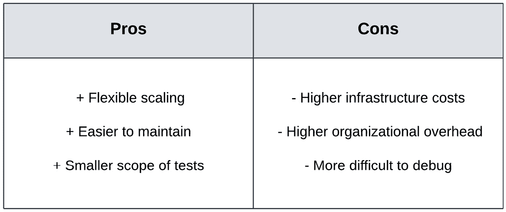

# Go 中的重构

我们已经探讨了整个测试金字塔中测试的概念和技术。我们在构建我们的主要研究项目，即`BookSwap`应用程序时应用了这些概念。这个网络应用程序目前由以下内容验证：

+   使用 Go 标准库实现的单元测试

+   使用`httptest`实现的集成测试

+   使用`godog`实现的端到端测试

为了在一个现实示例中演示这些技术，我们通过添加各种组件扩展了`BookSwap`应用程序的功能。在*第六章*，“BookSwap 网络应用程序的端到端测试”，我们通过添加在 Docker 中运行和使用 PostgreSQL 数据库保存其数据的能力来扩展了项目。

所有这些更改都增加了我们的`BookSwap`应用程序的复杂性，现在它依赖于以下内容：

+   两个用于数据库迁移和操作的库 – `golang-migrate`和`gorm`

+   三种不同类型的文件 – 源文件、实现文件和 Docker 文件

+   具有多个层级的复杂代码结构 – `db`、`handlers`和`cmd`

`BookSwap`应用程序最初是一个简单的 REST API，功能范围较小。然而，随着我们不断改进它并添加更多代码，安装和启动变得更加困难。这是软件项目自然生命周期的一部分。作为一名工程师，您将更经常地需要修改和扩展现有代码，执行**棕色地带开发**，而不是启动和实施没有现有依赖的新项目，也称为**绿色地带开发**。

本章专门介绍`BookSwap`应用程序，我们将学习代码重构的良好实践。然后，我们将学习如何验证重构代码的行为，它应该与它的遗留等效物执行和表现相同。最后，我们将讨论将单体应用程序拆分为微服务的最佳实践。

在本章中，我们将涵盖以下主题：

+   代码重构是什么以及为什么它是开发过程中的一个重要部分

+   如何有效地更改实现和测试代码

+   Go 中的错误验证

+   如何验证重构的成功标准

+   分割单体应用程序的良好实践

# 技术要求

您需要安装**Go 版本 1.19**或更高版本才能运行本章中的代码示例。安装过程在官方 Go 文档[`go.dev/doc/install`](https://go.dev/doc/install)中描述。

本书包含的代码示例在[`github.com/PacktPublishing/Test-Driven-Development-in-Go/chapter07`](https://github.com/PacktPublishing/Test-Driven-Development-in-Go/chapter07)上公开可用。

# 理解依赖关系的变化

在*第一章*，“掌握测试驱动开发”，我们讨论了作为**红-绿-重构** TDD 技术一部分的重构我们正在编写的代码。这涉及到限制我们在编写代码时的清理工作。然而，随着我们继续 TDD 之旅，考虑我们的代码如何随时间演变以及考虑更大规模的代码重构或重写是至关重要的。

**代码重构**通常与**代码重设计**互换使用，但它们代表了不同层次的代码修改。代码重设计涉及更改代码库/服务的功能，而代码重构涉及更改服务提供现有功能的方式。实际上，如果做得正确，代码重构对服务功能的任何内部和外部用户都是不可见的。

代码重构的目的

开发者重构代码是为了使其更高效、可维护和可扩展。代码重构有许多好处：更好的可读性、改进的性能以及使开发者能够更高效地更改代码。这些共同被称为**非功能性需求**。

一个项目的测试策略是验证和支持高效代码更改的重要辅助工具，并将帮助开发者避免以下情况：

+   **功能退化**：重构后的代码不应破坏任何现有功能，导致退化。集成测试将识别可能不再正确协同工作的组件，而端到端测试将确定哪些破坏影响了用户界面功能。

+   **性能下降**：重构后的代码不应比现有功能运行得更慢。集成测试将确定哪些组件在特定场景或操作中变慢，向开发者发出信号，指出哪些组件应进一步调查。端到端测试将确定哪些性能问题影响用户，但可能使隔离问题变得更加困难，因为它们不提供系统组件的粒度。然而，它们将给出一个关于特定性能问题严重性的重要指示，使开发者能够正确地优先处理问题。我们将在*第八章*，“测试*微服务架构*”中更详细地介绍性能测试。

+   **超出预期范围的变化**：重构后的代码不应影响预期范围之外的其他组件。这种指示对于遗留代码库尤为重要，因为开发者可能对不同组件的依赖关系图没有清晰的了解。单元测试将确定当前代码库/服务中哪些包可能受到重构的影响，而集成测试将突出显示不同服务之间的 API 是否可能被破坏。

这些问题的潜在成本以多种形式出现：

+   在潜在的故障期间，失去业务/交易量

+   在性能较慢的情况下，增加基础设施/云成本

+   如果开发者花费更长的时间交付代码更改，则增加开发成本

因此，代码重构易于接受和验证至关重要。

## 代码重构步骤和技术

现在我们已经了解了代码重构的基本需求，让我们来探讨一些代码重构技术。这些技术不仅限于 Go 开发本身，但了解我们更改代码的过程很重要，这样我们才能了解如何有效地验证其输出。*图 7.1* 展示了代码重构的基本工作流程：


图 7.1 – 代码重构的工作流程

代码重构步骤依赖于测试进行验证：

1.  开发者确定他们想要对现有实现进行的更改。

1.  然后，他们进行必要的更改，确保代码能够继续编译。这可能需要修改实现代码和测试代码。

1.  一旦完成第一次更改，开发者就会运行测试套件以验证他们的实现更改。

1.  如果测试通过，则此重构成功，开发者已成功实施此更改。他们可以继续提交并发布。

1.  如果测试失败，则此重构不成功，开发者必须修改他们的重构更改。这可能意味着对实现代码或测试代码进行进一步更改，或者简单地调整他们的新代码更改。

工作流程与我们在早期章节中看到的红绿重构过程密切相关。开发者不应在没有测试套件成功通过的情况下共享任何更改。这通常通过提交检查和构建/发布管道中的测试运行验证来强制执行。

如 *图 7.2* 所示，代码重构应包括一系列小的代码更改或修改，确保重构后的代码保留相同的主要功能：


图 7.2 – 作为一系列小更改的重构

就像代码开发过程的许多方面一样，发布小的、独立的更改比发布大的代码版本更好。这允许开发者验证每个代码更改，并依次发布。此外，在出现问题时，撤销小的代码更改将比撤销多日提交的大代码更改更容易。

*图 7.3* 展示了五种流行代码重构技术的概述：


图 7.3 – 五种流行的代码重构技术

五种技术可以结合使用，以改善代码复杂性和重复：

+   **红-绿-重构**是我们已经熟悉的技术。实现与相应的测试一起编写，从失败的测试开始，使其通过，然后根据需要重构编写的代码。这种方法确保所有功能都由测试覆盖，并且重构是作为初始实现的一部分进行的。由于测试与代码一起编写，因此这种技术可能需要在代码重构过程中进行测试更改。

+   **提取**是一种涉及将现有代码片段从可能很大的函数中提取出来形成其自身函数的技术。这个函数名应该描述提取片段实现的功能，从而提高包含多个功能片段的先前大函数的可读性。由于代码只是被提取，而不是重写，因此不太可能需要测试更改。

+   **简化**是一种提高大型函数复杂性的技术。这可以通过重构条件表达式或通过重构函数参数或调整接口签名来调整方法调用来实现。由于这种技术涉及更改函数签名，因此可能需要测试更改。

+   **内联**是与**提取**相反的技术。它涉及通过将内容移除并替换为现有函数调用的位置来删除冗余功能。这减少了代码的间接性，减轻了阅读代码的开发者的认知负担。除非被测试的方法被移除，否则这种技术不太可能需要测试更改。

+   **抽象**是最适合较大范围代码重构的技术。这种技术涉及引入新的抽象级别，如接口，以消除重复并允许在多个包之间重用行为。由于新接口将需要使用模拟和较大范围的重构，因此这种技术可能需要测试更改。

这些流行的技术将帮助您重构代码，并确保它继续遵循我们之前在*第三章*、“模拟”和“断言框架”中讨论的 SOLID 原则。

## 技术债务

代码重构是开发生命周期中极其重要且不可避免的一部分。当代码没有定期重构和维护时，它开始积累**技术债务**。如何有效管理技术债务的问题在工程社区中经常被讨论，因为工程经理很容易将交付具有实际货币价值的新功能（相对于没有立即后果或与之相关的成本的技术债务）作为优先事项。

敏捷开发中的技术债务

在敏捷中，技术债务是指优先考虑速度而非质量的后果。虽然代码经过测试以确保正确功能，但其内部结构可能是为了速度而做出的不良架构选择的结果。

技术债务的后果可能会以多种方式影响你的项目：

+   **缺陷**：随着技术债务的累积，重复代码和高内聚性可能导致难以修复和检测的缺陷。如果它们导致故障或影响用户操作，可能会产生财务后果。

+   **降低生产力**：由于技术债务不遵循 SOLID 原则，并且与代码库的其他部分不相似，开发者可能难以在添加新功能时对其进行更改。此外，技术债务通常也没有很好地记录，因此难以推断预期的行为。

+   **限制新功能**：随着债务的累积，开发者可能需要花费全部时间修复技术债务带来的缺陷和性能问题，这意味着他们没有时间交付新功能。这种“救火”和混乱的工作方式会让工程师感到沮丧，甚至可能导致更高的员工流失率。

技术债务常被比作财务债务。如果我们长时间不处理代码中的问题，并继续扩展设计不良的代码，债务会越来越大，处理起来也更加困难，就像财务债务会累积利息一样。为了避免这些后果，技术债务应该以敏捷工作方式与其他工作一起处理。

*图 7**.4* 展示了敏捷团队通常如何以优先级排序的工作 **待办事项** 来处理技术债务：


图 7.4 – 带有技术债务的冲刺计划

**冲刺待办事项** 是功能工作和技术债务的结合：

+   开发团队和产品团队各自维护自己的待办事项。通常，这些由 Jira 工单或 GitHub 问题表示，其中包含要完成的工作的详细信息。技术债务工作通常涉及重构现有代码，而功能工作则包括添加新功能。冲刺待办事项试图在这两种类型的工作之间找到平衡。

+   在冲刺计划阶段，代表利益相关者会优先考虑工作。在规划过程中涉及开发团队被视为良好实践，以确保整个团队对即将到来的冲刺目标有良好的理解。工程团队由专家组成，他们可以确定应该进行哪些重构工作。他们通常了解系统哪些部分需要关注。

+   冲刺规划会议的结果是一个优先级列表的工作，这些工作构成了冲刺待办事项。根据他们的专业知识，技术团队通常会为要完成的工作提供时间估计。然后，这些估计被用来确定可以完成哪些工作以匹配团队的能力。重构和功能工作被视为同等重要，每项工作的时间都是根据提供的估计来分配的。

虽然技术债务似乎没有立即的成本，但重要的是团队应该被允许花时间重构和维护他们的代码。

规划技术债务

“少量多次”的方法效果最好，即在规划功能工作的同时规划技术债务，而不是“大爆炸”方法，即整个冲刺都致力于修复问题和进行广泛的代码重构。

## 改变依赖项

现在我们已经很好地理解了如何规划和执行代码重构，是时候将我们的注意力转向代码重构的一个特殊情况，即更改依赖项。正如在*第三章*中讨论的，*模拟和断言框架*，依赖项通常被封装在我们的接口中。Go 强大的接口也有助于我们在依赖项更改时重构我们的代码。

接口通过以下方式使我们的代码更容易重构，以及更少耦合：

+   **明确的预期行为**：接口在调用端定义，确立了外部依赖在包内的预期行为。开发者有明确的方式来表明他们期望外部依赖提供哪些功能和方法签名。

+   **编译器强制的方法签名**：一旦定义了预期的行为，编译器将验证任何作为接口传递的结构是否满足这些签名。因此，代码永远不会进入一个状态，其中某个方法未定义，一旦调用就会导致运行时错误。

+   **包之间的分离**：由于接口位于调用包内部，它为包和外部依赖之间提供了一个屏障。然后，可以重构依赖项或实现新功能，而无需在调用包中处理这些更改。

+   **实现透明度**：调用包对外部依赖没有任何了解。这使得我们能够轻松地用一个具体实现替换另一个，这使得在重构期间更改依赖项变得容易。我们已经在*第三章*中看到了一个例子，*模拟和断言框架*，我们看到了如何为 UUT 的依赖项提供模拟，使我们能够独立于所有其他具体依赖项测试其行为。

分析这个的好例子是`BookSwap`应用程序的`PostingService`。该服务的作用是承担订单并提供所有书籍运输功能：

```go
// PostingService interface wraps around external posting
// functionality.
type PostingService interface {
  NewOrder(b Book) error
}
```

如预期的那样，我们已将`PostingService`定义为`BookSwap`应用程序内部的一个接口。这个服务尚未实现，因为我们已将这个服务的实现视为完全外部。请注意，这是一个纯粹虚构的服务，我们已用它来演示提供和消费外部依赖的过程。

`BookService`使用此定义的接口作为依赖项：

```go
// NewBookService initialises a BookService given its
// dependencies.
func NewBookService(db *gorm.DB, ps PostingService) *BookService {
  return &BookService{
    DB: db,
    ps: ps,
  }
}
```

只要它提供了接口定义中定义的方法，我们就可以提供这个函数的任何实现。这使得我们能够轻松地为方法提供任何服务的实现，而无需在此包内部进行任何进一步的代码更改，这意味着我们可以将重构的范围缩小到实现包。

作为依赖项的空值

接口的零值是 nil，因此当它作为参数传递时也会满足方法签名。虽然 nil 值依赖项如果在它上面调用函数可能会引起错误，但在编写测试时，对于我们不感兴趣的依赖项使用 nil 特别有用。

当依赖项的签名保持预期不变时，实现交换很容易，但更改接口方法签名并不容易，这将要求我们对定义了自己的包装接口的调用包进行更改。

当更改接口的签名时，您通常需要做出以下更改：

1.  如果接口实现是您项目的一部分，请对其进行更改。

1.  更新测试代码以确保重构更改正常工作。这将确保您没有引入任何错误或造成回归。

1.  根据编译器错误，您可以轻松地识别哪些包使用实现类型作为依赖项，因为它们将不再满足这些旧的方法签名。然后，您可以对任何围绕实现包装的接口进行相应的更改。

1.  如果您正在使用模拟生成工具，您可以根据新更新的接口定义重新生成您的模拟。

1.  如编译器错误所识别的，您可以更改测试代码。这些更改可能是在重新生成模拟或测试重构的新行为之后所需的。

编译器是您的指南

接口签名的强制执行将帮助您确定哪些包需要修改，并确保代码不会最终处于不稳定状态。编译器将突出显示任何需要修改的代码，并在您的重构努力中为您提供指导。

由于更改接口需要大量的重写工作，开发者会尽量避免进行这些更改。然而，花时间根据良好的架构原则设计代码应该有助于您避免经常需要进行如此大规模的代码更改。

# 依赖您的测试

我们现在对如何重构我们的代码有了很好的理解，并学会了如何利用 Go 的一些最佳特性：编译器和接口。这应该会使您的重构更加容易，并帮助您将其纳入您的冲刺计划。在本节中，我们将查看 `BookSwap` 应用程序中的一些代码重构示例，这将使我们能够使用本章中探索的所有技术。

## 自动重构

Go 最大的优势之一是其工具和 IDE 支持，这也不例外：

+   Google Go 团队维护了一个 Visual Studio Code 的 Go 开发扩展（[`code.visualstudio.com/docs/languages/go`](https://code.visualstudio.com/docs/languages/go)）

+   `vim-go` 插件（[`github.com/fatih/vim-go`](https://github.com/fatih/vim-go)）是由 Go 社区维护的一个流行的开源插件

+   JetBrains 团队创建了 GoLand（[`www.jetbrains.com/go/`](https://www.jetbrains.com/go/)），这是一个针对 Go 开发的专用产品

所有这些 IDE 都为我们提供了查找给定类型的引用和用法以及在整个调用堆栈中重命名符号的支持。这可以减少许多简单的重构中的枯燥工作，但您仍然需要自己进行相当多的更改。

让我们考虑将 `BookService` 重命名为 `BookRepository` 所涉及的重构。我们可能想要更改此名称，因为我们已经在 *第六章*，*End-to-End Testing the BookSwap* *Web Application* 中添加了与 `BookSwap` 应用程序数据库相关的功能。

首先，我们将使用 IDE 的重命名符号功能重命名结构体：

```go
// BookRepository contains all the functionality and
// dependencies for managing books.
type BookRepository struct {
  DB *gorm.DB
  ps PostingService
}
```

这将更新整个应用程序中所有实现和测试代码中对旧 `BookService` 的直接引用。这使我们免去了手动修复大量编译错误。

接下来，我们需要确保所有与这个结构体相关的函数都被正确命名。`NewBookService` 初始化函数也需要重命名：

```go
// NewBookRepository initialises a BookService given its
// dependencies.
func NewBookRepository(db *gorm.DB, ps PostingService) *BookRepository {
  return &BookRepository{
    DB: db,
    ps: ps,
  }
}
```

重命名的函数清楚地表明它负责根据其依赖关系创建 `BookRepository`。

我们还需要审查任何与旧名称相关的测试代码签名。由于我们希望测试名称反映它们验证的功能而不是它们验证的类型，因此我们不需要更改任何测试名称。

最后，包含并测试这些定义的文件名需要更改以匹配：

+   `book_service.go` 文件变为 `book_repository.go`，使文件名和其中包含的代码的命名保持一致

+   `book_service_test.go`文件变为`book_repository_test.go`，确保测试代码和实现保持在一起

那就是我们在`BookSwap`应用程序中重命名服务所需做的所有工作。这个简单的代码重构不需要任何测试更改，但它展示了重构 Go 代码的过程以及你如何依赖 IDE 来处理一些更繁琐的部分。

## 验证重构代码

虽然重命名符号很简单，但你将发现自己需要做的更常见更改是更改方法签名。让我们看看对`BookRepository`的`Get`方法签名的重构，该方法目前具有以下签名：

```go
// Get returns a given book or error if none exists.
func (bs *BookRepository) Get(id string) (*Book, error)
```

此方法接受一个 ID，从数据库中检索`Book`，或者在书籍未找到的情况下返回错误。这是此功能的常见签名。

我们将更改此方法以接受`*Book`并仅返回错误。这意味着从数据库中检索到的书籍将被填充到`book`参数中，如果未找到则返回错误。此方法的新签名如下：

```go
// Get populates a given book or returns error if none
// exists.
func (bs *BookRepository) Get(b *Book) error
```

在新的签名就绪后，是时候相应地更改我们的测试代码了。`book_repository_test.go`文件中的`TestGet` `Book`断言被更改以利用新的签名：

```go
for name, tc := range tests {
  t.Run(name, func(t *testing.T) {
    var b db.Book
    b.ID = tc.id
err := bs.Get(&b)
    if tc.wantErr != nil {
      assert.Equal(t, tc.wantErr, err)
      assert.Nil(t, b)
      return
    }
    assert.Nil(t, err)
    assert.Equal(t, tc.want, b)
  })
}
```

我们更改测试代码以使其编译并调整到函数的新签名。在重构过程中，应尽可能少地更改测试，以确保重构的代码没有造成任何回归。

到目前为止，测试将开始编译，但我们还没有完全实现新签名的代码。现在是时候将注意力转向新方法的实现了：

```go
func (bs *BookRepository) Get(b *Book) error {
  if r := bs.DB.Where("id = ?",
    b.ID).First(&b); r.Error != nil {
      return r.Error
  }
  return nil
}
```

代码被调整为读取`b *Book`参数的 ID，数据库将结果填充到相同的传入参数中。然后，我们根据项目是否找到返回错误或`nil`。

任何其他调用代码都需要像我们调整测试代码一样进行调整。编译器会通知你是否有任何需要重构的代码遗漏了。例如，如果我们向`BookRepository`的`Get`方法添加一个参数，却忘记在测试中更改它，编译器会在测试运行时通知我们预期的方法签名未定义：

```go
$ go test -run TestGetBook ./chapter07/db
./book_repository_test.go:34:19: not enough arguments in call to bs.Get
  have (*db.Book)
  want (*db.Book, string)
FAIL    github.com/PacktPublishing/Test-Driven-Development-in-Go/chapter07/db [build failed]
```

记住，你的测试代码是包 API 的第一个外部消费者，因此实现代码的任何更改都会首先影响你的测试。请注意，这种无法编译的状态的代码尚未提交到我们的仓库，因此你的测试输出将不会与前面的片段匹配。

# 错误验证

在*第四章* *构建高效的测试套件*中，我们简要讨论了 Go 的显式错误处理方法。我们了解到，错误通常在多个返回值列表中最后返回。到目前为止，我们一直在使用 Go 的内置`error`类型和代表性错误信息来向用户指示出错了。现在让我们更详细地看看 Go 中错误验证是如何工作的。

到目前为止，我们已经以两种方式创建了错误。最简单的方法是使用`errors.New`函数。它创建了一个带有给定消息的错误：

```go
err := errors.New("Something is wrong!")
```

这个函数接受一个错误信息作为参数，并返回`error`接口类型。为了获取我们的错误信息，我们在函数上调用`Error`方法：

```go
msg := err.Error()
```

这个方法返回一个字符串类型的消息。

对于这个例子，编写一个比较输入和输出错误信息的测试非常简单：

```go
func TestErrorsVerification(t *testing.T){
  t.Run("simple custom error", func(t *testing.T) {
    wantMsg := "Something went wrong!"
    err := errors.New(wantMsg)
    gotMsg := err.Error()
    assert.Equal(t, wantMsg, gotMsg)
  })
}
```

由于我们完全控制整个错误信息，我们可以轻松断言值是相等的。然而，如果错误信息构建是函数的一部分怎么办？在 Go 中构建包含输入和其他调用参数的代表性错误信息是一种常见做法。这类错误通常使用`fmt.Errorf`函数构建：

```go
func checkOdd(input int) error {
  if input%2 == 0 {
    return fmt.Errorf("Input %d cannot be even.", input)
  }
  return nil
}
```

`fmt.Errorf`函数以与`fmt`包中其他格式化函数相同的方式格式化错误，但返回一个格式良好的消息的`error`类型。对这个错误消息进行断言稍微复杂一些。

第一种选择是在测试代码中重建错误信息：

```go
func TestErrorsVerification(t *testing.T) {
  t.Run("formatted custom error", func(t *testing.T) {
   input := 4
   wantMsg := fmt.Sprintf("Input %d cannot be even.",
      input)
   err := checkOdd(input)
   gotMsg := err.Error()
   assert.Equal(t, wantMsg, gotMsg)
  })
}
```

测试代码使用了`fmt.Sprintf`函数，使用与`checkOdd`实现函数中调用`fmt.Errorf`函数相同的格式来格式化预期的错误信息。

这种第一种选择有三个缺点：

+   测试代码必须重复实现代码，仅仅是为了验证的目的。如果错误信息需要大量的设置，这可能会变得复杂。

+   测试代码现在与实现代码紧密耦合。现在，在实现代码中更改错误格式化逻辑需要相同的更改在测试代码中。

+   没有办法确保格式化在测试场景中完全相同地复制。这可能在由大型工程团队维护的大型代码库中成为一个问题。

第二种选择是放宽我们的错误验证，这样我们就不需要完全重新创建错误信息：

```go
func TestErrorsVerification(t *testing.T) {
  t.Run("formatted custom error", func(t *testing.T) {
    input := 4
    err := checkOdd(input)
    gotMsg := err.Error()
    assert.Contains(t, gotMsg, fmt.Sprint(input))
    assert.Contains(t, gotMsg, "even")
  })
}
```

使用`assert.Contains`函数来验证错误信息包含一些子字符串，我们可以相对有把握地说这些子字符串在实现代码中不会改变。这个选项已经消除了对错误信息格式化完整实现的必要性，简化了我们的测试代码。

然而，这个第二种选择也有不少缺点：

+   错误消息断言并未得到完全验证。例如，实现可能会产生完全无意义的消息，只要验证的字符串包含在其中，测试就会通过。测试将无法再对实现代码的完整功能进行断言。其他类型的测试，如集成测试或端到端测试，可能会验证这一点。然而，我们将探讨如何在单元测试中包含错误断言。

+   尽管已经减少，测试代码仍然有一些泄露的实现知识和错误消息的硬编码部分。因此，测试仍然脆弱，并且与其实现对应物紧密耦合。

+   仍然没有方法可以确保在测试中执行断言的方式是一致的。事实上，因为预期的字符串不再在测试的安排部分构建，所以在测试套件指出失败之前，甚至可能更难找到硬编码的字符串。

正如所讨论的，我们两个直接的选择都有显著的缺点。然而，正如我们从*第四章*中回忆起来的，*构建高效的测试套件*，`error`类型是一个简单的接口，只有一个方法：

```go
type error interface {
Error() string
}
```

我们可以轻松地通过实现这个简单的函数来创建我们自己的自定义错误类型。正如我们在多个场合所看到的，接口的力量在 Go 编程语言的许多方面都得到了体现，错误处理也是其中之一。

## 自定义错误类型

错误处理的第三种选择是创建我们自己的自定义错误类型，这将使我们能够向错误类型添加比简单地多次格式化字符串更多的信息。这将使我们能够在实现和测试代码中都具有灵活性。

首先，我们将定义一个简单的`evenNumberError`类型：

```go
type evenNumberError struct {
  input int
}
```

这个类型有一个字段用于`checkOdd`函数的输入。这将允许测试访问输入值，而无需检查返回的错误消息，这在之前提出的第一个和第二个选项中是必要的。

接下来，我们需要向这个新类型添加一个方法以确保它满足`error`接口：

```go
func (e *evenNumberError) Error() string {
    return fmt.Sprintf("Input %d cannot be even.", e.input)
}
```

这个方法以`evenNumberError`作为接收者，与`error`接口具有相同的签名。在方法内部，我们使用相同的格式和`fmt.Sprintf`函数，以及接收者的`input`字段。

实现函数可以被修改为使用这个新的`error`类型：

```go
func checkOdd(input int) error {
  if input%2 == 0 {
   return &evenNumberError{
     input: input,
}
  }
  return nil
}
```

在`evenNumberError`类型内部包装错误格式化后，这个函数的`return`语句简单地由创建这个类型的新实例并返回它的指针组成。我们将从`checkOdd`函数传递参数到其初始化中。

总是返回错误接口

最后要注意的一点是，`checkOdd`函数仍然返回`error`接口。因此，调用代码不需要了解在此包中创建的任何自定义错误类型。在处理自定义错误类型时，你也应该始终遵循这个模式。

使用这种新的自定义`error`类型，测试代码变得更加简化：

```go
func TestErrorsVerification(t *testing.T) {
  t.Run("custom error type", func(t *testing.T) {
    input := 4
wantErr := &evenNumberError{
      input: input,
    }
    err := checkOdd(input)
    var gotErr *evenNumberError
    require.True(t, errors.As(err, &gotErr))
    assert.Equal(t, wantErr, gotErr)
  })
}
```

此示例中错误验证的实现展示了如何在自定义`error`类型上运行验证：

1.  我们使用`input`字段创建`evenNumberError`类型的实例。这比创建预期的错误消息要简单得多。

1.  在调用`checkOdd`函数之后，我们需要将内置的`error`值转换为自定义`error`类型。这是通过使用`errors.As`函数完成的，如果转换成功，它将返回`true`。

1.  我们使用`require.True`函数来确保如果转换失败，测试将失败。

1.  最后，我们使用`assert.Equal`函数来确保实际错误与预期相符。

测试的实现变得更加简单，并且不再紧密耦合到被测试函数内部的错误格式化。这种方法确实有一个小小的缺点，就是它创建了一个新的自定义类型，但通过提供一种单一、统一的方式来格式化错误，与自定义`error`类型一起工作简化了实现代码。

我们像往常一样运行测试，以查看错误验证的实际效果：

```go
$ go test -run TestErrorsVerification ./chapter07/errors -v
=== RUN   TestErrorsVerification
=== RUN   TestErrorsVerification/simple_custom_error
=== RUN   TestErrorsVerification/formatted_custom_error
=== RUN   TestErrorsVerification/contains_custom_error
=== RUN   TestErrorsVerification/custom_error_type
--- PASS: TestErrorsVerification (0.00s)
  --- PASS: TestErrorsVerification/simple_custom_error (0.00s)
  --- PASS: TestErrorsVerification/formatted_custom_error (0.00s)
  --- PASS: TestErrorsVerification/contains_custom_error (0.00s)
  --- PASS: TestErrorsVerification/custom_error_type (0.00s)
PASS
ok      github.com/PacktPublishing/Test-Driven-Development-in-Go/chapter07/errors       0.122s
```

每个测试用例都在其子测试中运行，正如有组织的输出所示。

使用自定义`error`类型的另一个优点是，它们允许函数返回多种类型的错误，这可以为给定包或服务的调用者提供上下文。目前，我们应该记住，它们的优势在于简化我们的测试代码，同时提供精确的错误验证可能性。

# 拆分单体

我们将要讨论的最后一个重构方面是从单体架构迁移到微服务架构。虽然有一些大公司成功地使用单体架构运营，但在技术社区中，普遍认为微服务架构更容易扩展和维护，尤其是在跨多个团队工作时。因此，讨论一些关于如何在重构期间拆分服务的基本原则是很重要的。

什么是单体应用？

**单体应用**是一个单一的应用程序，它作为一个单元构建和发布。这个术语通常用来指代一个大型应用程序，它具有许多不同的职责，服务于许多不同的用户旅程。

*图 7.5* 展示了单体应用的某些优点和缺点：


图 7.5 – 单体应用的优缺点

单体应用的优缺点列表涵盖了从部署到弹性的各个方面：

+   由于单体是在一个运行的应用程序中构建和部署的，开发者会发现它们**易于部署**。然而，由于所有组件都一起部署，它们也不能单独扩展，这使得应用程序**更难扩展**。这可能会成为应用程序处理请求数量的瓶颈，影响企业的收入。将整个单体进行扩展也可能是不必要的昂贵，因为所有资源都一起扩展。

+   单体应用由于所有代码都生活在单一可搜索的代码库中，因此认知负担较低。在项目初期，开发者在一个单一的代码库中开发更为容易。然而，随着项目的推进和团队的扩大，代码库会受到其初始架构、设计和技术选择的限制。通常，这会导致**更慢**的开发速度。

+   由于他们只需要启动一个应用程序，工程师发现单体应用**简单易测试和调试**。然而，由于所有模块都一起托管，**错误可能导致应用程序完全中断**。这可能会再次显著影响企业的收入。

许多组织在拥有小型代码库和工程团队时开始使用单体应用。随着团队和应用程序功能的发展，他们发现难以扩展和维护单体。需要一种新的方法来构建应用程序，以减轻在单体中开发代码带来的不利影响。

什么是微服务架构？

**微服务架构**是一种系统设计方法，它依赖于独立构建和发布的称为**微服务**的服务。这些独立的单元有自己的责任和自包含的资源，以实现其目标。

*图 7.6*展示了微服务架构的一些优缺点：



图 7.6 – 微服务架构的优缺点

微服务架构的优点解决了许多单体应用的缺点：

+   由于每个微服务都是独立部署的，这种架构提供了**灵活的扩展性**。这允许我们根据最受欢迎的用户旅程来扩展应用程序的一部分。然而，由于每个服务都有其专用的资源集，微服务架构可能会产生**更高的**基础设施成本。

+   微服务的较小代码库**更容易维护**，尤其是在重构方面。它们还可以做出自己的技术选择，为工程师提供选择每个微服务目标最佳工具的机会。然而，不同代码库之间的分离确实需要**更高的组织开销**，以确保各个单元能够正确协同工作并遵循统一的一套工程标准。

+   由于每个微服务都有其自身明确的功能和责任，它们需要**更小的测试范围**来确保它们正确运行。然而，集成点成为测试的焦点，使得集成测试比以往任何时候都更加重要。当出现系统错误时，每个服务也有自己的日志集，这使得这种类型的架构**更难调试**。

*图 7.7*展示了两种系统类型：


图 7.7 – 单体应用与微服务架构对比

单体应用包含所有在一个单一单元中所需的组件，并依赖于一个数据库。微服务架构根据它们提供的功能来拆分单体应用，并且这些功能相互依赖，以提供与单体应用相同的用户旅程。

正如我们所看到的，这两种开发方法都不是完美的。当应用流量可预测或团队有严格的架构设计指南时，单体应用可能运行得很好，但大多数组织都会扩大团队规模并演进他们的产品。在这些情况下，组织通常会选择微服务架构。因此，工程师了解如何开发和测试微服务架构是绝对必要的。

## 关键重构考虑因素

许多组织已经着手将他们的单体应用拆分为微服务架构。工程界已经讨论了如何尽可能无痛且成功地完成这一旅程。我们可以强调一些此类重构的关键考虑因素。

### 定义边界

为了成功，微服务需要有它们自己的领域和明确的应用边界。工程团队能够确定他们应该从单体中提取哪些部分，无论是通过分析还是生成的依赖图。

基于此，他们可以确定以下内容：

+   微服务将负责的**领域功能性和模型**。例如，在一个电子商务应用中，我们可能会识别出一个负责在购物车中放置和管理商品的服务。

+   微服务将需要的**上游依赖**。例如，之前确定的购物车服务将依赖于库存服务，该服务会告诉它商品的成本以及它们是否有库存。

+   微服务将需要的**下游依赖**和数据存储解决方案。例如，购物车服务将把其数据保存到内存数据结构存储中，如 Redis，并在用户决定购买购物车中的商品后，有一个下游依赖到结账服务。

边界识别练习的结果可能是微服务基础设施需求的高级设计，以及微服务将向系统其他部分公开的 API 概述。

### 松散耦合

微服务架构的一个优点是它允许我们从开发和部署的角度构建松散耦合的服务。然而，如果团队没有隔离服务间的依赖关系，这种优势很容易就会丧失。

微服务的松散耦合是什么意思？

在微服务架构中，如果对某个服务的设计或实现进行更改不会导致其依赖的其他服务或依赖其服务的其他服务发生变化，则这些服务是松散耦合的。

松散耦合的微服务应遵循以下经验法则：

+   **拥有独立的数据存储**：当微服务共享单个数据库时，它们也共享一个**单点故障**。共享数据库的故障将导致所有依赖它的服务也失败。

+   **使用异步通信**：使用异步通信模式，如队列和事件总线，将数据传递给其他服务。这允许我们独立扩展服务，并在适当的情况下批量处理消息。

+   **实现容错性**：在设计服务时，假设其内部和外部依赖项可能会失败或响应缓慢。在 REST API 中，这通常是通过断路器模式实现的，当检测到故障模式时，它会超时外部调用，以确保您的微服务可以继续运行，如果其依赖项之一不再可用，则使用默认值。

+   **实现向后兼容的更改**：在可能的情况下，微服务 API 应进行向后兼容的更改，这样不会强迫其他服务同时对其有效载荷进行更改。

+   **实现请求跟踪和服务监控**：在微服务世界中，了解请求如何流经您的系统非常重要。这对于检测系统中的错误和识别基础设施资源不足的服务至关重要。

在微服务设计和实现过程中遵循这些规则将帮助您充分利用微服务的真正力量。在*第八章*《测试微服务架构》中，我们将进一步讨论这些原则，并讨论测试微服务的挑战以及我们需要如何调整我们的测试策略以适应微服务世界。

微服务在没有其依赖项的情况下会如何表现？

一旦我们确定了微服务的依赖项，我们应该记住设计并测试在依赖项遇到故障的情况下微服务的表现。这个被称为**优雅降级**的微服务设计的重要部分不应被忽视。

# 摘要

在本章中，我们探讨了代码重构这一重要主题，它是扩展和维护健康代码库的关键和不可避免的部分。我们首先学习了一些常见的代码重构技术，并讨论了技术债务的真实成本。然后，我们回顾了接口的力量，它使得改变依赖变得容易，并在重构期间允许我们使用编译器作为指南。

然后，我们考虑了为了确保测试在两种常见的重构操作（重命名结构体和更改方法签名）期间继续验证行为，我们必须对测试进行的测试更改。在扩展我们之前关于错误处理和验证的知识的基础上，我们学习了如何创建自定义错误类型，并更容易地验证错误消息。

最后，我们了解了一些组织从单体应用程序迁移到微服务架构的原因，并探讨了允许我们创建松散耦合微服务的经验法则。

在*第八章* *测试微服务架构*中，我们将扩展到目前为止所学的所有概念，并学习在测试微服务架构时应考虑哪些因素。我们将在我们的演示应用程序`BookSwap`上应用并展示这些概念。

# 问题

1.  代码重构和代码重设计有什么区别？

1.  描述代码重构的工作流程。

1.  技术债务是什么？

1.  单体应用程序是什么？微服务架构是什么？

# 进一步阅读

+   *整洁架构：软件结构和设计的工匠指南*，罗伯特·C·马丁著，由 Addison-Wesley 出版

+   *重构：现有代码的设计改进*，马丁·福勒著，由 Addison-Wesley Professional 出版

+   *构建微服务第二版：设计细粒度系统*，山姆·纽曼著，由 O’Reilly 出版

+   *从单体到微服务：转型单体应用的演进模式*，山姆·纽曼著，由 O’Reilly 出版
