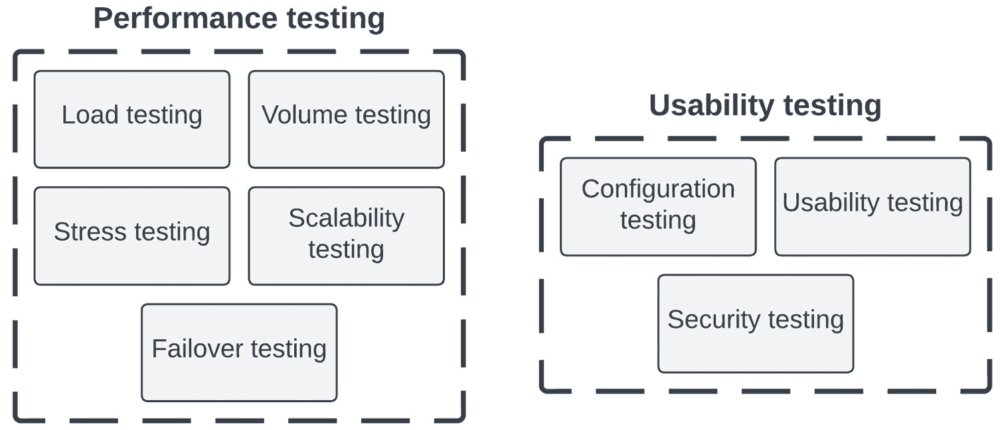
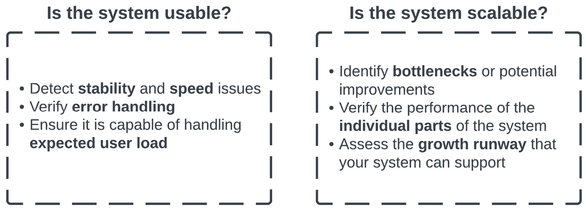
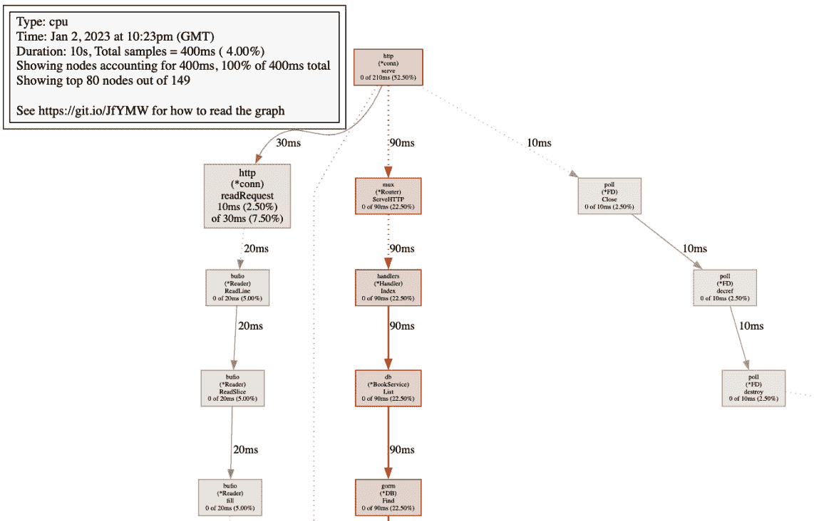
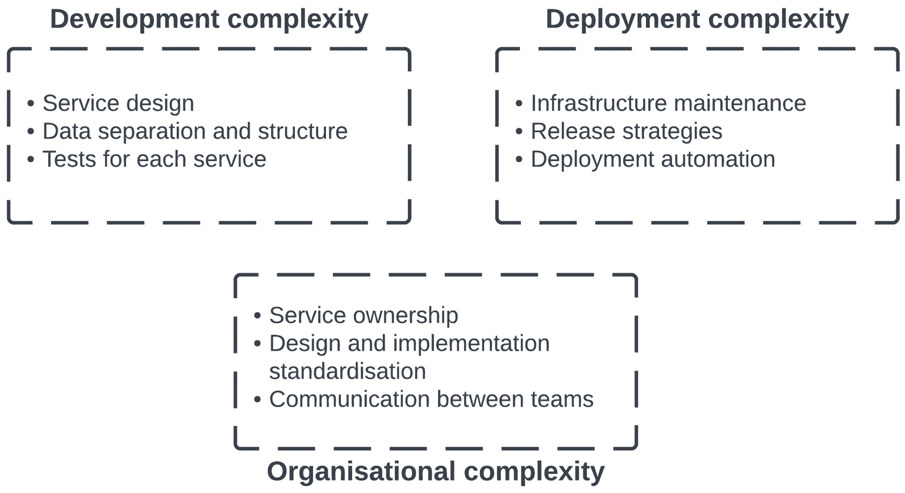
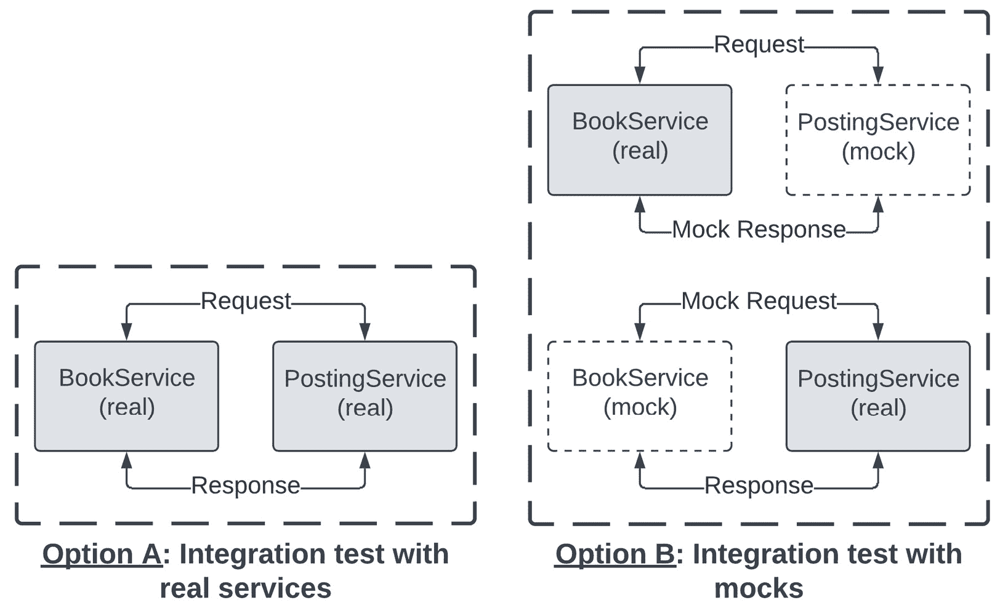
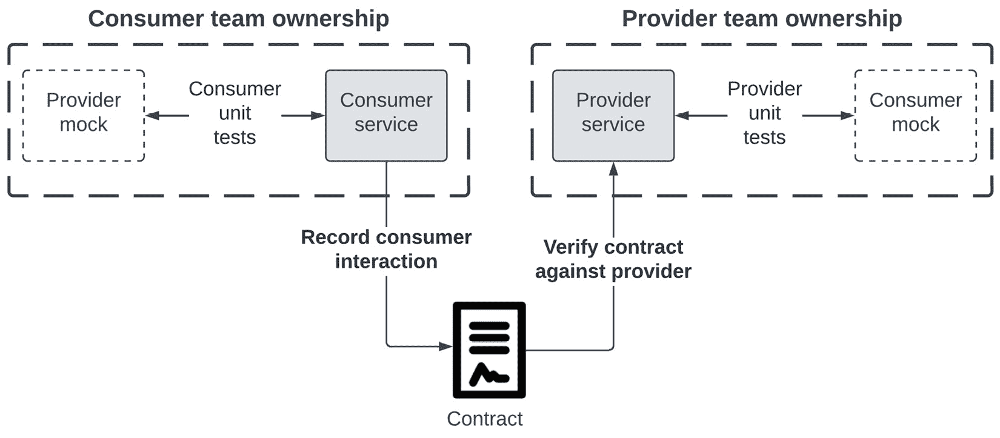
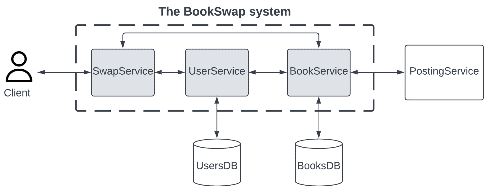
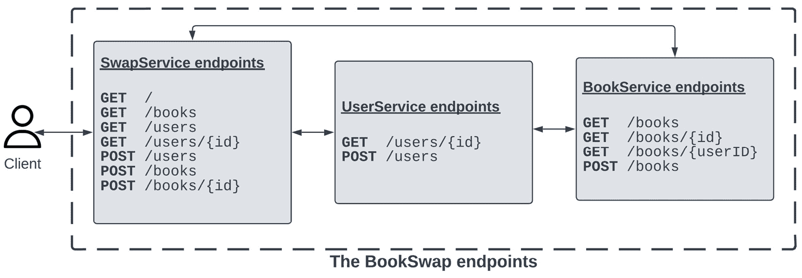
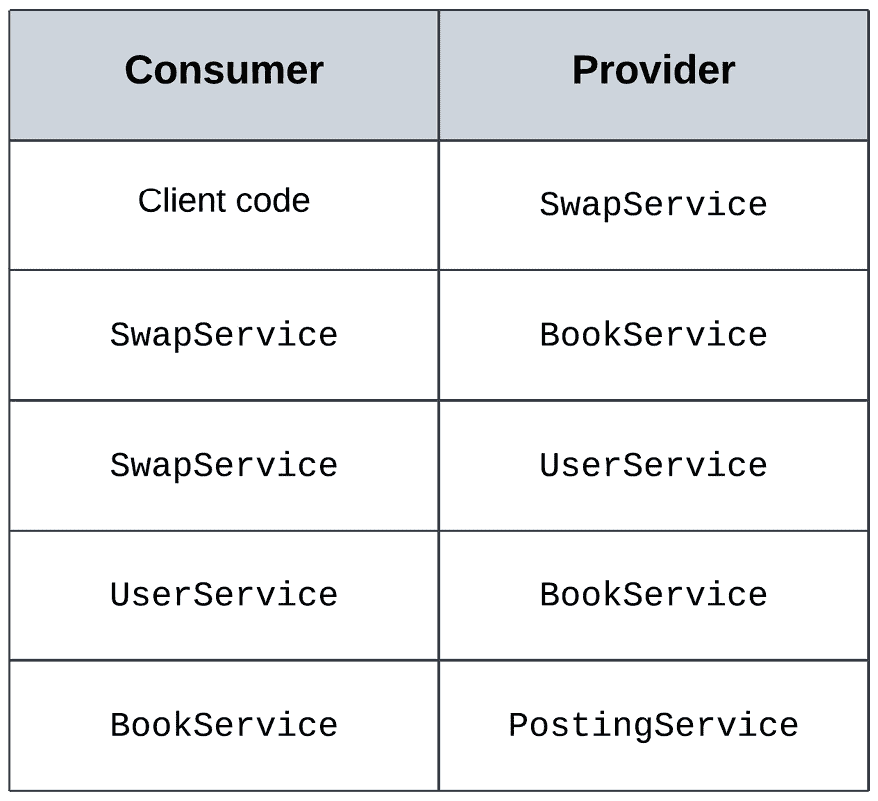

# 测试微服务架构

我们迄今为止涵盖的主题已经超出了如何编写测试的范围。我们探讨了广泛的软件设计和开发问题，包括使用 Docker 的容器化和与 PostgreSQL 的数据库集成。这突出了编写良好测试需要彻底了解待测试应用程序的架构和技术依赖性的事实。

除了这些软件开发概念之外，我们在*第七章*“Go 中的重构”中讨论了代码的演变。我们学习了一些常见的重构技术，并将单体应用程序与微服务架构进行了比较，这是 Go Web 应用程序随着成长和成熟而常见的演变。

我们将继续探索微服务架构和从上一章开始的重构。由于微服务通常由不同的软件团队拥有和开发，它们经常在没有中央监管的情况下进行更改。在这个快速变化的需求和实现的世界中，确保我们系统中的 API 集成点仍然正确运行是克服的最大挑战之一。另一个需要考虑的关键问题是系统中的错误检测——当出现问题的时候，如何在庞大的依赖图中隔离出故障的服务？

本章致力于讨论微服务架构的测试，以之前章节中介绍的单体`BookSwap` Web 应用程序为例。我们将更深入地了解非功能性测试的实施，这在之前的章节中已有简要讨论。然后，我们将学习合同测试的新概念以及如何利用 Pact 在微服务架构上实施合同。最后，我们将讨论如何将迄今为止构建的单体`BookSwap` Web 应用程序拆分。使用我们学到的概念和挑战，我们将讨论在生产环境中运行微服务的最佳实践。

在本章中，我们将涵盖以下主题：

+   非功能性测试的实施

+   测试微服务架构的挑战

+   使用 Pact 开始合同测试

+   拆分我们迄今为止构建的`BookSwap`单体

+   生产环境中运行微服务架构的最佳实践

# 技术要求

您需要安装**Go 版本 1.19**或更高版本才能运行本章中的代码示例。安装过程在官方 Go 文档[`go.dev/doc/install`](https://go.dev/doc/install)中有描述。

本书包含的代码示例在[`github.com/PacktPublishing/Test-Driven-Development-in-Go/chapter08`](https://github.com/PacktPublishing/Test-Driven-Development-in-Go/chapter08)公开可用。

# 功能性和非功能性测试

我们在*第一章*“掌握测试驱动开发”中简要介绍了非功能性测试的主题。到目前为止，我们推迟了这种重要类型的测试，并专注于验证各种功能方面，同时探索流行的测试库`testify`、`ginkgo`和`GoDog`。现在让我们探讨如何实现一些最重要的非功能性测试。

*图 8**.1*展示了主要的非功能性测试类型：



图 8.1 – 性能和正确性非功能性测试类型

测试类型分为**性能测试**和**可用性测试**。它们验证我们系统以下方面的内容：

1.  **负载测试**模拟对我们系统的用户需求。这些测试模拟预期需求和过载条件，以确定瓶颈或性能问题。

1.  **压力测试**模拟在极端条件下对我们系统的用户需求。这些测试用于确定我们系统的可扩展性限制，并验证当组件过载时，系统可以优雅地处理错误。

1.  **体积测试**模拟大量数据进入我们的系统。这与压力测试类似，但涉及相对大量数据的几个测试，而不是许多涉及较小数据量的测试来模拟用户需求。这些测试用于确定我们的系统可以处理的数据限制，这对于具有数据库/持久存储解决方案的服务特别有用。

1.  **可扩展性测试**验证我们的系统在突然负载下扩展其组件的能力。负载可以逐渐应用，也可以突然应用，这被称为**峰值测试**。

1.  **故障转移测试**验证我们的系统在故障后的恢复能力。这种类型的负面测试是对系统在事件发生后恢复速度的有用模拟。

1.  **配置测试**验证我们的系统在不同类型设置下的行为。它们可以是用户控制的设置或系统设置。系统设置可以改变系统的预期行为，以及其性能。

1.  **可用性测试**验证用户界面功能的使用直观性。这种测试的重点根据系统公开的功能而变化，但通常包括以下内容：

    1.  对于新用户来说，系统使用起来有多直观

    1.  用户完成任务有多容易

    1.  错误信息是否表述良好并能引导用户

1.  **安全测试**验证在开发过程中是否遵循了安全实践。被测试的系统应具有正确的身份验证、授权和数据完整性功能。

正如我们所见，非功能性测试对于确保我们的系统在各种条件下正确运行至关重要。没有涵盖这些重要测试类型的测试策略是不完整的。

非功能性测试验证了我们系统的关键方面

这些测试验证了被测试系统的性能和可用性，包括系统扩展和从故障中恢复的能力。这些类型的测试可能由不同的开发团队执行，因为它们可能需要来自工程团队之外的技术来实现。

## Go 语言中的性能测试

虽然我们已经确定非功能性测试涵盖了重要方面，但在从单体应用迁移到微服务架构时，性能测试变得更加重要。在微服务世界中，用户旅程各不相同，并由独立的系统组件处理，这可能导致对系统行为的整体视图不够一致。

*图 8.2*2 描述了性能测试回答的关键问题：



图 8.2 – 性能测试回答的关键问题

性能测试回答的两个重要问题与系统可用性和可扩展性相关。让我们看看每个问题意味着什么。

### 系统是否可用？

用户体验不仅仅是实现正确的功能，因为一个运行缓慢的系统最终会对用户满意度产生负面影响。性能测试有助于评估以下方面：

+   **稳定性**：不应发生间歇性故障，导致重试和负面用户体验。

+   **速度**：用户请求应保持在根据业务要求设定的可接受水平内，或者系统应适当扩展。

+   **错误处理**：错误应该优雅地处理，没有突然崩溃，并且在各种场景中应返回精心设计的消息。

+   **用户负载**：系统应该能够处理预期的用户负载，而不会导致意外的 CPU 或用户内存峰值。

### 系统是否可扩展？

商业和系统需求会随着时间而演变。一个可扩展的系统应该能够根据预期的未来业务需求进行增长。性能测试有助于评估以下方面：

+   **瓶颈**：监控各种指标使我们能够识别出我们系统中哪些服务不可扩展，并且应该进行重构。

+   **单个部分**：了解每个微服务的预期响应时间以及整个系统的估计响应时间很重要。这可以帮助我们为系统中的每个用户操作映射成本。

+   **增长空间**：性能测试使我们能够确定系统在其当前形式下还能承受多少用户和流量的增长。

当正确使用时，性能测试将确保每个微服务能够处理系统的当前负载，并且它们能够协同工作以正确地服务用户旅程。

“小规模且频繁”的方法

性能测试通常作为代码构建管道的一部分添加，以便开发团队在每次提交时都能立即获得性能反馈。与重构类似，性能改进最好是小规模且频繁进行。每次提交时监控性能将更容易看到任何趋势并快速修复新问题。

性能测试的全部内容都是量化比较我们的系统和其微服务的行为。我们如何实现这种量化？这通常是通过收集一些重要的指标来实现的：

+   **响应时间**：从用户请求到系统响应返回给用户所需的时间。通常，会测量**平均**和**峰值**响应时间，以提供对最坏情况和平均情况的指示。

+   **错误率**：系统处理的总请求数中错误案例的百分比。在 RESTful API 中，错误响应可以通过 HTTP 状态码轻松识别。

+   **CPU 和内存使用率**：微服务在其主机上使用的 CPU 和内存百分比。这些指标将显示系统是否正确扩展。

+   **并发用户**：同时请求特定资源的用户数量。这可以很容易地识别用户路径特定端点的任何峰值。

+   **数据吞吐量**：系统处理的数据量。这可以表明用户请求是否随时间增加，或者是否有大文件流入系统并影响性能。

在我们编写任何性能测试之前，测试系统应具备对这些指标的监控和警报功能。此外，我们应该根据系统的需求确定性能测试的失败标准。

虽然你应该始终与关键利益相关者一起确定阈值值，但我们可以根据经验和行业实践提出一些一般性建议：

+   平均响应时间通常应低于 500 毫秒，而峰值响应时间应低于 1 秒

+   错误率通常应低于 5%

+   CPU 和内存使用率通常应保持在 70%以下，以便系统可以处理可能出现的任何峰值

+   并发用户和数据吞吐量没有任何失败阈值，但应监控峰值和异常

现在我们已经了解了性能测试的重要性以及如何量化比较其结果，我们可以将注意力转向它们的实施。我们可以使用 Go 的`testing`标准框架或流行的第三方库来实现它们。

## 实施性能测试

在 *第二章*，*单元测试基础* 中，我们学习了如何使用 Go 的标准测试库编写和执行基准测试，这些是用于验证我们代码性能的特殊测试。我们还学习了如何从 Go 的测试运行器导出测试覆盖率指标。

我们可以使用基准测试为我们的端点编写性能测试。例如，我们可以轻松地为 `BookSwap` 应用的 `GET /` 根端点编写基准测试：

```go
func BenchmarkGetIndex(b *testing.B) {
  endpoint := getTestEndpoint(b)
  for x := 0; x < b.N; x++ {
    bks, err := http.Get(*endpoint)
    assert.Nil(b, err)
    assert.NotNil(b, bks)
  }
}
```

我们根据预期的签名创建一个新的基准测试，接受一个单个的 `*testing.B` 参数，并以 `Benchmark` 前缀命名。然后，我们利用标准的 `http` 库在定义的端点上调用 `GET` 操作，该操作由 `getTestEndpoint` 辅助函数返回。正如前几章所提到的，这个函数根据提供的环境变量构建端点。如果您想使用默认值运行，请将 `BOOKSWAP_BASE_URL` 环境变量设置为 `http://localhost`，并将 `BOOKSWAP_PORT` 环境变量设置为 `3000` 到您的终端会话中。

我们将这个测试保存在 `chapter08/performance/books_index_test.go` 文件中。在编写了简单的测试之后，我们需要确保 `BookSwap` 应用程序正在运行。我们可以轻松地使用 `docker compose -f docker-compose.book-swap.chapter08.yml up --build` 命令来运行它。正如前几章所提到的，记得在运行之前设置 `BOOKSWAP_PORT` 环境变量。如果您使用默认配置运行，则可以使用 `3000` 作为其值。

接下来，我们需要运行基准测试。`go test` 命令提供了与我们在 *第二章*，*单元测试基础* 中提取代码覆盖率详情类似的方式来支持基准测试。`runtime/pprof` 包提供了以下预定义的配置文件选项：

+   `cpu` 展示了我们的程序在哪里使用 CPU 循环

+   `heap` 展示了我们的程序在哪里进行内存分配

+   `threadcreate` 展示了程序在哪里需要新的线程

+   `goroutine` 展示了程序中所有 goroutines 的堆栈跟踪

+   `block` 展示了 goroutines 在等待锁定原语的地方

+   `mutex` 报告锁定竞争

我们将在 *第九章*，*测试并发代码的挑战* 中探讨线程、goroutines 和互斥锁的并发方面。现在，我们将专注于 CPU 分析。

我们使用两个配置文件选项运行我们新编写的基准测试，这将允许我们提取 CPU 配置文件：

```go
$ go test -bench BenchmarkGetIndex -cpuprofile cpu-books.out ./chapter08/performance
```

基准测试运行器输出了我们在介绍章节中看到的结果：

```go
pkg: github.com/PacktPublishing/Test-Driven-Development-in-Go/chapter08/performance
BenchmarkGetIndex-8         1556            796124 ns/op
PASS
ok      github.com/PacktPublishing/Test-Driven-Development-in-Go/chapter08/performance  2.600s
```

由于我们的索引端点相当简单，基准测试执行了 1,556 次，总运行时间为 2.6 秒。此命令运行基准测试并指示测试运行器将 CPU 配置文件保存到当前运行目录下的`cpu-books.out`文件。测试运行的详细信息保存在名为测试声明的包的`performance.test`文件中。

我们可以使用与 Go 工具链一起安装的`pprof`命令行工具查看该文件：

```go
$ go tool pprof performance.test cpu-books.out
```

这将打开一个交互式命令，使我们能够对测量的 CPU 时间有所了解。该命令将给出顶部配置文件结果的文本输出，而`web`将创建相同结果的视觉表示。在我们的基准测试的 CPU 配置文件上运行`top5`将展示以下五个结果：

```go
(pprof) top5      
Showing nodes accounting for 550ms, 80.88% of 680ms total
Showing top 5 nodes out of 91
  flat  flat%   sum%   cum   cum%
  180ms 26.47% 26.47%  180ms 26.47% runtime.pthread_cond_signal
  120ms 17.65% 44.12%  120ms 17.65% runtime.kevent
  100ms 14.71% 58.82%  100ms 14.71% runtime.cgocall
  80ms  11.76% 70.59%  120ms 17.65% runtime.pthread_cond_wait
  70ms  10.29% 80.88%  80ms  11.76% syscall.syscall
```

这些顶级结果占运行时间的 80%以上，但它们似乎仅与基准测试的运行和调度本身有关。由于基准测试被调度并运行数千次，我们可以预期测试运行器将需要使用相当多的 goroutines 和 threads 来执行测试。然而，这对于了解我们的`BookSwap`Web 应用程序的操作并不是非常有用的输出。由于 Web 应用程序在完全不同的进程中运行，与基准测试分离，我们无法从基准测试中分析我们的 Web 应用程序。

为了深入了解我们的`BookSwap`应用程序的 CPU 使用情况，我们需要将`pprof`工具集成到我们的 Web 应用程序中。通过允许`pprof`在我们的`handlers/config.go`中的其他处理器旁边注册自己，这样做很容易：

```go
func ConfigureServer(handler *Handler) *mux.Router {
  router := mux.NewRouter().StrictSlash(true)
  // other handler functions
  if os.Getenv("DEBUG") != "" {
    router.PathPrefix("/debug/pprof/").
      Handler(http.DefaultServeMux)
}
  return router
}
```

如果在启动应用程序时设置了`DEBUG`环境变量，`pprof`现在将能够服务所有配置了`debug/pprof`前缀的路径。我们可以通过在`docker.env`中添加`DEBUG=true`行轻松设置它。然后我们可以使用`docker compose -f docker-compose.book-swap.chapter08.yml up --build`命令以调试模式重新运行应用程序。这允许我们在特定环境中选择性地公开此端点。我们现在已准备好分析我们的 Web 应用程序。我们重新运行基准测试，它将花费大约 3 秒钟的时间运行。然后我们可以以与导出基准测试配置文件结果相同的方式将结果下载到本地文件：

```go
$ curl --output book-swap-app "http://localhost$BOOKSWAP_PORT/debug/pprof/profile?seconds=10"
```

在本例中，由于应用程序在本地运行，URL 是`localhost:$BOOKSWAP_PORT`，但我们会根据其他环境和配置更改它。此命令从过去 10 秒下载分析数据并将其保存到本地文件。然后我们可以像以前一样查看导出的结果：

```go
$ go tool pprof book-swap-app
```

此命令将打开与之前相同的交互式屏幕，但我们将现在选择使用`web`命令查看 CPU 的视觉表示。这将在一个默认浏览器窗口中启动一个图表，显示已配置文件分析的函数调用。

图形可视化

Go 的性能分析工具`pprof`依赖于外部依赖项进行图形可视化。这个依赖项名为`graphviz`，它不是用 Go 编写的，因此不会自动与 Go 工具链一起安装。您应该遵循官方文档([`graphviz.org/download/`](https://graphviz.org/download/))来为您的操作系统安装它。

*图 8**.3*展示了在基准测试索引端点时测量的 CPU 性能使用情况的视觉表示：



图 8.3 – BookSwap CPU 性能分析的视觉表示

从 CPU 性能分析中我们可以看出，`BookSwap`应用程序在服务 HTTP 连接和通过`GORM`库与数据库层交互时消耗了大部分资源。这可以通过对应每个操作的百分比和框的大小来表示。调用栈的视觉表示为我们提供了资源消耗情况的良好指示。我们在*第六章*中探讨了`BookSwap`应用程序的数据库方面，*《BookSwap Web 应用程序的端到端测试》*。如果我们想提高应用程序的性能，我们可以使用配置文件中提供的信息来识别需要改进的调用栈区域。

虽然基准测试允许我们创建简单的测试并模拟各种负载测试场景，但在许多不同的微服务中定义测试场景可能会相当冗长。有两个流行的开源库经常用于性能测试：

+   `testing`包。可以配置不同类型的负载。JMeter 在测试运行后也有生成结果图表和仪表板的能力。

+   **K6** ([`k6.io/`](https://k6.io/))是由 Grafana 维护的开源 Go 项目。测试计划是用类似于 JavaScript 的脚本语言编写的，这减少了编写测试场景所需的代码量。K6 提供了不同类型的负载配置，并且也有将测试结果输出到仪表板的能力。

+   **Gatling** ([`gatling.io/open-source/`](https://gatling.io/open-source/))是由 Gatling Corp 维护的开源 Scala 负载测试工具。与 K6 类似，测试是用领域特定语言编写的，但它基于 Scala。这个库提供了负载测试和在仪表板上的洞察力。

无论您选择哪种性能测试实现选项，您都可以对应用程序进行性能分析，并补充它提供的数据和图表。我们在这本书中不会探讨这些第三方工具，因为我们已经使用了 Go 内置的基准测试功能来编写我们的性能测试。

Go 配置文件是一个功能非常强大的工具，比我们在这里探索的具有更多功能。您可以在官方文档中了解更多关于 Go 的诊断功能（[`go.dev/doc/diagnostics`](https://go.dev/doc/diagnostics)）。

配置文件测试和应用

虽然我们没有直接使用我们运行的基准测试的配置文件信息，但配置文件测试可以是一种有用的方式来调查成本高昂或运行缓慢的测试。因此，了解如何导出和读取配置文件信息对于开发和测试编写都很有用。

# 合同测试

如*第七章*中所述，*Go 语言的重构*，微服务架构相对于单体应用具有许多优势：能够独立扩展系统组件，更小的代码库，易于维护，以及一个不太容易发生故障的系统。然而，当组织采用微服务架构时，工作流程的开发和测试会发生变化。这也带来了挑战，以及微服务架构的巨大好处。

*图 8**.4* 展示了微服务架构带来的三种复杂性类型：



图 8.4 – 微服务架构的复杂性

微服务架构增加了开发过程中的每个部分的复杂性：

1.  **开发复杂性**：每个微服务的源代码通常包含在其自己的独立代码库或仓库中。这导致由于以下组件而使开发过程变得复杂：

    1.  **服务设计**必须在多个服务之间保持一致。每个工程团队必须设计多个服务，而不是创建一个单体应用然后对其进行修改。

    1.  与服务设计相关，**数据分离和结构**也必须进行设计。每个微服务负责将其自己的数据保存到持久存储，并在需要时将信息发送到其他服务。如果没有进行任何设计，服务将需要来回传递数据，从而增加响应时间。

    1.  最后，团队将需要为每个服务实施**测试**。如果服务公开面向用户的功能，它将需要在测试金字塔的每个级别进行测试。这将增加系统所需的测试数量，尽管它们可能更快且测试的功能范围更小。

1.  **部署复杂性**：每个微服务都是其自己的独立运行应用程序。这导致由于以下组件而使部署管道变得复杂：

    1.  由于每个微服务及其依赖项的分离，开发团队在**基础设施维护**方面承担更高的负担。当服务需要不同类型的依赖项或版本时，这可能会变得更加复杂，因为随着系统的成熟和微服务没有同时更新。

    1.  当涉及到进行更改时，**发布策略**变得更加复杂，因为系统内部的依赖关系变得更加复杂。所有对数据结构或 API 更改的更新，包括服务，都不是直接面向用户的，因为它们可能会在系统其他地方造成故障。

    1.  **部署自动化**成为必要条件，以便使团队能够轻松构建和发布服务。测试还必须添加到发布管道中，以最大限度地减少故障风险。

1.  **组织复杂性**：团队可以同时开发和发布多个服务，这导致生产力提高，但也由于以下组件而带来组织挑战：

    1.  通常，微服务的数量远远超过工程团队的数量，在某些情况下甚至超过工程师！因此，**服务所有权**扩展到每个团队多个服务。这给团队增加了维护复杂性，他们必须在与交付新功能的同时管理这些复杂性。

    1.  团队必须就结构化和实现其服务的方式达成共识，以便工程师可以在团队之间工作，以及在整个系统中调查服务。因此，工程组织将不得不进行某种设计实施标准化过程。这可能是一项相当艰巨的任务，因为团队将有不同的需求或偏好。

    1.  最后，**团队之间的沟通**将需要有效地处理更大的系统级变更，以避免故障。这对快速增长的团队来说可能很困难。

通过一个坚实的测试策略，可以减轻微服务架构引入的复杂性，该策略会在它们在整个系统中造成故障之前标记出任何错误或损坏。如前所述，必须测试微服务之间的集成点，因为团队将在没有中央监督的情况下发布他们拥有的服务的更改。

*图 8**.5* 展示了我们可以如何利用我们迄今为止获得的知识来测试两个微服务之间的集成：



图 8.5 – 测试两个微服务之间的集成

在测试两个服务之间的集成时，有两种选择：

+   **选项 A：使用真实服务的集成测试**涉及在测试环境中编写真实服务之间的集成测试。这种方法使我们能够验证两个服务是否按预期运行，以及它们的集成是否成功。然而，随着系统的发展，设置每个服务和其依赖关系变得更加复杂。由于数据和请求需要跨越多个微服务或数据存储，单个测试运行也会变慢。

+   **选项 B：使用模拟器的集成测试**涉及为依赖项编写针对模拟器的单独集成测试。这种方法允许我们缩小测试范围并确保每个服务按预期工作。然而，由于它独立测试每个服务，实际上并没有验证服务是否按预期协同工作。如果任一服务不符合其定义的模拟器，则测试将通过，尽管我们可能正在创建中断。这与我们在*第三章*中识别的问题相同，*模拟和* *断言框架*。

这两种选择都不是理想的，因为我们需要编写健壮的测试来验证我们的微服务是否良好集成，以便在没有中央监督的情况下对微服务进行更改。我们将探讨一种可以减轻每种方法缺点的方法。

## 合同测试基础

由于现有解决方案的缺点以及测试微服务架构的困难，开发者开始使用另一种测试实践。**合同测试**提供了一种更简单的方式来确保微服务能够良好集成。这并不是一个新概念，但它因为非常适合分布式架构而获得了认可。

开发者编写虚拟合同，定义两个微服务应该如何交互。此合同提供了事实依据，并代表测试断言的预期值。每个合同都有两面：

+   `BookService` 是消费者，因为它发送请求。

+   `PostingService` 是提供者，因为它发送响应。

根据这个术语，*图 8.6* 展示了编写和运行合同测试的流程：



图 8.6 – 编写和运行合同测试

简单程序包括以下步骤：

1.  **建立消费者和提供者**：我们首先确定我们想要测试哪些服务。在微服务架构中，这并不总是直接的。毕竟，我们没有可以依赖的代码覆盖率指标来查看哪些微服务集成尚未经过测试。

1.  **识别受测试的交互**：这一步骤相当于确定我们想要测试的用户旅程或编写我们的功能测试。这应包括 HTTP 方法、HTTP 请求体以及我们可能需要的任何 URL 参数。在此阶段，我们还应确定提供者预期的响应。

1.  **消费者单元测试**：作为开发过程的一部分，团队将为消费者服务编写单元测试。这将针对一个由**消费者团队拥有**的提供者模拟器进行。

1.  **提供者单元测试**：与消费者服务端相同，团队将在开发过程中为提供者编写单元测试，我们使用一个位于**提供者** **团队所有者**之下的消费者模拟。

1.  **记录消费者交互**：基于单元测试中确定的参数和交互，我们可以开始制定消费者和提供者之间的合约。消费者团队捕获服务之间所需交互，由消费者请求和预期的提供者响应组成。

1.  **合约**：消费者请求和提供者响应被记录在同一文件中，称为合约。它跨越团队界限，是两个团队的真实来源，使他们能够使用共同语言轻松协作。正如我们之前提到的，微服务架构增加了组织复杂性，因此合约可以帮助团队更有效地沟通。

1.  **验证合约与提供者**：合约中记录的消费者请求与提供者微服务运行。预期的提供者响应与从真实提供者微服务收到的响应进行验证。

只有当合约通过与合约两边的真实服务交互进行验证时，合约测试才被认为是通过的。然而，与需要单一团队同时运行消费者和提供者进行测试的集成测试不同，合约测试允许这种验证分两步进行，从而保持每个服务的团队所有权。

消费者视角

合约测试是从消费者开始的，这决定了请求和期望。这有助于我们确保 API 对使用其功能的服务是稳定的，鼓励不促进破坏性变更的稳定 API。

合约文件的内容是整个流程中最重要的一部分，确保它们不包含任何错误非常重要。确保这一点最安全的方法是使用帮助我们生成它们的工具，而不是手动编写。我们不会尝试手动实现合约测试，而是查看使用最受欢迎的工具的过程。

## 使用 Pact

现在我们已经了解了合约测试的基本流程，我们可以看看一些工具，这些工具通过帮助我们生成合约和运行测试来简化流程。Pact ([`github.com/pact-foundation`](https://github.com/pact-foundation)) 是一个流行的开源合约测试工具，它允许我们轻松编写合约测试。它自 2013 年以来一直在运行，并迅速成为实施合约测试的首选。

Pact 的一些主要功能如下：

+   **同步和异步支持**：Pact 允许对 HTTP 端点以及异步非 HTTP 消息系统进行合同测试。它支持多种技术，如 Kafka、GraphQL 和发布/订阅消息模式。

+   **超过十种语言的库**：Pact 为前端和后端技术提供广泛的语言支持。Pact Go 库([`github.com/pact-foundation/pact-go`](https://github.com/pact-foundation/pact-go))为我们提供了测试 Go 微服务所需的功能。

+   **单元测试集成**：消费者代码库导入 Pact Go 库并使用它来编写单元测试。这允许开发者使用与编写单元测试相同的流程和技术进行合同测试。

+   **合同测试领域特定语言（DSL）**：Pact 库为项目提供了一个编写合同测试的通用 DSL。这允许开发者以统一的方式定义交互和预期响应。

+   **测试回放和验证**：基于测试规范，Pact 生成并记录测试运行。合同测试被称为 pacts，它们将与提供者服务进行回放和验证。

+   **代理服务**：Pact 提供了一个自托管的代理解决方案，允许轻松共享和验证合同和测试结果。此解决方案适用于生产系统并将合同测试集成到发布管道中。

这个功能列表是 Pact 迅速成为合同测试工具首选的原因。我们可以轻松使用 Pact Go 库实现合同测试步骤。

Pact 提供了一种易于安装的本地二进制文件，其中包含各种命令行工具，这些工具提供了测试同步和异步基于消息交互的功能：

+   在项目发布页面上找到工具的最新版本([`github.com/pact-foundation/pact-ruby-standalone/releases`](https://github.com/pact-foundation/pact-ruby-standalone/releases))。此页面还将包含适用于您操作系统的安装说明。

+   Pact Go 库支持 Go 模块，可以使用以下常用命令轻松添加到项目中：`go` `get github.com/pact-foundation/pact-go`。

将 Pact 工具添加到系统路径

如 Pact 设置说明中详细说明，请记住将`pact/bin`目录的路径添加到您的系统路径中。Go 测试运行器需要在测试运行和验证期间调用 Pact 工具。

安装将安装一些不同的工具，我们可以在合同测试期间使用它们。您可以自行探索它们。以下是一些最常用的工具：

+   `pact-mock-service`提供了模拟和存根功能。它可以帮助我们在合同测试期间轻松地为我们的提供者创建模拟。

+   `pact-broker` 提供启动之前提到的代理服务的功能，这使得共享合约和验证结果变得容易。它还允许您独立部署，包括使用 Docker。

+   `pact-provider-verifier` 提供对 pacts 两个版本的验证，无论值是否来自 Pact Broker 或其他来源。验证器通常添加到发布管道中，节省了实现自己的开发工作量。

工具安装完成后，我们可以查看一个针对 `GET /` 根端点的可能客户端的简单测试示例：

```go
func TestConsumerIndex_Local(t *testing.T) {
  // Initialize
  pact := dsl.Pact{
    Consumer: "Consumer",
    Provider: "BookSwap",
  }
  pact.Setup(true)
  // Test case - makes the call to the provider
var test = func() (err error) {
    baseURL, ok := os.LookupEnv("BOOKSWAP_BASE_URL")
    require.True(t, ok)
    url := fmt.Sprintf("%s:%d/", baseURL, pact.Server.Port)
    req, err := http.NewRequest("GET", url, nil)
    assert.Nil(t, err)
    req.Header.Set("Content-Type", "application/json")
    resp, err := http.DefaultClient.Do(req)
    assert.Nil(t, err)
    assert.NotNil(t, resp)
    return
   }
   t.Run("get index", func(t *testing.T) {
     pact.AddInteraction().
     Given("BookSwap is up").
     UponReceiving("GET / request").
     WithRequest(dsl.Request{
       Method: "GET", Path: dsl.String("/"),
       Headers: dsl.MapMatcher{
         "Content-Type":  dsl.String("application/json"),
       }
     }).
     WillRespondWith(dsl.Response{
       Status: https.StatusOK,
       Body: dsl.Like(handlers.Response{
         Message: "Welcome to the BookSwap Service!",
       }),
      })
      require.Nil(t, pact.Verify(test))
    })
    // Clean up
    require.Nil(t, pact.WritePact())
    pact.Teardown()
}
```

仔细观察客户端测试，我们可以看到使用 Pact 编写合同测试与使用 Go 的标准测试库编写单元测试并没有太大区别：

1.  测试的签名与单元测试相同，遵循测试命名约定，并接受单个 `*testing.T` 参数。

1.  Pact DSL 被初始化，我们使用 `Setup()` 函数启动 Pact Mock Server。Pact 将在本地机器上找到一个空闲端口，然后启动服务器。

1.  我们创建一个不接受任何参数并返回单个错误的测试用例函数：`func() error`。此函数包装了调用提供者的消费者代码，包括设置所需的任何请求。由于我们在 `BookSwap` 应用程序上没有专门的客户端服务，我们只需使用 `http` 库调用它。

1.  一切设置完成后，我们可以在子测试中运行测试用例。这允许我们使用迄今为止看到的相同测试技术，包括我们在 *第四章* 中探索的表驱动测试，*构建高效的测试套件*。

1.  在每个子测试中，我们使用 `AddInteraction()` 函数定义一个新的 Pact 交互，该函数设置合同测试的所有先决条件，包括启动 Mock Server（如果正在运行）。

1.  返回的 `dsl.Interaction` 类型允许我们配置描述消费者和提供者之间合同所需的所有属性：请求和响应体、头部、查询参数、状态码等。

1.  一切测试用例和预期行为设置完成后，我们使用 `Verify` 函数验证行为是否如预期，该函数接受已定义消费者配置的测试用例。

1.  最后，我们在文件中记录交互并调用 `Teardown` 函数，该函数停止 Pact Mock Server。默认情况下，Pact 将合约保存在项目中的 `pacts` 文件夹内。

我们可以像运行任何集成测试一样运行这个测试。这次测试运行的结果如下：

```go
$ LONG=true go test chapter08/contract_test/consumer_test.go -v === RUN   TestConsumerIndex_Local
2023/01/08 16:19:36 [INFO] checking pact-mock-service within range >= 3.5.0, < 4.0.0
2023/01/08 16:19:36 [INFO] checking pact-provider-verifier within range >= 1.36.1, < 2.0.0
2023/01/08 16:19:37 [INFO] checking pact-broker within range >= 1.22.3
2023/01/08 16:19:37 [INFO] INFO  WEBrick 1.3.1
2023/01/08 16:19:37 [INFO] INFO  ruby 2.4.10 (2020-03-31) [x86_64-darwin19]
2023/01/08 16:19:37 [INFO] INFO  WEBrick::HTTPServer#start: pid=83017 port=52412
=== RUN   TestConsumerIndex_Local/get_index
2023/01/08 16:19:37 [INFO] INFO  going to shutdown ...
2023/01/08 16:19:38 [INFO] INFO  WEBrick::HTTPServer#start done.
--- PASS: TestConsumerIndex_Local (1.67s)
    --- PASS: TestConsumerIndex_Local/get_index (0.01s)
PASS
ok      command-line-arguments  1.828s
```

命令的输出表明，`TestConsumerIndex_Local`测试是在 Pact Mock Server 上运行的，并且通过了。pact 也被写入到`pacts/consumer-bookswap.json`文件中。该文件包含消费者和提供方之间由测试描述的指定交互。

消费者在合同规范中指定了他们期望从提供方获得的行为。因此，提供方验证要简单得多：

```go
func TestProviderIndex_Local(t *testing.T) {
  // Initialise
  pact := dsl.Pact{
    Provider: "BookSwap",
  }
  url := getTestEndpoint(t)

  // Verify
  _, err := pact.VerifyProvider(t, types.VerifyRequest{
    ProviderBaseURL: url,
    PactURLs:        []string{PACTS_PATH},
  })
  require.Nil(t, err)
}
```

这个简单的片段包含了在提供方进行验证所需的一切：

1.  我们将提供方验证定义为单元测试，就像我们在消费者端所做的那样。

1.  当我们针对实际服务运行提供方验证时，我们不需要启动 Pact Mock Server，而是初始化 Pact DSL。

1.  我们调用`VerifyRequest`函数，传入提供方的 URL 和消费者定义的合同路径。这通过运行消费者测试生成，如前所述。

提供方的 URL 和合同定义的路径是在此测试范围之外定义的，这使得我们可以在不同的环境中运行此测试。一旦使用我们之前看到的 Docker 命令启动了`BookSwap`应用程序，我们就可以运行提供方验证：

```go
$ LONG=true go test chapter08/contract_ test/provider_test.go -v 
=== RUN   TestProviderIndex_Local
2023/01/08 17:46:09 [INFO] checking pact-mock-service within range >= 3.5.0, < 4.0.0
2023/01/08 17:46:09 [INFO] checking pact-provider-verifier within range >= 1.36.1, < 2.0.0
2023/01/08 17:46:09 [INFO] checking pact-broker within range >= 1.22.3
=== RUN   TestProviderIndex_Local/Pact_between__and__
=== RUN   TestProviderIndex_Local/has_status_code_200
    pact.go:638: Verifying a pact between Consumer and BookSwap Given BookSwap is up GET / request with GET / returns a response which has status code 200
=== RUN   TestProviderIndex_Local/has_a_matching_body
    pact.go:638: Verifying a pact between Consumer and BookSwap Given BookSwap is up GET / request with GET / returns a response which has a matching body
--- PASS: TestProviderIndex_Local (1.52s)
    --- PASS: TestProviderIndex_Local/has_status_code_200 (0.00s)
    --- PASS: TestProviderIndex_Local/has_a_matching_body (0.00s)
    --- PASS: TestProviderIndex_Local/Pact_between__and__ (0.00s)
PASS
ok      command-line-arguments  1.682s
```

提供方验证通过，因为从`BookSwap`应用程序返回的响应与我们已在消费者端指定的相符。我们现在已经成功编写并运行了我们的第一个 Pact 测试！所有与合同测试库的交互都是通过一个简单的 Go 库进行的，这也使我们能够以与单元测试相同的方式编写合同测试。

正如我们所见，Pact 的力量在于它允许开发者轻松实现代码优先的合同测试，因此它绝对是一个你应该考虑添加到你的项目中的框架，与合同测试实践一起。

Pact Broker 的作用

在我们探讨的例子中，合同测试是在本地运行的，因此它们可以共享访问相同的合同文件。然而，在微服务架构或面向消费者的服务中这是不可能的。团队运行一个专用的 Pact Broker 服务，该服务可以作为他们希望编写和验证的合同的 URL。Pact Broker 可以很容易地通过 Docker 使用其在 Docker Hub 上的镜像来运行（[`hub.docker.com/r/pactfoundation/pact-broker/`](https://hub.docker.com/r/pactfoundation/pact-broker/))）。

# 分解 BookSwap 单体应用

本章的讨论主要集中在讨论微服务架构上，因为分布式系统已成为标准，你很可能在不久的将来必须处理这类系统。然而，BookSwap 应用程序仍然是一个单体应用。

基于我们在 *第七章* 中讨论的一些实践，“Go 中的重构”，我们可以讨论如何拆分 BookSwap 单体。*图 8**.7* 展示了我们可能创建的一些微服务：



图 8.7 – 分布式的 BookSwap 系统

分布式的 `BookSwap` 系统具有具有明确定义职责的微服务：

+   `SwapService` 是系统的入口点，负责处理和路由系统所有传入的用户请求。它直接依赖于 `BookService` 和 `UserService`，它们拥有 `SwapService` 所依赖的数据。

+   `UserService` 负责所有与用户管理相关的操作。该服务拥有持久存储 `UsersDB`，在系统中对它有完全的控制权。这种存储可以采取任何形式，但该服务必须能够支持 `SwapService` 所需的访问模式。该服务直接依赖于 `BookService`。

+   `BookService` 负责所有与书籍管理相关的操作。该服务拥有自己的专用持久存储 `BooksDB`，在系统中对它有完全的控制权。该服务直接依赖于 `PostingService`，这是一个对 `BookSwap` 系统外部的服务。

避免共享数据库

`BookService` 和 `UserService` 被设计为拥有自己的专用数据库，而不是共享一个单一的持久存储。这使我们能够在两个微服务之间强制执行数据分离，并确保数据库故障不会导致两个服务都出现故障。

这个简单的 `BookSwap` 系统来自 *图 8**.7*，是我们如何拆分 `BookSwap` 单体的起点。正如我们所见，服务之间存在依赖关系，因此它们必须支持消费者所需的访问模式。单体拆分过程的下一步是设计不同服务的 API。

*图 8**.8* 展示了服务可能公开的 API 调用：



图 8.8 – BookSwap 微服务的端点

如前所述，`SwapService` 是唯一面向用户的服务，其他服务都是直接依赖于它的。我们可以看到 `BookSwap` 服务中不同域的以下访问模式：

+   书籍可以通过其主 ID 和所有者用户 ID 访问。这种通过两个索引的访问模式必须实现，以满足 `SwapService` 的要求。

+   用户和书籍之间存在 **一对多关系**。如果我们使用 SQL 数据库，那么用户 ID 就是书籍表的外键。这种依赖关系也可以在 NoSQL 表中实现，尽管它感觉更适合 SQL 数据库。

+   用户在相应的端点上使用相同的 `POST` 请求创建和更新。这符合 RESTful 设计实践，但这种合并操作应该在服务级别以下处理。

+   书籍通过 `POST` 请求创建，但使用其 ID 作为 URL 参数进行更新。第二次更新是交换端点的实现。

这些简单的访问模式可以很容易地使用 SQL 或 NoSQL 持久化存储解决方案实现。强烈建议 REST 端点使用 JSON 作为内容类型，尤其是在 Go 中，`encoding/json` 库原生支持 JSON 的序列化和反序列化。我们之前已经探讨了使用 PostgreSQL 的持久化存储，但大多数主要的 NoSQL 数据存储都有 Go 驱动程序。

`BookSwap` 单一应用程序直到现在都生活在单个代码库中，使开发者能够全面了解对应用程序所做的所有更改。然而，在微服务世界中，每个服务都有自己的代码仓库和团队所有权。

*图 8**.9* 展示了新微服务架构暴露的五个服务集成：



图 8.9 – 新微服务架构暴露的五个服务集成

微服务根据数据流和两个服务之间的请求流扮演消费者和提供者的角色：

+   客户端代码是发出请求到 `SwapService` 的消费者，它通过依赖 `BookSwap` 应用程序的其他服务来处理请求。

+   `SwapService` 作为消费者，因为它向 `BookService` 和 `UserService` 发出请求，以处理创建和更新它们相应的模型。

+   `UserService` 是消费者，`BookService` 是提供者，因为它检索属于用户的书籍列表。

+   `BookService` 是消费者，外部的 `PostingService` 是提供者，因为 `PostingService` 处理所有书籍交换的副作用，这是一个至关重要的细节，因为这些副作用是系统在现实世界中提供商业价值的原因。

测试 `BookService` 与外部 `PostingService` 之间的集成合同可以帮助我们验证版本升级，确保外部 API 继续与我们的系统良好集成。这是确保我们的系统及其所有依赖项持续成功运行的一个很好的方法。

从本节中`BookSwap`应用程序的例子中，我们可以看到，一旦领域和团队具备承担这一旅程的成熟度，单体应用程序可以转换为微服务架构。反过来，这给开发、测试和发布过程增加了不同的复杂性。这种复杂性随后使解决方案和团队能够进行扩展。一个稳固的测试策略，包括契约测试，可以帮助验证微服务架构的稳定性以及可扩展性。

# 生产最佳实践

我们将要探讨的微服务架构的最后一个方面是关于部署和发布的最佳实践。正如我们之前提到的，发布管道应该自动化，以便团队能够每天多次发布服务。在本节中，我们将简要探讨一些在迁移到微服务架构时需要考虑的常见模式和解决方案。

## 监控和可观察性

在微服务世界中，理解数据如何通过系统流动以及我们的系统健康状况可能很困难。这可以通过监控和可观察性解决方案得到缓解，它们为我们提供了所需的可视性。

可观察性与监控

可观察性和监控经常被互换使用，但它们有两个不同的预期目的：可观察性旨在为团队提供他们需要调试问题的数据，而监控旨在跟踪性能和识别服务异常。这意味着监控包含在可观察性中。观察结果需要从对业务有意义的价值观来考虑，以便提供对属性（如可用性、性能和容量）的可靠监控。

在本章前面的*Go 中的性能测试*部分，我们讨论了一些重要的性能指标。除了这些重要指标之外，还有`zap` ([`pkg.go.dev/go.uber.org/zap`](https://pkg.go.dev/go.uber.org/zap))、`logrus` ([`github.com/sirupsen/logrus`](https://github.com/sirupsen/logrus))和`apex/log` ([`github.com/apex/log`](https://github.com/apex/log))。

## 部署模式

虽然一个稳固的测试策略可以验证系统中的错误和性能问题，但没有任何代码更改或测试策略是完美的。部署模式将使我们能够逐步发布更改，从而更容易防止故障。以下有两种常见的模式：

+   **金丝雀部署**涉及将更改发布到一小部分流量中。如果金丝雀运行正常，那么我们将更改推广到更大比例的流量中。然而，如果金丝雀部署中记录的指标不是积极的，我们可以将流量回滚到仍然运行的应用程序的老版本，从而最小化处理负面更改后果所需的工作量。

+   **蓝绿部署**涉及维护要更改的微服务的两个版本。蓝色版本正在运行当前版本的服务，而绿色版本正在运行更新后的版本。一旦绿色版本通过测试，用户流量将被路由到绿色环境。在出现错误的情况下，流量可以路由回蓝色版本。一旦团队对绿色版本的功能正确性有信心，蓝色版本可以从运行环境中移除，或用于下一次迭代。

这两种流行的部署策略将使我们在推出微服务新版本时更容易避免中断，在错误率增加的情况下，我们可以快速回滚到之前的版本。这些策略得到了诸如 Kubernetes 和服务网格等工具的良好支持。

## 断路器模式

断路器模式是一种开发模式，它允许我们避免**级联故障**，即一个服务增加其他服务失败概率的过程。断路器通常封装对其他微服务的远程调用。一旦远程服务的调用错误率达到设定的阈值，断路器将立即拒绝其他请求，允许其他服务空间尝试恢复，并为用户提供清晰及时的反应来解释情况，而不是保持许多请求在空中。然后，开放的断路器在延迟后重试，如果远程服务可用，则变为关闭状态并能够传递进一步请求，如果问题持续，则再次变为开放状态。

一个流行的开源断路器实现是`hystrix-go` ([`github.com/afex/hystrix-go`](https://github.com/afex/hystrix-go))库，它实现了错误监控和重试。这种模式简单，同时也要求我们考虑所有远程调用的默认值和回退行为。对依赖故障的错误情况的显式实现为我们的微服务架构带来了额外的弹性。

这就带我们结束了对微服务架构实现和测试的探索。正如我们在本章中看到的，一个全面的测试策略将使我们能够充分利用微服务的力量，但我们必须意识到开发过程中的差异，以便能够有效地与微服务架构一起工作。

# 概述

在本章中，我们讨论了如何测试微服务架构。在前面章节中专注于功能测试之后，我们首先探索了非功能测试。然后，我们更详细地研究了性能测试，这是一种特别重要的非功能测试类型。然后，我们探讨了微服务架构给开发过程带来的复杂性，并学习了如何通过合同测试帮助验证 API 集成。

我们学习了如何使用 Pact 工具编写使用与开发者为单元测试使用的相同技术和流程的合同测试。最后，我们探讨了如何拆分单体`BookSwap`应用程序，包括我们将编写哪些服务、端点和合同测试。

在*第九章*《测试并发代码的挑战》中，我们将探讨 Go 中的并发复杂问题。我们将学习 Go 并发的基础知识，然后探索并发引入的测试挑战。

# 问题

1.  功能测试和非功能测试之间的区别是什么？

1.  性能测试应该测量哪些关键指标？

1.  性能测试如何确保系统可扩展？

1.  微服务架构有哪些好处？微服务架构引入了哪些类型的复杂性？

1.  合同测试是什么？

# 进一步阅读

+   《Web 应用程序安全：现代 Web 应用程序的利用和对策》，安德鲁·霍夫曼著，由 O'Reilly 出版

+   《生产就绪微服务：在工程组织内构建标准化系统》，苏珊·J·福勒著，由 O'Reilly 出版

+   《构建微服务：设计细粒度系统》，萨姆·纽曼著，由 O'Reilly 出版

+   《单体到微服务：转型单体应用的演进模式》，萨姆·纽曼著，由 O'Reilly 出版

# 第三部分：高级测试技术

最后部分致力于讨论测试复杂 Go 代码的更具挑战性的方面，因为前两节提供了测试应用程序所需的所有工具和技术。我们首先通过了解 Go 并发机制和并发不可测试的条件开始我们的探索，包括如何使用 Go 的竞态检测器。然后，我们通过利用模糊测试和基于属性的测试重新审视并扩展我们对边缘情况的测试，使我们能够用大量输入来测试我们的代码，以确保其健壮性。最后，我们探索如何利用 Go 最近引入的泛型能力来编写可以与不同类型一起工作的代码，学习如何将表驱动测试转换为验证泛型代码，并利用泛型创建自定义测试工具。

本部分包含以下章节：

+   *第九章*《测试并发代码的挑战》

+   *第十章*《测试边缘情况》

+   *第十一章*《与泛型一起工作》
