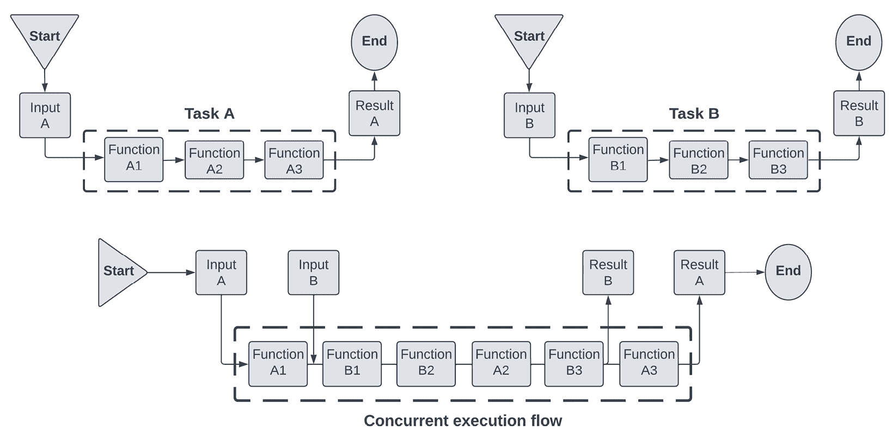
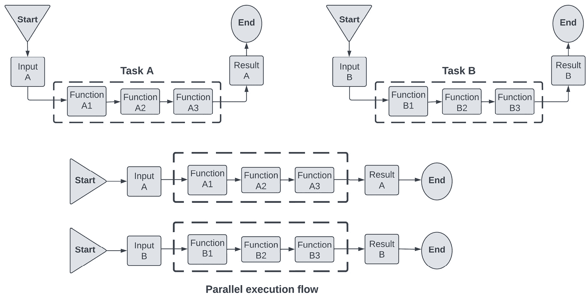
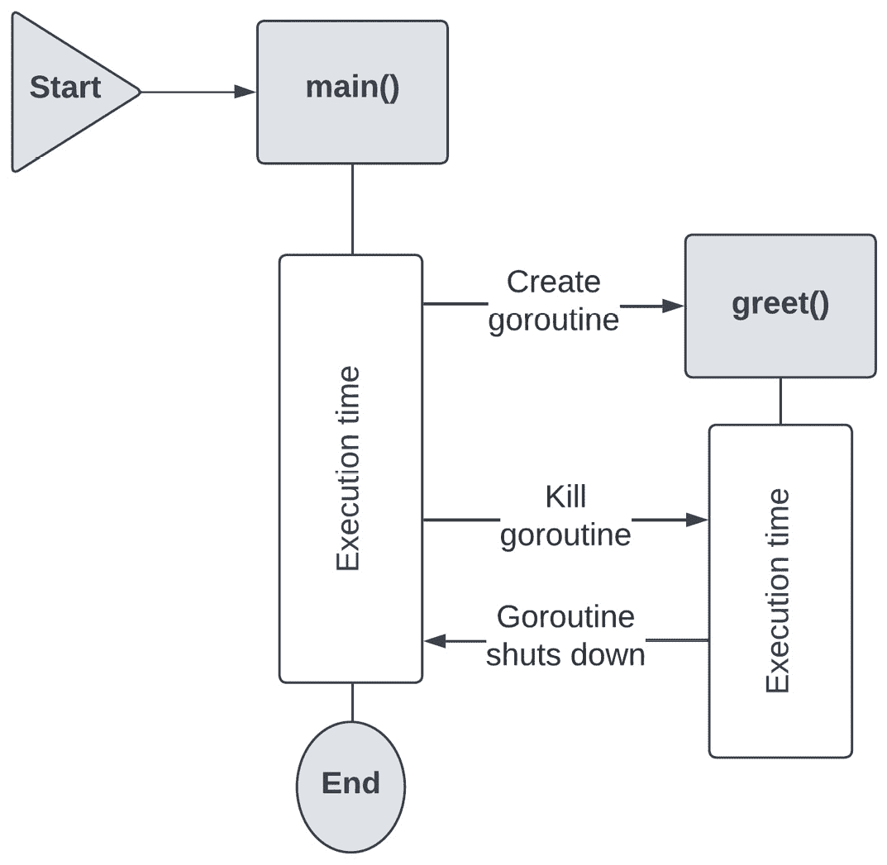
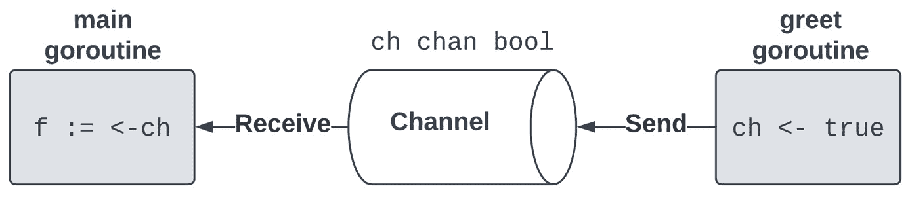
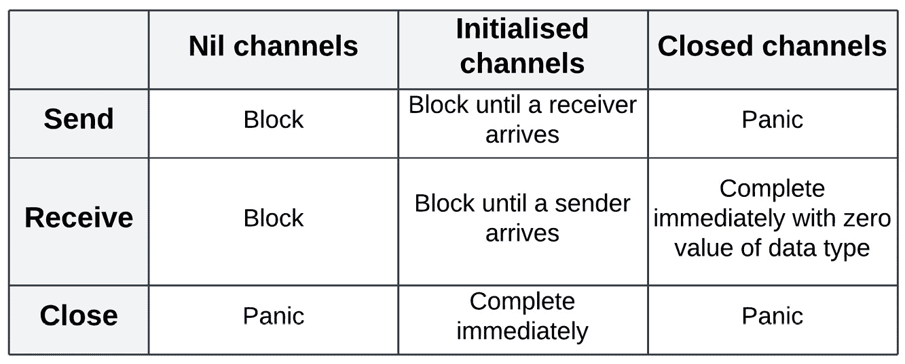
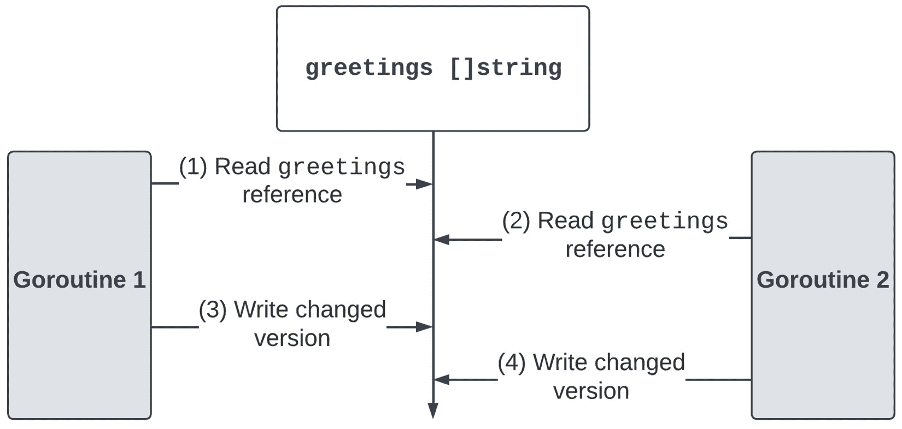
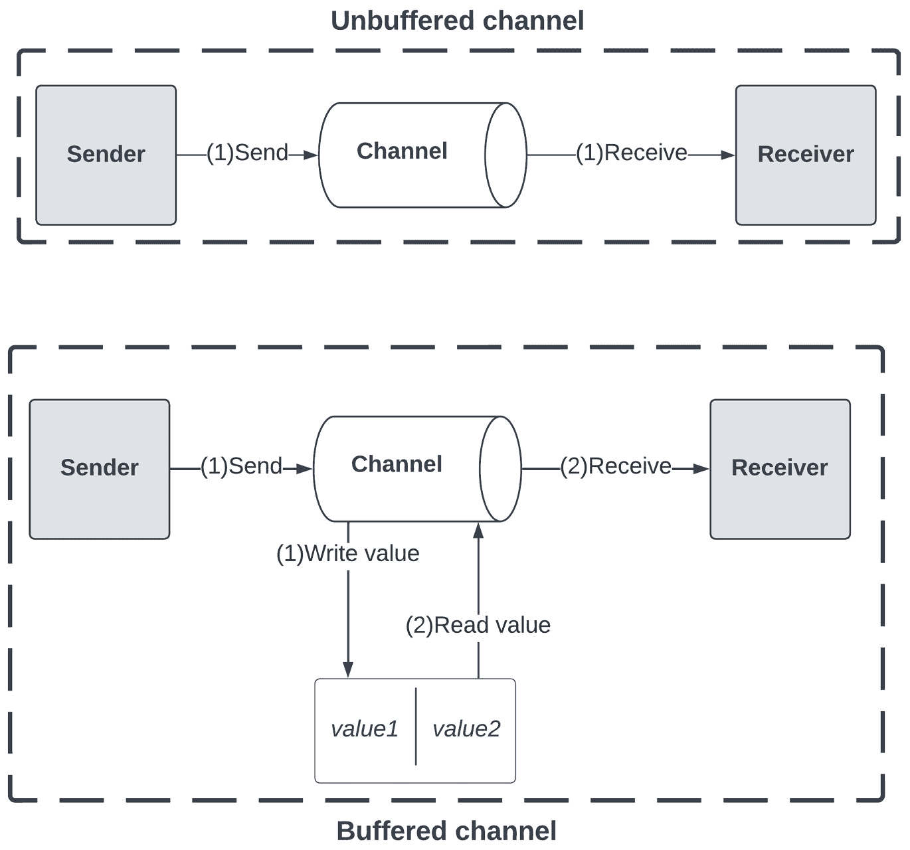
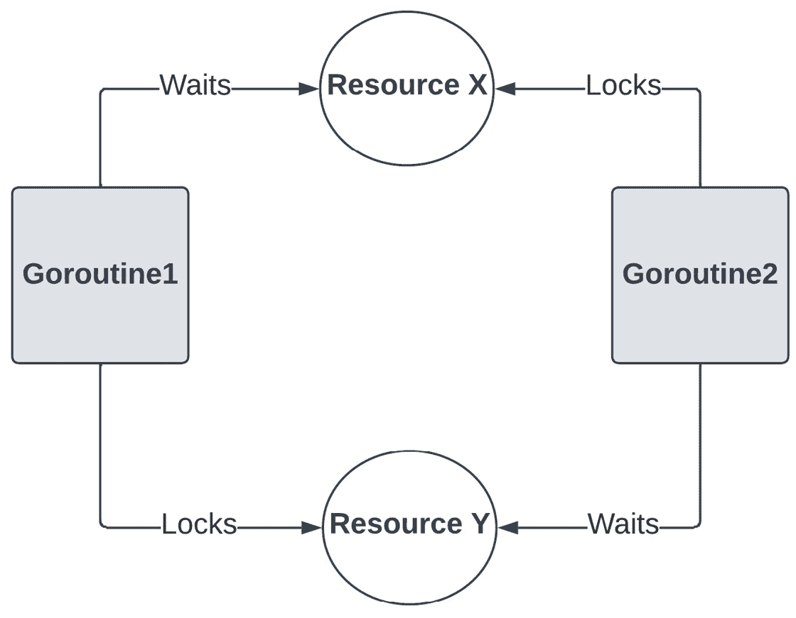
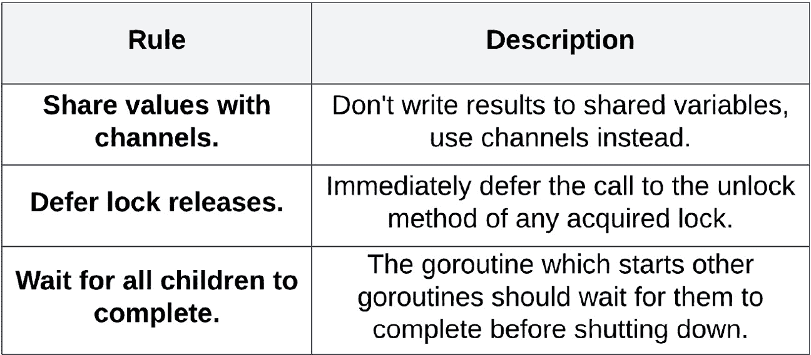

# 测试并发代码的挑战

在前面的章节中，我们涵盖了 TDD 实践者测试应用程序所需的所有基本知识。我们学习了如何在开发阶段对代码进行单元测试，如何对较大的组件进行集成测试，以及如何对整个服务进行端到端测试。这些都是构建和运行任何软件项目的基本构建块。测试套件使我们能够验证我们的应用程序是否按照客户的要求运行。

随着系统的增长和成熟，开发者不可避免地必须考虑如何更改和演进他们的代码，确保他们的系统保持高性能和可扩展性。正如在*第七章*中讨论的，*Go 中的重构*，有一些常见的重构技术可以帮助我们使代码变更过程更加容易。一种常见的系统重构技术是将单体应用程序拆分，并用微服务架构替换。在第*第八章*中，*测试微服务架构*，我们学习了如何使用新引入的合同测试技术拆分`BookSwap`应用程序并测试微服务之间的集成。

当我们步入微服务架构的世界时，由于两个关键方面，测试变得更加困难：服务由组织内部的团队更改，没有任何中央监督，并且操作顺序无法保证。我们在前面的章节中涵盖了集成测试方面，但尚未探讨操作顺序变化带来的困难。最重要的是，我们需要探讨如何处理不同的操作顺序可能使应用程序处于的不同状态。

本章将探讨并发代码的实现和测试。我们将从讨论 Go 的并发机制开始，这是 Go 编程语言的主要优势之一。然后，我们将探讨一些常见的并发示例。我们将学习如何利用 Go 的工具链中的 race detector，最后，我们将讨论哪些并发条件无法测试，并探讨如何在`BookSwap`应用程序中检测并发问题。

在本章中，我们将涵盖以下主题：

+   Go 的并发机制——goroutines、channels 和同步原语

+   应用并发示例和模式，包括创建线程安全的数据结构

+   并发代码不可测试的条件——竞争条件、死锁和饥饿

+   Go race detector 的使用和限制

+   在`BookSwap`应用程序中检测和修复并发问题

# 技术要求

您需要安装**Go 版本 1.19**或更高版本才能运行本章中的代码示例。安装过程在官方 Go 文档中描述，网址为[`go.dev/doc/install`](https://go.dev/doc/install)。

本书包含的代码示例在[`github.com/PacktPublishing/Test-Driven-Development-in-Go/chapter09`](https://github.com/PacktPublishing/Test-Driven-Development-in-Go/chapter09)公开可用。

# Go 中的并发机制

Go 内置的并发机制是其最大的优势之一，也是开发者选择使用 Go 为其服务的主要原因之一。由于 Go 的**goroutines**和**channels**，在 Go 中实现并发既简单（又痛苦！）我们将探索每个机制并回顾其行为，以便我们更好地理解如何使用和测试它们。

**并发**是程序同时处理多个任务的能力。这种关键能力使我们能够充分利用 CPU 的处理能力，从而使我们能够最优化地使用我们的资源。这对于所有系统来说都很重要，以便能够处理尽可能多的请求，同时不干扰程序中的其他流程，并保持计算成本较低。

*图 9**.1*展示了两个并发任务：



图 9.1 – 两个任务的并发执行流程

任务被分为形成调用栈的函数：

1.  在这个例子中，每个任务被分为三个函数，这些函数构成了调用栈。任务从接收输入开始，并在计算结果或输出后结束。**任务 A**被分为三个函数：**函数 A1**、**函数 A2**和**函数 A3**。这种分离在**任务 B**中也是相同的。

1.  两个任务，**任务 A**和**任务 B**，彼此独立。每个任务都接收自己的输入并计算自己的结果。由于任务之间没有连接，它们可以以任何顺序计算。这使得它们适合作为**并发****执行流程**的一部分来执行。

1.  当并发执行任务时，子任务会被**调度**和**中断**以实现最有效的执行。在调用栈中中断函数的能力是这两个任务并发执行的关键要求。我们将在接下来的章节中学习如何防止这些中断。

1.  每个任务从接收输入开始。在这个例子中，**输入 A**在**输入 B**之前接收，并且相应的**任务 A**首先开始执行。

1.  子任务或函数以交错的方式执行，CPU 以结合的方式执行**任务 A**和**任务 B**的函数。我们注意到子任务在任务内部是有序执行的。这意味着**函数 A1**在**函数 A2**之前执行，但关于**任务 B**的子任务的执行时间上没有**顺序保证**。

1.  一旦任务成功完成，输出将被返回，CPU 可以自由执行其他任务。我们注意到，尽管 **输入 B** 第二个到达，**任务 B** 第二个开始，但它首先完成，并且首先返回 **结果 B**。函数的调度取决于资源的可用性和其他因素。我们将在后面的章节中探讨 Go 语言中调度的工作原理。

由于并发运行的任务之间没有顺序保证，我们应该小心允许并发运行的任务是独立的，并且不依赖于彼此。否则，任务的并发执行可能会导致运行缓慢的任务或错误。

避免顺序假设

并发性可以在库的底层使用，并且它可能并不总是容易看到它的使用位置。因此，我们应该避免对顺序或执行时间做出假设。我们将学习如何利用同步机制和检查来确保在执行开始之前条件得到满足。

并行性经常与并发性混淆，但它是指程序执行任务的同时性的能力。与并发性不同，并发性并不保证任务顺序，我们知道在这种模式下的任务执行将是并行的。任务也应该相互独立，因为它们不能相互等待。

*图 9.2* 描述了两个并行任务：



图 9.2 – 两个任务的并行执行流程

两个任务的并行执行流程是同时发生的：

1.  一旦接收到 **输入 A** 和 **输入 B**，任务就开始执行。

1.  任务同时且独立地执行，不受干扰或交错。

1.  任务在同一时间完成，误差范围内。无论我们尝试将它们指定得多么一致，资源使用和性能总会存在偏差。

为了实现真正的并行性，需要单独的计算资源。这增加了我们系统基础设施的成本，对于某些工程团队来说，这可能是不受欢迎的，甚至可能是决定性的。因此，并发性通常是实现程序中多任务的首选方式。随着系统的成功，正确实现的并发性可以促进系统在能够承担这种增加成本的情况下，顺利过渡到并行性。

在 Go 语言中，函数或子任务的并发处理是通过 **goroutines** 来执行的。在接下来的几节中，我们将探讨它们是什么，如何进行调度，以及如何同步它们。

## Goroutines

现在我们已经了解了并发性和并行性之间的区别，我们将把注意力集中在本章剩余部分对 Go 语言中并发实现的探讨上。

**Goroutines**是可以在与其他函数或方法并发运行的功能或方法。它们通常被称为**轻量级线程**，因为它们具有较小的内存分配，并且在一个远小于操作系统线程的数量上运行。

使用`go`关键字很容易指示 Go 运行时在其自己的 goroutine 中运行一个函数：

```go
func greet(gr string) {
  fmt.Println("Hello, friend!")
}

func main() {
  go greet()
  fmt.Println("Goodbye, friend!")
}
```

这个代码片段创建了一个`main`函数和一个`greet`函数，该函数接受一个字符串作为参数，然后将其打印到终端。我们通过在其调用前添加`go`关键字来指示运行时在其自己的 goroutine 中运行该函数。最后，我们打印“再见，朋友！”这一行来表示`main`函数已完成。

我们使用常规命令运行这个小程序：

```go
$ go run chapter09/concurrency/goroutines/main.go 
Goodbye, friend!
```

程序没有打印问候语；相反，它只打印了再见行。这是由于程序和 goroutine 的行为所致。*图 9**.3*展示了这些特性的可视化：



图 9.3 – 问候程序的 goroutine 执行

由于 goroutine 创建的**非阻塞行为**，程序没有将问候语打印到终端：

1.  当我们运行我们的程序时，主函数开始执行。这个函数在其自己的 goroutine 中运行，我们将称之为**主 goroutine**。主函数根据主函数体内的语句有自己的**执行时间**。

1.  在主函数执行期间，主 goroutine 指示 Go 运行时在这个 goroutine 中运行`greet`函数。这个主 goroutine 与主 goroutine 有**父子关系**。我们将把这个子 goroutine 称为**问候 goroutine**。

1.  创建子 goroutine，该 goroutine 将运行我们的`greet`函数，这是一个**非阻塞操作**。这使我们能够实现之前讨论的并发中的多任务方面。

1.  由于主 goroutine 没有被阻塞，它完成了自己的工作并完成了执行时间。一旦主 goroutine 完成，Go 运行时会清理其所有资源。由于主 goroutine 与问候 goroutine 之间存在父子关系，运行时会**终止****问候 goroutine**。

1.  问候 goroutine 立即停止执行并**关闭**。根据它从 CPU 获得的执行时间，问候 goroutine 可能能够执行其打印到终端的操作，也可能不能。

由于这些特性，程序无法可靠地将问候语打印到终端。我们需要阻止主 goroutine 关闭，以便给子 goroutine 足够的时间完成其执行。

一种解决方案是通过调用`time.Sleep`函数阻塞主 goroutine 的终止，持续预定的时间，例如 1 秒。另一种更有趣的解决方案是通过向共享变量写入值来指示问候 goroutine 已完成其工作：

```go
var finished bool
func greet() {
  fmt.Println("Hello, friend!")
  finished = true
}

func main() {
  go greet()
  for !finished {
    fmt.Println("Child goroutine not finished.")
    time.Sleep(10 * time.Millisecond)
  }
  fmt.Println("Child goroutine finished.")
  fmt.Println("Goodbye, friend!")
}
```

这两个函数共享内存空间，因此它们可以写入和读取共享变量。代码片段展示了这一点：

1.  我们在顶部创建了一个名为`finished`的`bool`类型变量。这个变量的目的是向`main`函数提供一个信号，表明`greet`函数已完成。

1.  一旦`greet`函数将问候语写入终端，它就会将`finished`变量的值设置为`true`。

1.  在`main`函数的主体内部，我们创建了一个`for`循环，该循环将一直执行，直到`finished`变量的值为`true`。使用`time.Sleep`函数，我们每 10 毫秒轮询变量的值。

1.  一旦`for`循环完成，主 goroutine 完成其执行，并且两个 goroutine 的所有资源都被清理干净。

运行此程序将打印以下内容：

```go
$ go run chapter09/concurrency/goroutines/main.go
Child goroutine not finished.
Hello, friend!
Child goroutine finished.
Goodbye, friend!
```

最后，使用写入共享变量的简单方法，我们成功地阻塞了主 goroutine，直到其子 goroutine 完成。我们终于能够在终端中看到打印的问候语，程序正在正确执行。

这种在 goroutines 之间共享信息的方式被称为**通过共享内存通信**，并且是处理其他编程语言中并发问题的传统方式。这种方法并非没有缺点。然而，Go 还有另一种方法，我们将在下一节中探讨。

## 通道

**通道**为 goroutines 之间提供了一种相互通信的方式。我们可以将内置的通道类型视为一个管道，通过它可以安全地在 goroutines 之间发送信息，而无需使用共享变量或内存。在 Go 中，这个原则被称为**通过通信共享内存**。

*图 9.4* 描述了通道的主要操作和语法：



图 9.4 – Go 通道的操作和语法

与通道的交互展示了其两种主要操作的语法：

1.  `ch chan bool`：通道是 Go 中的内置类型，因此我们不需要导入任何库。通道是通过使用`chan`关键字后跟数据类型`bool`来声明的，通道将能够传输这种类型的数据。只有这种类型的变量可以通过它传输。这是由编译器强制执行的。

1.  `ch <- true`：通道支持的第一种操作是`<-`，它表示数据通过通道流动的方式。在这种情况下，箭头指向通道，我们将一个`true`值发送给它。

1.  `f := <-ch`：发送操作的对应操作是接收操作。这个操作是通过将通道操作符指向通道并将接收分配给一个名为`f`的局部变量来执行的。

这就是通道的基本用法，尽管我们将在后面的章节中探讨一些更细微的细节。发送和接收操作是**阻塞和同步的**，因此交易双方都需要可用才能完成操作。

通道是一个优秀的**同步和通信机制**。我们可以利用它们通过更简洁的代码来同步主 goroutine 和 greeter goroutine：

```go
func greet(ch chan bool) {
  fmt.Println("Hello, friend!")
  ch <- true
}
func main() {
  ch := make(chan bool)
  go greet(ch)
  <-ch
  fmt.Println("Child goroutine finished.")
  fmt.Println("Goodbye, friend!")
}
```

这个简化的解决方案利用通道来同步两个 goroutine：

1.  `greet`函数被修改为接受一个通道参数。同样，对于 map 和 slice，通道类型有一个内置的指针引用，因此我们不需要使用`&`运算符显式地通过指针传递它。

1.  一旦打印出问候语，`greet`函数就会向通道发送`true`值。这将向主 goroutine 发出信号，表明`greet`函数已成功完成。

1.  在主函数内部，我们使用`make`函数初始化一个通道。通道类型的零值是`nil`，所以我们使用`make`函数创建一个准备好使用的通道。在底层，`make`函数将分配所有所需的资源。

1.  一旦在它自己的 goroutine 中启动了`greet`函数，主函数就会在通道上调用接收操作。由于通道上的发送和接收操作是阻塞的，这将会阻塞主 goroutine，直到`greet` goroutine 完成并且能够通过通道发送值。

使用通道简化了实现，消除了对轮询`finished`变量值的需要。我们还注意到，通道变量`ch`已经在主函数内部初始化，并作为参数传递。由于现在没有全局变量，我们消除了两个 goroutine 之间通过共享内存进行通信的需要。

通道支持一个最后的操作，即关闭操作。与发送和接收不同，关闭通道会改变通道的状态，并向通道的接收者指示工作的完成。这是一个可以用于同步的操作，而不是支持 goroutine 之间的信息交换和通信。一个关闭的通道将立即返回通道类型的零值给所有接收操作，并在未来尝试在通道上执行的所有发送操作上引发 panic。

由于我们通道的目的在于同步`greet`和`main` goroutine，我们可以利用关闭操作来进一步简化我们的代码：

```go
func greet(ch chan struct{}) {
  fmt.Println("Hello, friend!")
  close(ch)
}

func main() {
  ch := make(chan struct{})
  go greet(ch)
  <-ch
  fmt.Println("Child goroutine finished.")
  fmt.Println("Goodbye, friend!")
}
```

我们对我们的解决方案做了一些调整。通道的数据类型现在是空的`struct{}`，这减少了通道的内存占用。在`greet`函数内部，函数打印问候语后立即关闭通道。虽然这些变化看起来并不显著，但此解决方案可以用于向多个接收器发出工作已完成的通知，而不是需要在通道上写入多个值。这是一个强大的机制，我们可以利用它来解决各种问题。

*图 9**.5* 总结了我们迄今为止研究过的通道的行为：



图 9.5 – 通道操作和状态的总结

此图是理解通道在我们代码中如何行为的有用参考：

1.  `make`函数。它们不能用于发送信息，但在启动 goroutine 时很有用。nil 通道将在未来某个时间初始化以供使用：

    1.  发送操作将阻塞，直到通道初始化，之后将应用初始化通道的规则。

    1.  接收操作的行为与发送操作相同。

    1.  关闭操作在 nil 通道上会引发恐慌。由于 nil 通道尚未准备好通过发送信息，因此关闭它们是没有意义的。因此，如果我们尝试关闭 nil 通道，这被视为一个致命错误。

1.  **初始化通道**是通过 make 函数创建的，并准备好使用。它们可以用于发送信息：

    1.  发送操作将阻塞，直到到达接收者。发送 goroutine 将无法执行到这一点，直到操作完成。

    1.  接收操作将阻塞，直到从发送者那里收到值。由于发送和接收是同步操作，两个 goroutine 都必须准备好完成操作，以便完成事务的两个部分。因此，如果发送者启动但接收者尚未准备好，这意味着发送者将暂停，直到接收者准备好，这可以是一个有用的特性。

    1.  关闭操作立即完成。一旦第一个操作完成，通道将进入**关闭通道**状态。

1.  关闭的通道是已成功关闭的初始化通道。处于此状态的通道表示它们将不再能够传输信息：

    1.  发送操作将引发恐慌。没有简单的方法知道通道是否已关闭，因此恐慌让发送者知道他们应该停止向其发送值，但你应该小心编写代码，以避免遇到恐慌。

    1.  接收操作将立即使用通道数据类型的零值完成。正如我们在问候示例中看到的那样，我们可以使用关闭通道上的接收操作作为同步机制。

    1.  关闭操作会引发恐慌，因为通道只能移动到关闭状态一次。再次强调，防御性编程（例如，单一责任原则，即代码的某一部分只负责关闭通道）可以帮助控制这种情况。

最后要注意的一点是，一旦通道被关闭，就不能再次打开。在解决更复杂问题时使用它们可能会引起一些复杂性。现在我们已经了解了 goroutines 和通道的基本行为，我们可以在下一节探索一些常用的并发示例。

# 应用并发示例

应用并发示例

+   `sync.Map` 是一种线程安全的映射实现。我们将在下一节探讨如何创建其他线程安全的数结构。

+   `sync.Mutex` 是一种排他锁。它允许我们一次只让一个 goroutine 使用资源。根据要解决的问题，也可以使用只读或读写互斥锁。

+   `sync.Once` 是一种特殊的锁，它只能被获取一次。这对于包装只应运行一次的语句，例如清理代码，非常有用。

+   `sync.Pool` 是一组临时对象，可以单独保存和检索。它可以被视为对象的缓存，使得创建线程安全的列表变得容易。

+   `sync.WaitGroup` 等待一组 goroutines 完成。这个原语内部有一个计数器和锁，允许它跟踪在完成之前需要等待多少个 goroutines。这可以大大简化主 goroutine。

您可以在官方 Golang 文档中阅读 `sync` 包的同步原语的完整文档（[`pkg.go.dev/sync`](https://pkg.go.dev/sync)）。这些精心设计的同步原语为我们提供了解决许多类型问题的工具。让我们在下一节中看看它们在实际中的应用。

## 关闭操作会引发恐慌，因为通道只能进入关闭状态一次。再次强调，防御性编程（例如，单一责任原则，即代码的某一部分只负责关闭通道）可以帮助控制这种情况。

正如我们在 *图 9**.5* 中看到的那样，如果我们尝试多次关闭通道，通道会引发恐慌。这是一个使用 `sync.Once` 的绝佳候选，尽管我们可以想象出这个机制的其他伟大用途，例如实现 **单例模式** 或执行清理函数。

这种特殊的锁很容易使用，以确保通道只关闭一次：

```go
func safelyClose(once *sync.Once, ch chan struct{}) {
  fmt.Println("Hello, friend!")
  once.Do(func() {
    fmt.Println("Channel closed.")
close(ch)
  })
}
func main() {
  var once sync.Once
  ch := make(chan struct{})
  for i := 0; i<3; i++ {
    go safelyClose(&once, ch)
  }
  <-ch
  fmt.Println("Goodbye, friend!")
}
```

我们通过包装关闭操作来实现通道的安全关闭：

1.  我们创建了 `safelyClose` 函数，它接受一个指向 `sync.Once` 类型的指针和由主函数创建的通道。请注意，与通道类型不同，我们需要使用显式的参数指针类型传递 `Once` 类型。

1.  在`safelyClose`函数内部，我们在`once.Do`方法中调用 channel 的关闭操作。`Do`方法接受一个函数作为参数，因此我们将我们的语句包装在一个匿名函数中。

1.  在主函数内部，我们创建了一个零值的`sync.Once`实例。对于同步原语，我们不需要进行特殊初始化，所以零值可以直接使用。

1.  我们使用`for`循环创建了多个 goroutine，这些 goroutine 执行`safelyClose`函数。这些 goroutine 都共享相同的`once`和 channel 实例。

1.  最后，我们通过从 channel 接收操作来阻塞主 goroutine。这个操作将在第一个 goroutine 关闭 channel 时完成。

运行示例程序显示，启动了多个 goroutine，但 channel 只关闭了一次：

```go
$ go run chapter09/concurrency/once/main.go
Hello, friend!
Channel closed.
Hello, friend!
Goodbye, friend!
Hello, friend! 
```

从输出中我们可以看到，启动了多个 goroutine，但 channel 只关闭了一次。`sync.Once`使用简单，但它可以帮助我们在应该只执行一次的操作周围建立安全性，例如关闭 channel。

## 线程安全数据结构

工程师经常解决的问题之一是构建**线程安全的数据结构**。这些类型的结构对多个 goroutine 的读写都是安全的。默认情况下，Go 的 slices 和 maps 不是线程安全的，所以我们需要注意多个 goroutine 访问共享数据结构和资源。这也是为什么使用 channel 进行通信比通过共享内存（以数据结构或变量表示）进行通信更受欢迎的原因之一。

`sync.Map` ([`pkg.go.dev/sync#Map`](https://pkg.go.dev/sync#Map)) 是一个线程安全的 map 实现。这个 map 在底层使用锁，所以它的性能可能不如内置的 map 类型。同步 map 公开了提供读取和写入功能的方法：

```go
const workerCount = 3
func greet(id int, smap *sync.Map, done chan struct{}) {
  g := fmt.Sprintf("Hello, friend! I'm Goroutine %d.", id)
smap.Store(id, g)
  done <- struct{}{}
}
func main() {
  var smap sync.Map
  done := make(chan struct{})
  for i := 0; i < workerCount; i++ {
    go greet(i, &smap, done)
  }
  for i := 0; i < workerCount; i++ {
    <-done
  }
  smap.Range(func(key, value any) bool {
    fmt.Println(value)
    return true
  })
  fmt.Println("Goodbye, friend!")
}
```

我们通过包装方法与同步 map 交互：

1.  我们在程序顶部声明了`workerCount`常量，它将表示我们将启动的 goroutine 数量。

1.  `greet`函数接受三个参数：一个 ID、一个指向`sync.Map`的指针，以及一个 channel，用于我们发出 goroutine 已完成工作的信号。我们格式化一个问候字符串，该字符串使用了传入的 ID。然后，我们使用`Store`方法将其保存到 map 中，并向`done`channel 写入一个值，向主 goroutine 发出信号，表明这个工作 goroutine 已完成。

1.  在主函数内部，我们初始化了 map。这个 map 的零值已经准备好使用，就像我们之前看到的`sync.Once`一样。我们还初始化了一个 channel，我们将使用它来向主 goroutine 发出信号，表明工作 goroutine 已完成。

1.  然后，我们运行两个 `for` 循环。第一个循环在其自己的 goroutine 中启动 `greet` 函数，而第二个循环等待在 `done` 通道上接收到值。这允许我们在继续之前等待所有 goroutine 完成。

1.  最后，我们使用 `Range` 方法读取 `map` 中包含的所有值，该方法接受一个匿名函数作为参数。我们打印条目并返回 `true`，这将允许 `Range` 方法继续循环。

这个程序的输出显示，问候语可以同时保存和检索：

```go
$ go run chapter09/concurrency/syncmap/main.go 
Hello, friend! I'm Goroutine 2.
Hello, friend! I'm Goroutine 0.
Hello, friend! I'm Goroutine 1.
Goodbye, friend!
```

内置的 `map` 类型在多个 goroutine 同时写入时会引发 panic，所以你应该确保在这种情况下使用同步的 `map`。

与 `sync.Map` 的方法类似，我们可以通过使用 `sync.Mutex` 锁来限制对底层数据结构的访问来创建我们自己的线程安全自定义数据结构。例如，我们可以通过以下方法创建线程安全的 **后进先出**（**LIFO**）堆栈：

```go
// Thread safe LIFO Stack implementation
type Stack struct {
  lock sync.Mutex
  data []string
}
// Push adds the given element to the end of the list
func (s *Stack) Push(el string) {
  defer s.lock.Unlock()
  s.lock.Lock()
  s.data = append(s.data, el)
}
// Pop removes and returns the last element from the list,
// or an error if the list is empty.
func (s *Stack) Pop() (*string, error) {
defer s.lock.Unlock()
  s.lock.Lock()
  if len(s.data) == 0 {
    return nil, fmt.Errorf("stack is empty")
  }
  last := s.data[len(s.data)-1]
  s.data = s.data[0 : len(s.data)-1]
  return &last, nil
}
```

堆栈实现使用了 `sync.Mutex`，它公开了两个方法，`Lock` 和 `Unlock`，以限制对底层数据切片的访问：

1.  自定义的 `Stack` 结构体有两个字段，一个锁和一个数据切片。这些字段是未导出的，因为它们应该只由堆栈数据结构本身来管理。

1.  `Stack` 有两个方法。`Push` 将元素添加到数据切片的末尾，而 `Pop` 从数据切片中移除最后一个元素并返回它。如果切片为空，则 `Pop` 方法将返回一个错误。

1.  两个函数都使用了 `sync.Mutex` 类型的锁来确保一次只有一个 goroutine 调用这两个方法。我们使用 `defer` 关键字来确保无论方法通过哪个执行路径，锁都会被释放。

`sync.Mutex` 是一种多功能的锁定机制，可以用来阻止对任何访问共享资源或需要独占控制资源的代码段的访问。这被称为 **关键** **代码段**。

类似地，`sync` 包还提供了 `sync.RWMutex`，它提供了分别控制读写锁的能力。这种级别的控制对于创建由许多 goroutine 使用的线程安全数据结构可能很有用。

## 等待完成

在本节中，我们将探索的最后一个同步原语是 `sync.WaitGroup`。在底层，`WaitGroup` 管理一个内部计数器，它维护着剩余要完成资源的数量。这个专门的锁允许我们等待多个 goroutine 完成，从而简化了上一节中的同步 `map` 示例：

```go
const workerCount = 3
func greet(id int, smap *sync.Map, wg *sync.WaitGroup) {
  defer wg.Done()  
  g := fmt.Sprintf("Hello, friend! I'm Goroutine %d.", id)
  smap.Store(id, g)
}
func main() {
  var smap sync.Map
  var wg sync.WaitGroup
  wg.Add(workerCount)
  for i := 0; i < workerCount; i++ {
    go greet(i, &smap, &wg)
  }
  wg.Wait()
  smap.Range(func(key, value any) bool {
    fmt.Println(value)
    return true
  })
  fmt.Println("Goodbye, friend!")
}
```

我们做了一些关键性的更改，极大地简化了我们的解决方案：

1.  `greet` 函数接受一个指向 `sync.WaitGroup` 的指针，而不是完成通道。在函数顶部，我们使用 `defer` 关键字调用 `WaitGroup` 的 `Done` 方法，这将减少其内部计数器 1，表示这个 goroutine 已完成。

1.  在 `main` 函数内部，我们初始化 `sync.WaitGroup`，它已准备好使用。我们将 `workerCount` 添加到内部计数器，向其指示我们将启动多少个 goroutine。`WaitGroup` 将阻塞，直到这个内部计数器达到零，这将在每个子 goroutine 调用 `Done` 方法一次后发生。

1.  最后，我们在 `main` 函数的更下方调用 `Wait` 方法。此方法将阻塞，直到 `WaitGroup` 的内部计数器达到 0。这消除了在 `for` 循环中为每个完成的 goroutine 从通道读取消息的需要。

这使我们到达了对 Go 并发基础和应用的探索的结尾。正如我们所见，Go 并发利用了 goroutine、通道和同步原语。我们可以轻松地使用锁来创建线程安全的数据结构，并确保关键代码部分一次只被一个 goroutine 访问。在下一节中，我们将学习新引入的并发特性给我们的程序带来了哪些问题。

# 并发问题

在 Go 中编写并发代码既优雅又简单。然而，它确实使我们的代码更加复杂。开发者需要熟悉并发机制的行为，才能理解他们正在阅读的代码。此外，由于时间在 goroutine 的行为中起着至关重要的作用，我们可能很难重现潜在的错误。在本节中，我们将探讨三个常见的并发问题。随着我们深入每个示例，我们也将有机会了解 Go 并发机制的行为。

## 数据竞争

**数据竞争** 是最常见的并发问题。当多个 goroutine 同时访问和修改相同的共享资源时，就会发生此问题。这是我们应避免在 goroutine 之间共享状态，而倾向于使用通道在 goroutine 之间共享信息的原因之一。

我们通过将格式化的问候语保存到切片中，而不是立即将问候语打印到终端，修改了之前的问候示例：

```go
const workerCount = 3
var greetings []string
func greet(id int, wg *sync.WaitGroup) {
  defer wg.Done()
  g := fmt.Sprintf("Hello, friend! I'm Goroutine %d.", id)
  greetings = append(greetings, g)
}
func main() {
  var wg sync.WaitGroup
  wg.Add(workerCount)
  for i := 0; i < workerCount; i++ {
    go greet(i, &wg)
  }
  wg.Wait()
  for _, g := range greetings {
    fmt.Println(g)
  }
  fmt.Println("Goodbye, friend!")
}
```

乍一看，代码示例并没有做太多修改：

1.  在程序顶部，我们声明了将要保存问候语的 `greetings` 字符串切片。我们还声明了 `workerCount` 常量，其值为 `3`，这是我们将要运行的 goroutine 数量。

1.  `greet` 函数接收两个参数，即 goroutine ID 和指向 `sync.WaitGroup` 的指针。在函数结束时，我们将格式化的问候语 `g` 添加到 `greetings` 切片。

1.  在 `main` 函数中，我们创建 `sync.WaitGroup` 并在多个 goroutine 中运行 `greet` 函数。`WaitGroup` 用于确保主 goroutine 等待所有工作 goroutine 完成。在 `main` 函数的末尾，一旦所有 `greet` goroutine 完成，我们遍历 `greetings` 切片并将每个条目打印到终端。

由于`main`函数等待所有 goroutines 完成，我们预计所有 goroutines 都将正确保存其问候。由于`workerCount`等于`3`，我们预计将在终端打印出三条线。让我们以通常的方式运行这个程序并查看其输出：

```go
$ go run chapter09/concurrency/data-races/main.go 
Hello, friend! I'm Goroutine 2.
Hello, friend! I'm Goroutine 1.
Goodbye, friend!
```

观察输出，我们看到只有两个 goroutines 记录了它们的结果。我们可以看到，我们做出的代码更改出了问题。

这个代码示例存在数据竞争。*图 9**.6*展示了这个示例中发生的事件序列：



图 9.6 – 数据竞争事件

当多个 goroutines 尝试将它们的结果附加到`greetings`切片时，它们实际上在幕后执行一些操作：

1.  `greetings` **引用**：**Goroutine 1**开始执行，通过读取`greetings`切片的引用。它将根据这个值完成其操作。

1.  `greetings` **引用**：在稍后的时间，**Goroutine 2**开始执行，通过读取`greetings`切片的引用。这可能或可能不是**Goroutine 1**读取的相同值。

1.  **(3) 写入更改版本**：在执行过程中，**Goroutine 1**准备写入其更改并完成其执行。如果底层数组中有空间，元素将被附加到它。否则，将创建一个新的更大的数组，并将元素复制到它。创建一个新的切片，其引用指向更新的底层数组。

1.  **(4) 写入更改版本**：最后，**Goroutine 2**准备写入其更改。然而，它对此前**Goroutine 1**所做的任何更改一无所知。它仍然基于它在**2**点读取的引用进行工作。**Goroutine 2**写入其更改，覆盖了**Goroutine 1**将在**3**点保存的所有工作。

由于`greetings`切片没有被锁保护，goroutines 可以在这个过程中的任何时刻被中断。由于这些更改交织在一起，goroutines 可能会最终覆盖彼此的更改，导致结果不一致。根据时间不同，你的输出可能看起来与前面的结果不同。也根据时间不同，我们可能会看到所有问候都打印到终端，并假设程序正在正确运行，或者我们可能会看到我们在测试运行期间看到的不一致行为。数据竞争是并发世界中的常见问题，它们可能很难找到和复制。

## 死锁

**死锁**是另一个常见的并发问题。当 goroutines 被阻塞等待永远不会变得可用的资源时，就会发生这个问题。goroutines 将永远无法继续。Go 运行时会检测到你的程序变得阻塞并触发 panic，关闭并清理资源。

为了修复上一节中的数据竞争，我们将修改代码以使用通道，允许一次只有一个 goroutine 向 `greetings` 切片追加：

```go
var greetings []string
const workerCount = 3
func greet(id int, ch chan struct{}, wg *sync.WaitGroup) {
  defer wg.Done()
  g := fmt.Sprintf("Hello, friend! I'm Goroutine %d.", id)
  <-ch
  greetings = append(greetings, g)
  ch <- struct{}{}
}
func main() {
  ch := make(chan struct{})
  var wg sync.WaitGroup
  wg.Add(workerCount)
  for i := 0; i < workerCount; i++ {
    go greet(i, ch, &wg)
  }
  ch <- struct{}{}
  wg.Wait()
  for _, g := range greetings {
    fmt.Println(g)
  }
  fmt.Println("Goodbye, friend!")
}
```

乍一看，这个例子似乎是合理的：

1.  `greet` 函数接受三个参数：一个 ID、一个通道以及指向 `WaitGroup` 的指针。在函数内部，我们从通道读取，将我们的问候语追加到 `greetings` 切片，然后写入通道。

1.  在 `main` 函数内部，我们初始化通道和 `WaitGroup`。这些是我们 goroutines 将使用的同步机制。

1.  然后，我们编写一个 `for` 循环，该循环将启动与 `workerCount` 相同数量的 goroutine 运行 `greet` 函数，这里为三个。

1.  循环之后，我们向通道发送一个值以启动第一个 goroutine。这也向工作 goroutine 发出信号，表明主 goroutine 已准备好处理他们的结果。

这看起来像是一个合理的解决方案，可以确保我们的数据竞争问题得到解决。让我们以通常的方式运行这个程序并查看其输出：

```go
$ go run chapter09/concurrency/deadlock/main.go
fatal error: all goroutines are asleep - deadlock!
goroutine 1 [semacquire]:
sync.(*WaitGroup).Wait(0x0?)
        /usr/local/go/src/sync/waitgroup.go:139 +0x52
main.main()
        .../chapter09/deadlock/main.go:28 +0xd5
goroutine 19 [chan send]:
main.greet(0x0?, 0x0?, 0x0?)
        .../chapter09/deadlock/main.go:17 +0x165
created by main.main
        .../chapter09/deadlock/main.go:25 +0x4f
exit status 2
```

该程序存在死锁，由 Go 运行时检测到。堆栈跟踪表明有两个 goroutine 被阻塞：

+   主 goroutine 无法完成 `WaitGroup` 的 `Wait` 方法

+   其中一个工作 goroutine 无法完成其通道发送操作

这种死锁是由通道操作的同步性质引起的。最后一个工作 goroutine 试图向通道发送信号并表明其工作已完成，但通道上没有剩余的接收者。因此，工作 goroutine 保持阻塞状态，`WaitGroup`永远不会解锁，整个程序冻结。

goroutines 变得阻塞的常见原因包括等待完成通道操作或等待 `sync` 包中的某个锁变为可用。理解我们使用的并发机制的行为是避免问题和错误的最有效工具。

## 缓冲通道

默认情况下，通道是**无缓冲的**，这意味着它们没有存储或缓冲值的容量。这就是为什么我们迄今为止看到的所有通道操作都是**同步的**。然而，这可能会限制发送者和接收者，他们的操作速度不同。一种特殊的通道类型解决了这一限制。

缓冲通道能够接受预定义的、有限数量的值，而无需接收者。这允许我们处理有限数量的 `make` 函数：

```go
ch := make(chan Type, capacity)
```

容量是一个整数，对于无缓冲通道，其默认值为`0`。此参数定义了将保存通道值的后备数组的尺寸。

*图 9**.7* 展示了两种类型通道上的发送和接收操作：



图 9.7 – 通道上的发送和接收操作

操作的定时是通道之间的关键区别：

+   在**无缓冲通道**上，发送和接收操作同时发生。通道不存储任何值，并且只能在发送者和接收者都可用时完成操作。

+   在**缓冲通道**上，通道有一个有限的容量缓冲区，可以保存值，如果它有足够的容量。发送和接收操作在不同的时间完成，因为通道将其发送者的值存储在其缓冲区中。一旦接收者准备好，它可以从其缓冲区中读取可用的值并将其传递给接收者。

+   当缓冲区达到容量时，缓冲通道将阻塞发送操作，直到缓冲区开始被接收者清空，此时其行为类似于无缓冲通道。

我们可以利用缓冲通道允许`greet`工作 goroutine 在写入其值后立即完成，而不是等待主 goroutine 可用以接收它们的值：

```go
const workerCount = 3
func greet(id int, ch chan string) {
  g := fmt.Sprintf("Hello, friend! I'm Goroutine %d.", id)
  ch <- g
  fmt.Printf("Goroutine %d completed.\n", id)
}
func main() {
  ch := make(chan string, workerCount)
  for i := 0; i < workerCount; i++ {
    go greet(i, ch)
  }
  fmt.Println(<-ch)
  fmt.Println(<-ch)
  fmt.Println("Goodbye, friend!")
}
```

这个简单的示例演示了缓冲通道的使用：

1.  `greet`函数再次接受两个参数：一个 ID 和一个`string`数据类型的通道。缓冲通道与无缓冲通道具有相同的类型，因此`greet`函数无法检测它是否正在使用缓冲通道或无缓冲通道。

1.  在`greet`函数内部，我们格式化问候语并将其发送到通道。

1.  在`main`函数的顶部，我们通过传递`workerCount`作为通道的容量来初始化缓冲通道。然后，我们在`for`循环内部启动`greet`函数的自己的 goroutine，并将索引和通道作为函数的参数传递。

1.  最后，我们从通道打印并接收两个值，然后终止程序。

我们以通常的方式运行程序，以查看其行为：

```go
$ go run chapter09/concurrency/buffered-channels/main.go 
Goroutine 1 completed.
Goroutine 2 completed.
Goroutine 0 completed.
Hello, friend! I'm Goroutine 2.
Hello, friend! I'm Goroutine 1.
Goodbye, friend!
```

程序按预期运行：工作 goroutine 立即完成，主 goroutine 向终端打印两条消息，然后成功完成。然而，这个程序确实有一个问题。问候 goroutine 的第三次问候成功发送到通道，但从未被接收。从问候者的角度来看，其结果被正确发送和处理，而实际上主 goroutine 从未处理它。

由于接收者只准备好两次，我们的程序有一个**泄漏的资源**，这是一种未正确释放的资源。虽然 Go 垃圾收集器会收集未使用的内存，但我们应避免编写此类代码，因为如果这些操作在规模上执行，可能会导致问题和错误。

缓冲通道具有有限的容量，以确保避免这类资源泄露。它们通常用于实现**工作池并发模式**，这是等待重复处理作业的一组 goroutine 的实现。

到目前为止，我们已经通过研究代码示例和推理我们可以重现的问题的行为和问题，讨论了并发机制的行为和问题。在下一节中，我们将讨论如何利用 Go 工具检测程序中的并发问题。

# Go 竞争检测器

在*第八章*《测试微服务架构》中，我们探讨了如何使用`pprof`工具来分析 Go 应用程序的 CPU 和内存使用情况。可以帮助我们找到并发问题的基本工具之一是 Go 竞争检测器。这是一个强大的工具，它分析我们的代码，以在应用程序运行时找到并发问题。

Go 的竞争检测器是在 2012 年发布的 Go 1.1 版本中添加到工具链中的。这个工具旨在帮助开发者找到他们代码中的竞争条件。正如我们之前在示例中看到的，在 Go 中编写并发代码很容易，但即使在最可读和设计良好的代码中也可能出现错误。

使用`–race`命令行标志可以启用竞争检测器，与`go`命令一起使用。例如，我们可以指示它与我们的程序一起运行：

```go
$ go run –race main.go
```

竞争检测器也可以与其他命令一起使用，包括`build`和`test`命令。这使得在开发过程的任何阶段使用检测器来查找应用程序中的数据竞争变得容易。

一旦启用检测器，编译器就会记录内存访问，Go 运行时会分析这些记录以查找数据竞争。正如我们所知，数据竞争通常是由多个 goroutine 在没有使用同步机制的情况下访问和修改一个共享资源所引起的。

当发生数据竞争时，检测器将打印出有关问题的详细报告，指明问题，并指导一个警觉的开发者找到检测到的问题的修复方法。让我们用上一节中的数据竞争示例来试一试：

```go
$ go run -race chapter09/concurrency/data-race/main.go 
==================
WARNING: DATA RACE
Read at 0x0000011e6d70 by goroutine 8:
  main.greet()
      .../chapter09/data-races/main.go:15 +0xf5 
Previous write at 0x0000011e6d70 by goroutine 7:
  main.greet()
      ../chapter09/data-races/main.go:15 +0x1b3
==================
==================
WARNING: DATA RACE
Read at 0x00c00009e000 by goroutine 9:
  runtime.growslice()
      /usr/local/go/src/runtime/slice.go:178 +0x0
  main.greet()
      .../chapter09/data-races/main.go:15 +0x12f 
Previous write at 0x00c00009e000 by goroutine 7:
  main.greet()
      .../chapter09/data-races/main.go:15 +0x164
==================
Hello, friend! I'm Goroutine 0.
Hello, friend! I'm Goroutine 2.
Goodbye, friend!
Found 2 data race(s)
exit status 66
```

如预期的那样，竞争检测器在我们的数据竞争示例中发现了某些问题。输出指出了问题：

1.  第一个数据竞争发生在`main.go:15`的`greet`函数中。一个 goroutine 正在读取一个变量，而另一个 goroutine 正在写入它。

1.  当切片在追加过程中增长时，第二个数据竞争正在发生，这由对`runtime.growslice()`的调用指示。如果需要，此函数会复制切片并处理分配更大的后端数组。对这个切片的修改也是以交错的方式发生的，不同的 goroutine 中发生读取和写入。

1.  最后，打印出程序的输出，竞争检测器总结说发现了两个数据竞争。

如我们之前所怀疑的，在未使用同步机制的情况下对共享切片进行的并发更改导致了数据竞争。由竞争检测器识别的代码块如下：

```go
func greet(id int, wg *sync.WaitGroup) {
  defer wg.Done()
  g := fmt.Sprintf("Hello, friend! I'm Goroutine %d.", id)
  greetings = append(greetings, g)
}
```

检测器高亮显示的行是在 append 函数期间对问候切片的读取和写入。正如我们在前面的章节中讨论的，append 函数由多个操作组成，如果它们在多个 goroutines 之间交错，可能会导致数据竞争。

由于竞态检测器所需的仪器，它只能找到在触发时发生的数据竞争。因此，我们的应用程序应该接受现实工作负载和用户旅程，以便检测问题。

根据官方 Go 文档（[`go.dev/blog/race-detector`](https://go.dev/blog/race-detector)），启用竞态检测的应用程序使用的 CPU 和内存是未启用时的 10 倍，因此我们应该避免在生产环境中运行它们。相反，我们应该在启用竞态检测的情况下运行我们的负载测试和集成测试，因为这些测试通常涉及程序最重要的部分。

竞态检测器的局限性

虽然竞态检测器是一个非常有用的工具，但我们应记住它只能检查竞态条件。虽然它不会标记任何假阳性，但代码可能包含其他并发问题。我们应该记住，竞态检测器只是一个指示器。

## 无法测试的条件

虽然 Go 竞态检测器是一个有用的工具，但并发测试很难进行，并且证明是正确的。竞态检测器只关注查找数据竞争，但我们已经在前一节中看到，存在其他并发问题，例如 *并发问题*，我们探讨了死锁和泄漏的资源。

由于对时间的依赖，有四个基本上无法测试的并发问题：

1.  **竞态条件**：由于多个 goroutines 在没有正确使用同步机制的情况下读取和修改共享资源，导致不稳定或不一致的行为。例如，goroutines 读取和增加一个公共计数器。

1.  **死锁**：Goroutines 由于等待永远不会变得可用的资源而变得阻塞，这可能是因为它们从未达到所需状态，或者因为另一个 goroutine 锁定了资源而从未释放。例如，一个 goroutine 正在等待从 nil 通道接收，而这个通道永远不会被初始化。

1.  **活锁**：与死锁类似，当 goroutines 继续尝试获取永远不会变得可用的资源时，它们会变得活锁，这可能是因为它们从未达到所需状态，或者因为另一个资源锁定了资源而从未释放。在这种情况下，goroutines 将浪费 CPU 继续重试不可能的操作。例如，一个 goroutine 定期轮询写入一个被另一个 goroutine 锁定的变量，而这个变量正在等待第一个 goroutine 锁定并从未接收到的资源。

1.  **饥饿**：与活锁类似，goroutine 无法获取继续处理所需的所有资源。由于贪婪的 goroutine 没有释放资源，一个或多个 goroutine 被阻止执行有意义的工作。例如，一个 goroutine 锁定了一个资源，然后继续执行一个非常长时间的操作，阻止其他 goroutine 在同时获取对资源的访问。

*图 9.8* 展示了死锁通常发生的一个常见场景：



图 9.8 – 常见的死锁问题

在这个场景中，两个 goroutine 需要两个资源来完成它们的工作。每个 goroutine 在等待第二个资源的同时都持有着一个资源。没有任何一个 goroutine 能够完成其工作，从而发生死锁。如果每个 goroutine 都在轮询检查资源或另一个 goroutine 的状态，这种相同的场景也可能导致活锁。在这种情况下，每个 goroutine 都在使用 CPU 周期，但永远不会完成执行。

这四个不可测试的条件实际上是**设计不良的代码**或**对并发机制行为的错误理解**的结果。这是我们开始本章时详细讨论和探索 Go 并发机制的基本原理和行为的主要原因。这些条件可以通过使用良好的 linters 和代码审查来检测，但最好的防御措施是在编写代码时意识到这些问题。

*图 9.9* 总结了使用并发时的三条经验法则：



图 9.9 – 并发经验法则

这三条经验法则将帮助您最小化我们迄今为止讨论的难以检测的并发问题：

1.  **通过通道共享值**：如前所述，我们应该避免使用变量和指针来共享结果。即使通过锁正确保护，通道也更为高效，并且可以简化您的代码。

1.  一旦获取，就立即使用`defer`关键字。这将确保您的函数释放锁，无论完成逻辑分支或任何潜在的错误。您还应该考虑是否需要读写锁，或者是否可以通过获取读互斥锁来避免饥饿，如果可能的话。

1.  **等待所有子 goroutine 完成**：正如我们讨论的那样，goroutine 与其创建的 goroutine 之间存在父子关系。您应该利用同步机制来确保在关闭之前，父 goroutine 等待它创建的所有 goroutine，以确保操作正确完成并且资源得到正确清理。

单独的测试**不能证明**四个不可测试条件的不存在，但它可以给我们带来统计上的信心，即这些错误不会在我们的系统重要的场景中发生。因此，编写覆盖我们代码并发部分的测试是我们测试策略的重要组成部分。

在下一节中，我们将探讨如何利用竞争检测器在并发条件下测试`BookSwap`应用程序。

# 用例 - 测试 BookSwap 应用程序的并发性

本章的最后部分致力于检测`BookSwap`网络应用程序中的并发问题。我们将利用 Go 的竞争检测器，以及我们迄今为止学到的测试策略，来查看我们可以在`BookSwap`应用程序中发现哪些问题。

你可能想知道为什么我们会担心`BookSwap`应用程序的并发方面，因为我们迄今为止在代码库中没有使用任何锁、通道或 goroutine。Go 的`net/http`库在底层使用 goroutine 来处理 HTTP 请求，所以即使应用程序没有显式创建自己的 goroutine 和通道，它仍然可能存在并发问题。一旦`BookSwap`应用程序从单体应用转换为我们在*第八章*中讨论的运行在微服务架构中，这种效果将会进一步放大。

我们已经拥有了编写可以模拟和验证我们应用程序并发行为的测试所需的全部工具。我们将编写一个并发创建`BookSwap`用户的测试：

```go
func TestUpsertUser_Load(t *testing.T) {
if os.Getenv("LONG") == "" {
    t.Skip("Skipping TestUpsertUser_Load in short mode.")
  }
  userEndpoint := getTestEndpoint(t)
  requestBody, err := json.Marshal(map[string]string{
    "name":      "Concurrent Test User",
    "address":   "1 London Road",
    "post_code": "N1",
    "country":   "United Kingdom",
  })
  require.Nil(t, err)
  require.NotNil(t, requestBody)
  for i := 0; i < LOAD_AMOUNT; i++ {
    t.Run("concurrent upsert", func(t *testing.T) {
      t.Parallel()
      req := bytes.NewBuffer(requestBody)
r, err := http.Post(userEndpoint, "application/json", 
                          req)
      assert.Nil(t, err)
      body, err := io.ReadAll(r.Body)
      r.Body.Close()
      require.Nil(t, err)
      var resp handlers.Response
      err = json.Unmarshal(body, &resp)
      require.Nil(t, err)
      assert.Equal(t, http.StatusOK, r.StatusCode)
      assert.Nil(t, err)
      assert.NotNil(t, resp)
      assert.NotEmpty(t, resp.User.ID)
    })
  }
}
```

这个基准测试并发地向`BookSwap`应用的`POST /users`端点发送请求：

1.  我们使用通常的签名声明一个新的测试，它接受一个`*testing.T`参数。这个测试只有在将`LONG`参数传递给测试运行器时才会运行，因为它需要`BookSwap`应用程序处于运行状态。`userEndpoint`是由`getTestEndpoint`辅助函数根据环境变量返回的。为了简洁，我们没有在这里包含这个函数的实现。

1.  在测试设置中，我们使用字符串键和值类型的 map，其中包含我们创建新用户所需的全部 JSON 字段。我们使用标准库中的`json.Marshal`函数来完成这项工作。这个函数将返回一个字节数组`[]byte`，我们将将其用作 HTTP POST 调用的请求体。

1.  我们使用`for`循环重复相同的测试，直到达到`LOAD_AMOUNT`常量。测试运行器将根据其可用的配置并行运行测试。包含这个`for`循环是很重要的；否则，我们的 goroutine 只会进行单个调用。

1.  我们使用`t.Parallel`方法设置测试并行运行。在底层，这会创建多个 goroutines 并将测试迭代分配给它们。此方法接受一个函数作为参数，该函数将设置任何局部状态并在测试的每个 goroutine 中运行。

1.  在循环中，我们将 JSON 字节切片转换为缓冲区，这是调用`http.Post`函数所必需的。此函数接受`usersEndpoint`，它将包含要测试的 URL。

1.  一旦 HTTP 请求完成，它将返回一个响应，我们可以对此做出断言。我们确保关闭响应的主体，以便允许同一连接被另一个 goroutine 重用。

测试的简单配置将允许我们使用固定数量的并发请求来测试我们的端点。正如我们在前面的章节中看到的，此函数根据为应用程序指定的环境变量构建 URL。如果您想使用默认值运行，请将`BOOKSWAP_BASE_URL`环境变量设置为 http://localhost，并将`BOOKSWAP_PORT`环境变量设置为`3000`到您的终端会话中。

默认情况下，基准测试将使用的 goroutine 数量等于`GOMAXPROCS`变量。此变量将等于运行它的机器上的 CPU 数量。您的操作系统决定什么算作 CPU，因此对于具有超线程的四核机器，`GOMAXPROCS`将是`8`。如果您想调整 goroutine 的数量，可以很容易地通过更改此环境变量来配置它。就像我们在*第八章*中用`pprof`工具所做的那样，*测试微服务架构*，我们运行带有启用竞争检测器的`BookSwap`应用程序：

```go
$ go run -race cmd/main.go
```

资源和 goroutines 的修改发生在`BookSwap`应用程序本身，而不是测试代码中，这就是为什么我们测量应用程序而不是测试代码。记住，`BookSwap`应用程序现在依赖于数据库，我们需要运行 PostgreSQL 并设置`BOOKSWAP_DB_URL`环境变量为 PostgreSQL 连接字符串。

在另一个终端窗口中，我们以通常的方式运行基准测试，因为并行运行基准测试在测试配置之外是不可见的：

```go
$ LONG=true go test  chapter09/user_create_test.go -v
```

我们可以在第一个控制台中通过按下*Ctrl* + *C*发出`SIGINT`以停止竞争检测器。如果检测到数据竞争，它们将打印到终端，并伴随`BookSwap`的日志。由于竞争检测器是在测试代码之外运行的，因此检测到数据竞争时我们不能使测试失败。因此，我们必须监控日志以查看是否检测到数据竞争。

这种简单的技术可以用于我们应用程序的端到端测试和集成测试。你可以用它来实现任何用户旅程或请求序列。然而，我们应该始终牢记，竞争检测器是一个有限的工具，没有任何数量的测试可以最终和明确地证明不存在不可测试的并发问题。

# 摘要

在本章中，我们讨论了重要且具有独特挑战性的并发主题。由于对并发机制的良好理解对于避免问题至关重要，所以我们首先学习了 Go 最核心的两个并发机制——goroutines 和 channels 的基础知识。然后，我们研究了三个应用并发示例，这有助于我们进一步探索它们的行为。

一旦我们熟悉了并发的工作方式，我们就开始研究一些常见的并发问题。Go 竞争检测器是一个可以帮助我们检测数据竞争并提供精确指导以帮助工程师解决问题的工具。然而，由于时间的重要性，无法最终证明不存在并发问题，因此谨慎设计始终是第一道防线。最后，我们查看了一个应用示例，展示了如何使用基准测试对`BookSwap`应用程序进行并发调用并检测 Go 竞争检测器的问题。

在*第十章*，“测试边缘情况”，我们将探讨如何扩展测试并确保我们的代码通过 Go 的模糊测试能力变得健壮。

# 问题

1.  并发和并行之间的区别是什么？

1.  无缓冲通道支持哪些操作？它们是如何表现的？

1.  `sync.Mutex`和`sync.WaitGroup`之间的区别是什么？

1.  什么是数据竞争？什么是死锁？

1.  你如何使用 Go 的竞争检测器？

# 进一步阅读

+   《Go 中的并发：开发者的工具和技术》，作者凯瑟琳·考克斯-布达伊，由 O’Reilly 出版

+   《用 Go 进行网络编程：从零开始学习编写安全可靠的网络服务》，作者亚当·伍德贝克，由 No Starch Press 出版

+   《编程语言中的并发简介》，作者马修·J.索蒂尔等人，由 Chapman & Hall 出版
