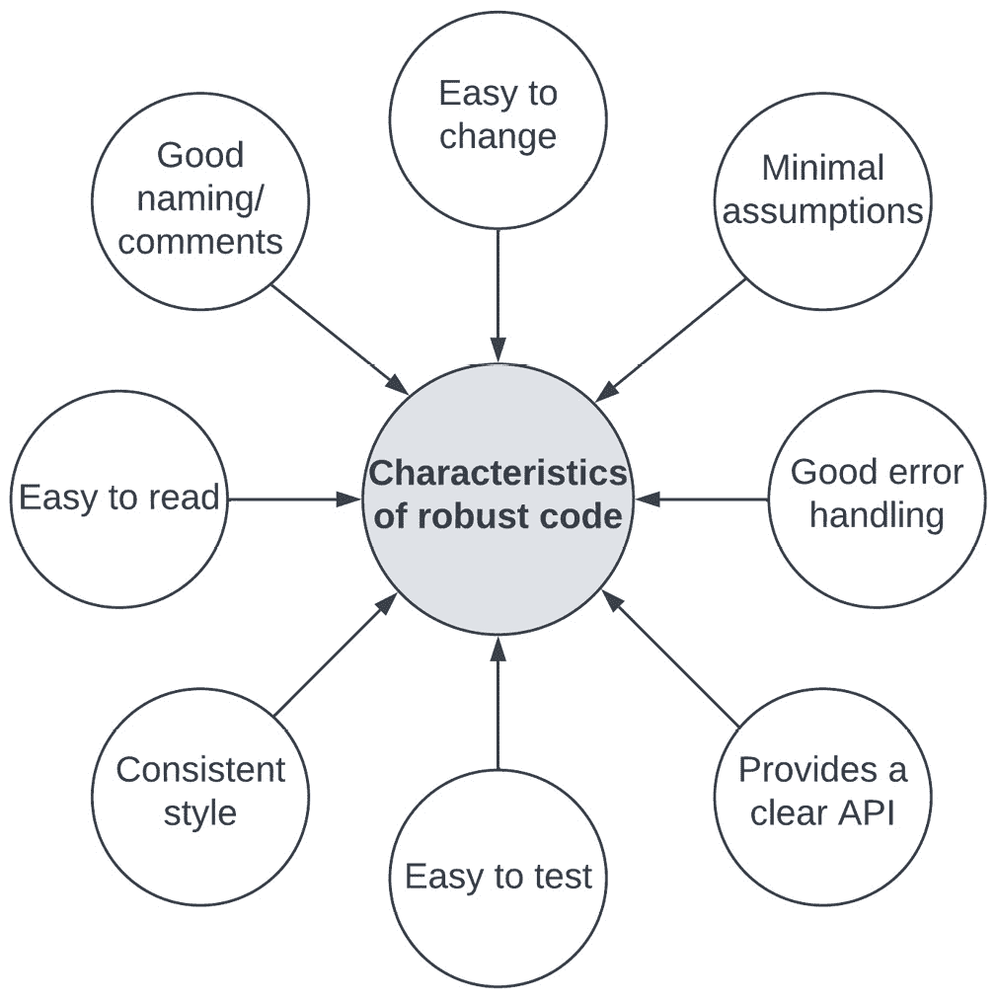
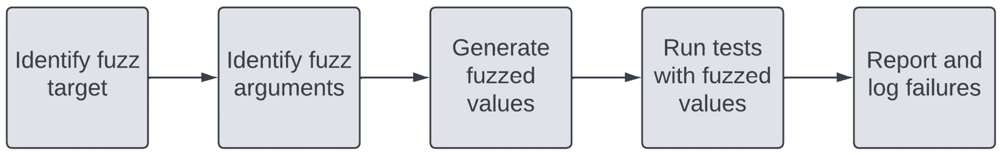
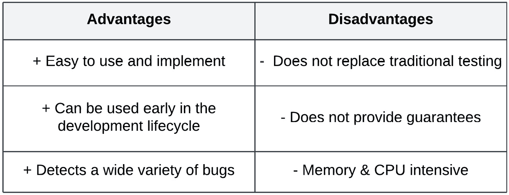
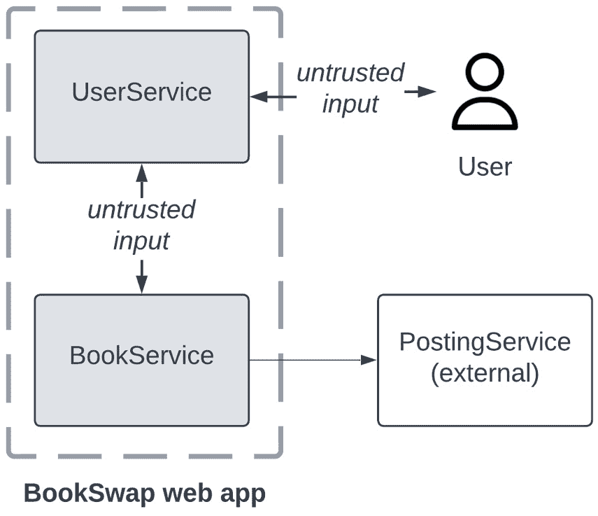

# 测试边缘情况

在前几章中，我们讨论了 Web 应用程序的实现和测试。我们使用了各种功能性和非功能性测试来确保我们微服务架构中的各个服务保持性能并正确交付功能。

在第四章*“构建高效的测试套件”*中，我们讨论了边缘情况和边界情况的定义，以及如何使用表格驱动测试来实现它们。对于生产系统，无论我们多么致力于在各种场景中实施测试，全面测试复杂的系统几乎是不可能的。因此，测试策略应该考虑到系统需求和用户旅程。

然而，无论我们设计实施多么谨慎，测试策略也有其局限性。正如在第九章*“并发代码的挑战”*中讨论的那样，测试不能证明并发错误的缺失，但确实给我们带来了统计上的信心，即这些错误不会在我们测试策略覆盖的场景下发生。我们还讨论了并发问题不是实现错误，而是系统设计故障，因此，为了避免此类错误，对 Go 的并发机制有深入理解非常重要。

本章将通过一个新的视角来探讨之前讨论过的边缘情况主题。我们将从代码鲁棒性的概念介绍开始，这将使我们能够编写适用于广泛输入的稳定实现代码。然后，我们将学习如何使用 Go 新引入的模糊测试能力来编写覆盖广泛输入的测试。最后，我们将探索基于属性的测试，它允许我们为真正对我们重要的输出属性编写断言，而不是精确值匹配。这与我们迄今为止看到的测试编写方法不同，可以使编写边缘情况的测试变得更加简单。

在本章中，我们将涵盖以下主题：

+   实现代码鲁棒性的定义和最佳实践

+   Go 新引入的模糊测试能力

+   基于属性的测试概念及其在 Go 中的实现

+   如何在`BookSwap`应用程序中使用模糊测试和基于属性的测试

# 技术要求

您需要安装**Go 版本 1.19**或更高版本才能运行本章中的代码示例。安装过程在官方 Go 文档[`go.dev/doc/install`](https://go.dev/doc/install)中有描述。

本书包含的代码示例在[`github.com/PacktPublishing/Test-Driven-Development-in-Go/chapter10`](https://github.com/PacktPublishing/Test-Driven-Development-in-Go/chapter10)上公开可用。

# 代码鲁棒性

在*第四章* *构建高效的测试套件*中，我们讨论了我们的测试策略应该覆盖的变量值类型。在这些值中，我们确定了三种类型的测试用例来覆盖我们的参数：

+   基本情况

+   边缘情况

+   边界情况

我们进一步确定了当多个输入变量以边缘值提供时发生的边界情况。我们应该编写覆盖我们函数提供的输入值的广泛范围的测试用例。

在微服务架构的世界里，我们往往无法控制提供给我们的服务和函数的值，因此我们编写的代码应该在各种情况下保持稳定。为了实现这种稳定性，我们应该实现一个设计良好、经过充分测试的稳健代码库。

**代码稳健性**是一个经常被忽视的质量，它可以帮助我们编写即使经过变化和重构周期也能保持稳定的代码。*图 10*.1 展示了稳健代码的主要特性：



图 10.1 – 稳健代码的特性

简而言之，稳健代码由于以下特性而易于开发者工作：

+   **易于更改**：稳健代码能够处理各种外部因素，使其更容易重构和更改其依赖项。我们将看到其他特性将有助于使稳健代码易于更改。

+   **最小假设**：稳健代码对其可用的输入参数和资源的值做出最小假设。它应该检查它没有内部生成的任何值，以确保它符合预期。

+   **良好的错误处理**：稳健代码通过检查外部函数的错误，在出现错误时优雅地结束当前操作，并向调用者提供有意义的错误信息来实现良好的错误处理。

+   **提供清晰的 API**：稳健代码为外部调用者提供了一个易于阅读和理解的 API。它应该清楚地说明它期望的参数类型和可能返回的错误。虽然文档是一个有用的补充，但我们不应依赖它。稳健代码应尽可能使用自定义类型和接口来利用编译器检查和类型安全。

+   **易于测试**：由于我们已经探讨的特性，稳健代码易于测试。清晰的 API 使我们能够轻松设计测试用例，模拟所需的任何依赖项，或为合同测试的实施制定任何合同。良好的错误处理，返回良好构建的错误，使我们能够编写简洁的断言来验证返回的错误信息。

+   官方文档中的`go vet`命令 – [`pkg.go.dev/cmd/vet`](https://pkg.go.dev/cmd/vet)。

+   **易于阅读**：使用一致风格、处理错误和提供良好 API 的健壮代码可以减少开发者理解其行为所需的认知负荷。这使得阅读和搜索变得更加容易。

+   **良好的命名/注释**：文档是编写代码的一个重要但经常被忽视的方面。变量命名应该简短，但能代表其提供的功能。函数和类型应该有伴随的文档，清楚地说明它们的预期行为和提供的功能。您可以在官方博客上了解更多关于如何编写 Go 注释的信息 - [`tip.golang.org/doc/comment`](https://tip.golang.org/doc/comment)。

以健壮性为设计目标将帮助我们创建稳定的系统和微服务架构。开发者实现系统的一种常见方式是通过模拟**Unix 哲学**的原则，这是由其创造者和社区确立的。它指出，健壮性源于透明性和简单性，这些原则与 Go 软件开发密切相关。通过查看这些原则，我们可以看到它们在我们考察的*图 10.1*中反映出来：

+   透明代码易于阅读和理解。一致性风格、良好的命名/注释和清晰的 API 定义有助于提高可读性。

+   简单的代码也容易理解，但它也很简单，提供了易于重用的明确功能。这为我们提供了模块化，使我们能够重用它们来解决各种问题和情况。然而，它也应该能够优雅地处理错误情况或它未设计来适应的情况。

就像 Linux 一样，开源软件和库通常被认为比它们的专有版本更健壮，因为它们有更广泛的受众可以找到并纠正错误。这是我们为什么在整个 TDD 探索过程中只探索开源库和工具的一个原因。

与健壮代码相反的是脆弱且易出错的代码。这种类型的代码难以理解，即使使用我们在*第七章*中探索的策略，也很难重构。通常，代码重构涉及对代码进行更改以增加健壮性，使用我们在下一节中将要探索的一些最佳实践。

## 最佳实践

现在我们已经很好地掌握了健壮代码的特点，我们可以开始探讨在 Go 中实现它的最佳实践。我们可以通过查看一个简单的脆弱代码示例并探索我们可以做些什么来使其更加健壮来开始我们的探索。

我们将编写一个函数，该函数以键排序顺序返回 Go 映射中包含的值。为了实现这一点，我们的函数将执行以下操作：

1.  从映射中提取包含的键。

1.  根据给定的顺序参数对键进行排序。

1.  提取与它们的键对应的值，并将它们作为切片返回。

地图刷新器

Go 映射是动态的、无序的键值对集合。可以使用唯一的键访问和修改值。它们使用内置的`map`类型表示。映射的零值是 nil，因此使用`make`函数进行初始化。自 Go 1.12 以来，`fmt`包将按键排序顺序打印映射，但重要的是要记住，集合是无序的。

基于这些知识，我们可以编写一个简单的函数来从映射中返回排序后的值：

```go
var input map[int]string
func GetValues(dir string) []string {
  var keys []int
  for k := range input {
    keys = append(keys, k)
  }
  if dir == "asc" {
    sort.Ints(keys)
  }
  if dir == "desc" {
    sort.Slice(keys, func(i, j int) bool {
      return keys[i] > keys[j]
    })
  }
  var vals []string
  for _, k := range keys {
    vals = append(vals, input[k])
  }
  return vals
}
```

这个示例函数确实可以工作，返回排序后的值，但它确实有一些可以改进的地方，使其不那么脆弱：

1.  **全局变量**：输入地图是一个全局变量，其定义在函数的作用域之外。从函数签名中看，函数与地图之间的依赖关系并不明确。

1.  `GetValues`函数没有给出任何关于排序功能的指示。也不清楚`dir`参数的用途及其允许的值。

1.  `range`操作符能够处理传递给它的 nil 映射而不会引发 panic，但在这个情况下`GetValues`函数的预期行为并不明确。

1.  `dir`参数。该函数处理参数的值并执行相应的排序，但在另一个值的情况下，值将简单地保持未排序。更好的做法是，函数的调用者能够收到一些指示，表明函数无法执行其预期的工作。

1.  `dir`参数的验证是对函数内部定义的硬编码值进行的。除非排序方向的值相同，包括字母大小写，否则函数将不会匹配它。此外，除非检查实现代码，否则调用者不知道接受的值是什么。

1.  使用`sort`包对键进行正确的排序。这比从头实现排序算法要好得多，但两个排序情况是使用不同的`sort`包函数实现的。

1.  **内存分配**：用于键和排序值的切片被声明为它们的零值，尽管我们已经知道我们将要排序的键和值的数量。在底层，Go 运行时会根据值的数量增长来扩展基本数组并复制数据。

我们可以通过解决原始实现中我们发现的问题来增加这个函数的健壮性。由于这个函数目前是独立于任何其他代码运行的，所以这个代码重构相对简单。修改后的版本如下：

```go
type SortDirection int
const (
  ASC SortDirection = iota
  DESC
) 
// GetSortedValues returns the key-sorted values of a given map.
func GetSortedValues(input map[int]string, dir SortDirection) ([]string, error) {
  if input == nil {
      return nil, fmt.Errorf("cannot sort nil input map")
  }
  keys := make([]int, 0, len(input))
  for k := range input {
    keys = append(keys, k)
  }
  switch dir {
    case ASC:
      sort.Slice(keys, func(i, j int) bool {
        return keys[i] < keys[j]
      })
    case DESC:
      sort.Slice(keys, func(i, j int) bool {
return keys[i] > keys[j]
})
    default:
      return nil, fmt.Errorf("sort direction not recognized")
    }
    vals := make([]string, 0, len(input))
    for _, k := range keys {
      vals = append(vals, input[k])
    }
    return vals, nil
}
```

我们对这个简单函数所做的更改解决了我们之前确定的大多数问题：

1.  我们引入一个新的`SortDirection`类型来替换`dir`参数的字符串值。这个类型用于创建一个包含可接受排序方向值的`enum`。

1.  函数的签名已更改，以将输入映射作为参数，从而消除了其对输入映射全局变量的依赖。如果函数无法完成其操作，它还会返回第二个错误值。

1.  或者，我们本可以允许`GetSortedValues`函数接受一个排序函数作为参数，允许调用者实现他们自己的自定义`sort`函数。这将允许我们将整个排序逻辑移出函数，但也会给调用代码带来更多的灵活性。

1.  如果输入映射为 nil，则函数返回错误并停止执行。这是我们决定实现该函数的行为，使用户清楚地知道未初始化的映射被视为错误情况。

1.  用于保存键和值的切片以与输入映射的长度相同的容量初始化。将这些值追加到这些切片中不会导致底层的数据重新分配和复制。由于这是一个小型示例函数，我们将假设映射的大小足以在内存中加载，但在处理非常大的数据集时可能并非如此。

1.  我们使用`switch`语句来检查新实现的`SortDirection`的值。该函数有两个可接受的案例，用于升序和降序排序，如果引入了没有正确实现的另一个`enum`值，则返回错误。两种情况都使用`sort.Slice`函数实现排序。

这些更改增加了我们简单函数的鲁棒性，使其更容易和更直观地使用。我们还看到，添加代码鲁棒性完全是关于小的变化，这些变化累积起来可以显著提高我们的代码稳定性和可读性。

一旦我们养成了编写具有鲁棒性和稳定性的代码的习惯，它就会成为我们解决方案的一部分，从而消除了以后返回和重构的需要。正如我们多次提到的，测试代码与实现代码一样重要。因此，它也应该以鲁棒性为设计目标。在接下来的几节中，我们将探讨两种编写鲁棒测试代码的策略，以验证边缘情况。

# 模糊测试的使用

如前所述，编写涵盖所有可能用户场景和参数值范围的测试非常困难。要编写和维护的测试用例数量可能比项目工作更耗时。在本节中，我们将探讨 Go 的模糊测试功能，它可以帮助我们编写涵盖广泛输入的测试。

**模糊测试**是一种强大的技术，已被用于在各种软件系统中查找错误，包括 Go 标准库本身。它涉及生成各种值并将它们用作 UUT 的输入。生成的值对 UUT 进行压力测试，有助于发现错误或意外行为，如恐慌、内存泄漏或输出错误。

模糊测试是自动化的黑盒测试，可以用来检测我们系统中任何潜在的功能或安全问题。它们通常使用 **模糊工具** 运行，该工具负责值生成、测试执行和错误检测。在本节中，我们将重点介绍使用模糊测试来检测功能错误。

*图 10.2* 展示了模糊测试中涉及的步骤概述：



图 10.2 – 模糊测试的主要步骤

编写模糊测试与常规单元测试没有太大区别：

1.  **识别模糊目标**：就像正常测试一样，我们首先识别 UUT。模糊目标将是我们在测试中要覆盖的函数。

1.  **识别模糊参数**：模糊目标仅适用于模糊测试，如果它至少接受一个参数。这些参数将由模糊工具生成，并用作之前已识别的模糊目标的输入。

1.  **生成模糊值**：一旦指定了测试，模糊工具将开始为我们生成模糊参数的随机值。

1.  **使用模糊值运行测试**：测试使用生成的模糊值执行。通常，模糊测试是快速运行的单元测试，因为它们将使用大量生成的模糊值。

1.  **报告和记录失败**：测试运行器将执行测试，记录和报告失败。就像单元测试一样，模糊测试可以包含断言和验证。

模糊测试可以用来验证 UUT 或模糊目标未生成的任何输入值。这些可以是来自系统中的其他服务或外部来源的值。它可以应用于文件、策略、应用程序和库。

## Go 中的模糊测试

能够进行模糊测试是全面测试策略的一个重要组成部分。模糊测试在 Go 1.18 版本中添加到标准 Go 测试库中。这个特性受到了 Go 社区的热烈期待，使得编写模糊测试与编写单元测试一样简单。

就像测试和基准测试一样，模糊测试必须遵循一些规则：

1.  测试必须以 `Fuzz` 前缀开始。我们注意到测试是导出函数，通过以大写字母开头定义。例如，对我们 `GetSortedValues` 函数的模糊测试将被命名为 `FuzzGetSortedValues`。

1.  测试必须在以 `_test.go` 后缀命名的测试文件中定义。与其他测试文件一样，我们应该使用源文件名来命名我们的测试文件。例如，如果我们的排序函数定义在 `sort.go` 文件中，那么其相应的测试文件可以是 `sort_test.go`。

1.  测试必须接受单个 `*testing.F` 参数，并且没有返回值。这是模糊测试与测试运行器和模糊工具交互的方式。

1.  模糊目标是通过对`*testing.F`参数调用`Fuzz`函数来定义的。这个函数接受一个`*testing.T`参数，后面跟着模糊参数。每个测试只能有一个模糊目标，UUT 的调用将发生在模糊目标内部。

1.  使用`*testing.F`参数上的`Add`函数将模糊参数添加到模糊工具中。这将指示工具生成用于模糊目标的值。

1.  模糊参数可以是以下类型：

    1.  `string`，`[]byte`

    1.  所有`int`类型，包括`rune`

    1.  所有`uint`类型，包括`byte`

    1.  所有`float`类型

    1.  `bool`

1.  由于测试运行数量庞大，模糊测试将在并行中运行。因此，它们应该是确定的。

1.  使用`go test`命令或跟随测试名称或包的`-fuzz`标志，模糊测试将与您的其他单元测试并行运行。同样，这与我们运行基准测试的方式相似。

模糊工具监控测试运行并报告发生的错误。模糊测试可能因以下原因失败：恐慌、测试失败、不可恢复的错误或超时。默认情况下，模糊目标的超时时间为 1 秒，因此您的测试应该很快。

模糊测试将继续运行，直到找到失败的输入或用户手动取消测试运行。或者，我们可以使用`–fuzztime`命令行参数提供最大执行时间或最大迭代次数。

### 一个简单的模糊测试

我们可以为上一节中编写的`GetSortedValues`函数编写一个简单的模糊测试：

```go
func FuzzGetSortedValues_ASC(f *testing.F) {
  input := map[int]string{
    99: "B",
    0:  "A",
  }
  f.Add(3, "W")
  f.Fuzz(func(t *testing.T, k int, v string) {
    input[k] = v
    keys := make([]int, 0, len(input))
    for k := range input {
      keys = append(keys, k)
    }
    sort.Ints(keys)
    sortedValues, err := GetSortedValues(input, ASC)
    require.Nil(t, err)
    require.NotNil(t, sortedValues)
    for index, v := range sortedValues {
      key := keys[index]
      assert.Equal(t, input[key], v)
    }
  })
}
```

我们已经根据我们讨论的规则编写了模糊测试，并使用了与单元测试相同的技巧：

1.  我们使用所需的签名声明一个模糊测试。测试以`Fuzz`前缀开始，并接受`*testing.F`参数。

1.  我们使用`f.Add`方法向模糊测试工具添加两个模糊测试参数，一个用于`int`类型的映射键，另一个用于`string`类型的映射值。这些值将由模糊工具生成。这两种类型都接受为模糊参数。

1.  我们使用`f.Fuzz`方法定义模糊目标。此方法接受一个函数作为参数，该函数本身接受模糊参数作为参数。该函数还接受一个`*testing.T`参数，这使得我们能够在模糊目标内部编写测试断言。

1.  在模糊目标内部，我们编写测试代码。我们将模糊参数添加到映射中，使用生成的值来测试我们的功能。然后，我们从映射中提取键并按升序排序。

1.  我们调用`GetSortedValues`函数，这是本测试的 UUT，并传递包含模糊参数的输入映射。

1.  测试结束时，我们使用之前排序的键切片来断言返回的值已正确排序。

我们已经成功编写了第一个模糊测试。我们可以使用带有两个配置标志的`go test`命令来运行它：

```go
$ go test -fuzz FuzzGetSortedValues_ASC -fuzztime 5s ./chapter10/fragile-revised -v
=== FUZZ  FuzzGetSortedValues_ASC
fuzz: elapsed: 0s, gathering baseline coverage: 0/711 completed
fuzz: elapsed: 1s, gathering baseline coverage: 711/711 completed, now fuzzing with 8 workers
fuzz: elapsed: 3s, execs: 10707 (3569/sec), new interesting: 54 (total: 765)
fuzz: elapsed: 5s, execs: 17519 (3262/sec), new interesting: 67 (total: 778)
--- PASS: FuzzGetSortedValues_ASC (5.14s)
PASS
ok      github.com/PacktPublishing/Test-Driven-Development-in-Go/chapter10/fragile-revised      5.303s
```

`–fuzz` 标志指示测试运行器执行指定名称的模糊测试，而 `–fuzztime` 标志指定测试应运行最长时间为 5 秒。我们的测试运行输出突出了测试运行的一些关键指标：

+   `elapsed` 表示处理时间

+   `baseline coverage` 表示应用于测量测试提供的覆盖范围的场景数量

+   `execs` 表示使用模糊目标运行的测试用例数量

+   `new interesting` 是指识别出的新输入数量，这些输入扩展了模糊测试的覆盖范围

现在我们已经了解了如何编写和运行模糊测试，我们准备将它们添加到自己的测试策略中。然而，它确实有一些缺点。*图 10**.3 展示了模糊测试的一些优点和缺点：



图 10.3 – 模糊测试的优点和缺点

模糊测试的优点如下：

1.  使用 `testing` 包，我们可以轻松地为 Go 中的任何内容编写模糊测试。然而，保持测试范围小很重要，这样它们可以快速高效地执行。

1.  **可以在开发生命周期的早期使用**：正如我们在简单示例中看到的，可以为函数甚至小的代码单元编写模糊测试。这使得在任何开发生命周期阶段利用它们变得容易。

1.  **检测广泛的错误**：模糊测试生成覆盖边缘情况并在多次执行中运行的值。这使得它成为检测那些否则不可能找到的错误的好工具。

模糊测试的缺点如下：

1.  **不取代传统测试**：模糊测试补充而不是取代我们在本书中探讨的测试类型。因此，编写这些测试可能需要额外的工程努力。

1.  **不提供保证**：模糊测试只提供 UUT 稳定性的指示，而不是保证。因为它生成随机值，所以它只能向开发者指示它所覆盖的输入中存在的错误。

1.  **内存和 CPU 密集型**：正如我们从示例输出中看到的，模糊测试在大量场景中并行运行。这使得它们比单元测试更消耗内存和 CPU。

尽管有缺点，模糊测试是一种有用且强大的测试技术，它补充了我们迄今为止探索的所有传统测试方法。由于它能够生成大量输入，模糊测试也是一项重要的工具，可以帮助发现安全漏洞。在安全模糊测试中，我们将恶意数据输入到程序中，而在功能模糊测试中，我们输入无效数据。本书不会专注于安全测试，但这也是模糊测试的另一个用途。它特别有助于确保我们的系统在边缘情况或处理用户输入时保持稳定。

# 基于属性的测试

模糊测试在测试我们应用程序的边缘情况时是一个巨大的进步。我们可以将其视为类似于混沌测试，在那里我们测试大量边缘情况，希望检测到错误。然而，我们对随机输入没有任何控制。这导致两个问题：

+   我们测试了大量的无关场景，这些场景在我们系统中不太可能发生。

+   我们不知道真正重要的场景是否已被我们的模糊测试覆盖。相反，如果我们有一个更结构化的方法可用，那就太好了。

**基于属性的测试**是一种测试技术，它涉及将程序与一组对我们用户旅程和系统行为重要的属性或规范进行测试。这允许工程师采用系统性的测试方法，而不是专注于验证输入。

在基于属性的测试中，我们生成满足我们已识别的约束或属性集的随机输入。生成方面确保我们测试的边缘情况空间比传统手动编写的测试要大。对属性的重视确保我们覆盖了对我们应用程序重要的边缘情况。再次强调，这并不保证没有错误，但它确实确保我们花费时间测试重要的事情。

`testing/quick`包提供了我们可以利用的测试辅助功能，以实现基于属性的测试：

+   `quick.Check`函数接受一个具有`bool`返回值的函数，并搜索使输入函数返回`false`的任意值。

+   `quick.CheckEqual`函数接受两个函数，并寻找一个使这两个函数返回不同结果的输入。

+   `quick.Generator`接口定义了一个`Generate`方法，自定义类型可以实现。一旦它们满足此接口，我们就可以使用`quick.Value`函数为我们的自定义类型生成随机值。这为我们提供了为任何导出类型生成值的灵活性。

`quick`包的`Check`函数也接受一个`*quick.Config`参数，允许我们使用最大迭代次数或其他随机生成器来配置我们的测试运行。

这种类型的测试直观且易于实现。回顾我们实施的模糊测试示例，模糊目标中的验证仅断言了元素顺序，而不是元素本身的值。实际上，我们没有意识到，我们已经编写了我们的第一个基于属性的测试。然而，基于属性的测试的真实价值在于其寻找导致失败的函数输入，而不是生成完全随机的值。

我们可以重新实现我们之前实现的模糊测试，同时考虑基于属性的测试：

```go
func TestGetSortedValues_ASC(t *testing.T) {
  input := map[int]string{
    99: "B",
    0:  "A",
  }
  isSorted := func(k int, val string) bool {
    input[k] = val
    keys := make([]int, 0, len(input))
    for k := range input {
      keys = append(keys, k)
    }
    sort.Ints(keys)
    sortedValues, err := fr.GetSortedValues(input, fr.ASC)
    if err != nil || sortedValues == nil {
      return false
    }
    for index, v := range sortedValues {
      key := keys[index]
      if input[key] != v {
        return false
      }
    }
    return true
  }
  if err := quick.Check(isSorted, nil); err != nil {
    t.Error(err)
  }
}
```

测试的结构不同，但它使用了与模糊测试相同的验证：

1.  测试使用常规的单元测试签名，以`Test`前缀开始，并接受一个参数`*testing.T`。

1.  在测试内部，我们声明一个`isSorted`辅助函数，它接受我们将生成的两个参数，一个用于新映射条目的键，一个用于值。它还返回一个`bool`值，使其适合与`quick.Check`函数一起使用。

1.  在函数内部，我们将生成的值添加到输入映射中。然后，我们复制键并对其进行排序。我们调用`GetSortedValues`函数和我们的单元测试单元（UUT），以获取实际值进行验证。

1.  在出现错误或空切片的情况下，我们返回`false`，停止测试。如果排序后的值与预期不符，我们也会返回`false`。这将向`quick.Check`函数发出错误发生的信号。

1.  在测试内部，我们将`isSorted`辅助函数传递给`quick.Check`函数，如果它返回错误，则测试失败。

在出现错误的情况下，`quick.Check`函数将报告导致失败的值。强制测试失败，我们将收到一个包含导致失败的输入信息的输出：

```go
$ go test -run TestGetSortedValues_ASC ./chapter10/fragile-revised -v
=== RUN   TestGetSortedValues_ASC
  sort_test.go:62: #1: failed on input 73546389, "\U000773b8"
--- FAIL: TestGetSortedValues_ASC (0.00s)
FAIL
exit status 1
FAIL    github.com/PacktPublishing/Test-Driven-Development-in-Go/chapter10/fragile-revised      0.154s
```

导致失败的输入值可以被工程师用来调试应用程序并修复失败的原因。

本章中我们讨论的两种测试技术，模糊测试和基于属性的测试，使我们能够利用值生成并测试系统输入的广泛边缘情况。这些测试技术是本章开头讨论的健壮代码最佳实践的补充，并使我们能够确保我们服务的稳定性和可靠性。

# 用例 - BookSwap 应用程序的边缘情况

本章教会了我们两种新的测试技术：模糊测试和基于属性的测试。我们学习了如何将这些技术应用到提供返回输入映射中包含的键排序值的简单函数中。在本节中，我们将通过讨论如何将这些技术应用到我们迄今为止构建的`BookSwap`应用程序中结束我们的探索。

如前所述，健壮的代码应该测试它自己没有生成的任何变量。我们将这些输入命名为来自不可信的来源。*图 10*.*4*展示了从处理服务的角度来看可以被认为是不可信的所有输入：



图 10.4 – BookSwap 应用程序中的不可信输入

我们在`BookSwap`的服务中确定了两个不可信输入的来源：

+   `UserService`接收来自用户的输入。由于我们无法控制用户提交的内容，这种交互是不可信输入的来源。

+   `UserService`从`BookService`接收信息。如您从我们在*第八章*中讨论的*测试微服务架构*中记得，微服务在没有中央监督的情况下进行更改。因此，由于`UserService`无法控制此外部服务提供的功能，这种交互是不可信输入的来源。

+   同样适用于`BookService`，它接收来自`UserService`的请求。虽然这种交互不会主动向`BookService`发送输入，但请求仍然包含不可信的信息。

基于这些见解，我们可以确定需要为我们的 Web 应用程序公开的 HTTP 处理器实现模糊测试。我们将测试我们在前几章中也测试过的用户创建操作。使用 Go 的模糊测试功能可以轻松地对 HTTP 端点进行模糊测试：

```go
func FuzzTestUserCreation(f *testing.F) {
  // other initialization
  f.Add("test user", "1 London Road", "N1", "UK")
  f.Fuzz(func(t *testing.T, name string, address string,
    postCode string, country string) {
    requestBody, err := json.Marshal(map[string]string{
      "name":      name,
      "address":   address,
      "post_code": postCode,
      "country":   country,
    })
    require.Nil(t, err)
    req := bytes.NewBuffer(requestBody)
    resp, err := http.Post(userEndpoint, "application/json", req)
    assert.Nil(t, err)
    defer resp.Body.Close()
    assert.Equal(t, http.StatusOK, resp.StatusCode)
    assert.Nil(t, err)
    assert.NotNil(t, resp)
  })
}
```

除了与模糊测试工具交互以设置模糊测试目标和参数之外，此测试的主体与我们已熟悉的 HTTP 测试相同。我们为用户创建请求所需的字段添加了四个模糊测试参数。在模糊测试目标内部，我们创建并序列化请求到 JSON 格式。最后，我们使用`http.Post`函数将请求发送到`/users`端点。正如我们在本章中看到的上一个模糊测试示例，我们使用`LONG=true go test -fuzz FuzzTestUserCreation -fuzztime=5s ./chapter10 -v`命令运行此测试。这需要 BookSwap 应用程序正在运行，我们可以使用我们之前看到的 Docker 命令轻松做到这一点`docker compose -f docker-compose.book-swap.chapter10.yml up --build`。测试还依赖于环境变量来构建测试的 URL。如果您想使用默认值运行，请将`BOOKSWAP_BASE_URL`环境变量设置为 http://localhost，并将`BOOKSWAP_PORT`环境变量设置为`3000`到您的终端会话。

这使我们结束了对模糊测试和基于属性的测试的探索，这两种相关技术使我们能够轻松编写覆盖广泛边缘情况的测试策略。这两种技术都很好地与 Go 的`testing`包集成，并且可以在我们应用程序测试的任何级别轻松实现。

# 摘要

在本章中，我们回顾了我们对于覆盖输入变量边缘情况的理解和策略。我们的讨论从代码健壮性的概念开始，关注于编写能够处理意外输入和错误的代码。一旦代码健壮性成为我们思维模式的一部分，我们就会开始理解代码的边缘情况。然而，手动实现测试以覆盖所有这些值可能非常困难。

两种测试技术利用输入生成来简化这项任务：模糊测试和基于属性的测试。这两种技术都可以使用 Go 的测试库实现，使我们能够轻松利用这些技术的优势来验证我们组件的广泛边缘情况。最后，我们查看了一个应用示例，展示了如何将模糊测试与`BookSwap`应用程序的用户创建流程结合使用，确保它对生成的值是稳定的。

在*第十一章*，*使用泛型*，我们将探讨 Go 语言中另一个新引入的特性，即泛型。我们将看到它如何使我们的实现和测试代码更加简单和易于使用。

# 问题

1.  健壮代码有哪些特点？

1.  什么是模糊测试？

1.  在 Go 中，模糊测试的签名是什么？

1.  什么是基于属性的测试？

1.  UUT 的不信任输入有哪些？

# 进一步阅读

+   *《编写整洁代码的艺术：消除复杂性并简化生活的最佳实践》*，作者：Christian Mayer，由 No Starch Press 出版

+   *《如何破坏软件：测试的实用指南》*，作者：James Whittaker，由 Pearson 出版
