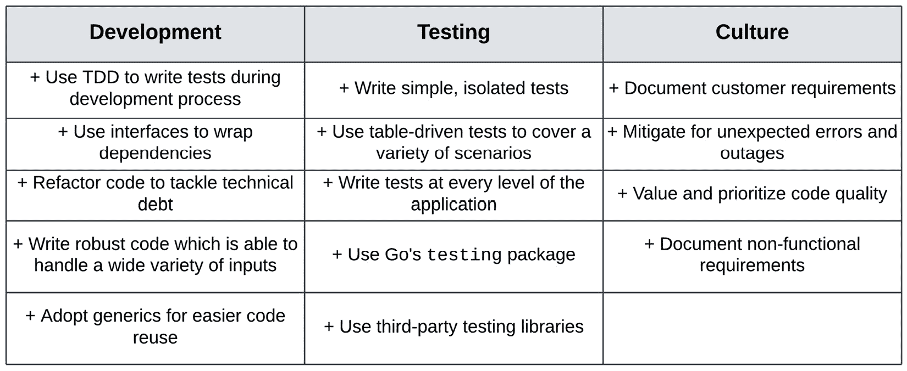

# 11

# 使用泛型

前几章已经涵盖了测试和代码设计的各个方面，复杂性逐渐增加。这些测试将使我们能够验证各种应用程序的行为，包括微服务架构和将数据持久化到数据库服务的服务。我们拥有执行各种系统功能性和非功能性测试所需的所有知识。

我们还讨论了随着工程组织的成长和新功能的添加，系统需要如何改变和演进。在第*9 章*中，*并发代码的测试挑战*，我们讨论了如何通过利用 Go 的并发机制来最大限度地利用计算资源，从而能够处理生产流量。在第*10 章*中，*测试边缘情况*，我们探索了两种测试技术来覆盖系统边缘情况，包括 Go 的模糊测试功能。

Go 的`go test`工具集。泛型是 Go 社区期待已久的重大功能之一。它允许我们编写可以与任何类型一起工作的函数、类型和数据结构，而不是在声明时局限于一种类型。新发布的语言功能是我们可能改变代码的另一个原因，与我们所讨论的维护和功能开发过程并列。

本章将探讨泛型代码的实现和测试。我们将从探索如何编写泛型代码开始，探讨用例和语法。然后，我们将探讨如何测试泛型代码，包括泛型如何帮助我们简化测试代码。最后，我们将回顾我们所学的所有内容，并总结一些我们在本书中探索的测试最佳实践。

本章将涵盖以下主题：

+   在 Go 中编写泛型代码的基础

+   测试泛型代码

+   利用泛型为测试工具提供支持

+   本书涵盖的测试最佳实践的总结

# 技术要求

您需要安装**Go 版本 1.19**或更高版本才能运行本章中的代码示例。安装过程在官方 Go 文档中有描述，请参阅[`go.dev/doc/install`](https://go.dev/doc/install)。

本书包含的代码示例在[`github.com/PacktPublishing/Test-Driven-Development-in-Go/chapter11`](https://github.com/PacktPublishing/Test-Driven-Development-in-Go/chapter11)上公开提供。

# 在 Go 中编写泛型代码

Go 中泛型的引入是一个备受争议和期待的功能。一些开发者认为引入泛型会与 Go 的核心原则——简洁性相矛盾，而另一些开发者则认为这是一个成熟的标志，将使他们能够编写更好的生产代码。与每个技术解决方案或设计决策一样，优势和劣势之间存在着权衡。

如前所述，**泛型**指的是编写与不同数据类型一起工作的代码的能力，而无需限制为特定类型。在没有泛型的情况下，我们使用了 Go 接口在 Go 中实现泛型行为。在 *第三章*，*Mocking 和 Assertion Frameworks* 中，我们探讨了接口的力量，并看到了它们如何被用于封装和替换依赖项。虽然接口与泛型不同，但它们提供了一种实现类似目标 **灵活性** 和 **代码重用** 的方法。

*图 11**.1* 展示了泛型和接口的比较：


图 11.1 – 泛型和接口的比较

虽然泛型和接口都为我们提供了代码灵活性和多态性，但它们有以下主要区别：

1.  泛型是一种指定类型的方式，而接口指定行为。正如我们所见，接口是一组必须由结构体定义的方法，以满足它们。另一方面，泛型使我们能够指定可以使用的参数类型。

1.  泛型是语言内置的，而接口是由应用程序定义的。接口由工程师作为其代码库的一部分来定义，这使得定义它们以包含应用程序所需的行为变得更加容易。泛型的规范是内置到语言中的，并且可以在代码库之间共享。

1.  泛型的范围有限，而接口的范围广泛。由于它们是内置到语言中的，因此它们足够简单，可以解决各种各样的问题。另一方面，接口具有表达性，可以定义复杂的行为。

泛型和接口都是由 Go 编译器实现的，因此它们都进行静态类型检查。然而，接口确保参数有特定的方法可用，而泛型则不提供这些保证。

## Go 中的泛型

编写泛型代码的能力是其他强类型编程语言（如 Java、C# 和 C++）的核心部分。将其添加到 Go 中，使我们能够编写更灵活和可重用的代码。让我们看看一些如何利用这种新能力的例子。

指定泛型代码有三个主要组件：

1.  `T`，并允许我们在实现中引用占位符类型。泛型函数或类型由这个占位符作为其规范的一部分来定义。

1.  **类型约束**帮助我们为类型参数定义规则或子类型。约束不是像接口那样的完整规范，但它们允许我们将类型参数限制为某些属性。

1.  **类型参数**是在调用通用函数或类型时传递的类型，它指定了我们将使用的数据类型。类型参数用于替换函数或类型签名中声明的类型参数占位符。

1.  **类型推断**是在幕后进行的确定变量类型的过程，而不需要显式指定其类型。这也允许我们编写更简洁的泛型代码。

这四个组件共同作用，使我们能够轻松编写通用代码。*图 11.2*通过一个通用函数的简单示例演示了每个组件：


图 11.2 – 简单函数的泛型示例

该示例定义了一个通用`sum`函数，它接受两个参数。它定义了一个类型参数`T`，该参数必须满足指定的类型约束。在`main`函数中，我们使用`int64`类型参数和两个参数调用该函数。编译器使用类型推断来确保传递的参数符合类型约束，并用`main`函数中提供的类型参数替换类型参数。我们将在下一节中探讨如何编写和测试通用 Go 代码。

## 探索类型约束

类型约束是泛型的一个核心组件，因为它们允许我们限制我们的泛型代码可以与之一起使用的数据类型。这使得我们能够编写更安全、更简单的代码，这些代码在满足指定条件的数据类型上操作。

在 Go 中，类型参数是在方括号`[]`内声明的。类型参数定义了一个类型名称和可能的约束。我们可以以几种方式声明约束：

+   `any`接口是空接口`interface{}`的别名，允许使用所有类型。这使我们能够构建无约束的函数和类型。例如，我们可以通过使用`any`接口使`sum`函数接受任何参数类型：

    ```go
    func sumT any T {
    ```

    ```go
      // implementation
    ```

    ```go
    } 
    ```

+   `comparable`接口是一个预声明的类型约束，表示可以使用`==`运算符进行比较的类型。这些类型是`string`、`bool`、所有数字以及包含可比较字段的复合类型。例如，`sum`函数现在将允许这些类型作为参数，但我们需要相应地实现求和逻辑，因为`+`运算符将不再由所有这些类型实现：

    ```go
    func sumT comparable T {
    ```

    ```go
      // implementation
    ```

    ```go
    } 
    ```

+   `|`运算符。这允许我们创建包含多个类型的约束，而无需将它们包装在自定义接口中。这正是我们在*图 11.2*中看到的例子，其中`sum`函数允许`int64`和`float64`类型，这些类型已经支持`+`运算符：

    ```go
    func sumT int64 | float64 T {
    ```

    ```go
      // implementation
    ```

    ```go
    }
    ```

+   `|`运算符。例如，`Number`接口允许`int64`和`float64`类型，然后我们可以将这些类型用于`sum`函数的指定中，从而得到与之前类型集相同的指定：

    ```go
    type Number interface {
    ```

    ```go
      int64 | float64
    ```

    ```go
    }
    ```

    ```go
    func sumT Number T {
    ```

    ```go
      // implementation
    ```

    ```go
    }
    ```

+   可以使用`~`关键字来限制所有具有相同底层类型的自定义类型。这允许我们将自定义类型纳入我们的约束之中。例如，`Number`接口现在将允许任何基于`int`和`float64`的类型：

    ```go
    type Number interface {
    ```

    ```go
      ~int64 | ~float64
    ```

    ```go
    }
    ```

+   `constraints`包定义了一些有用的约束，可以与您的泛型代码一起使用。此包包含数值和有序约束，您可能会发现它们很有用。例如，我们可以通过使用此包修改`sum`函数以接受所有有符号整数：

    ```go
    func sumT constraints.Signed T {
    ```

    ```go
      // implementation 
    ```

    ```go
    }
    ```

泛型可以应用于函数和结构体，允许我们创建泛型数据结构和可重用的行为。这可以简化我们的代码，并消除为了适应不同类型的数据而多次定义代码的需要。在*第十章*，*测试边缘情况*中，我们实现了一个根据键值对映射值进行排序的函数：

```go
// GetSortedValues returns the key-sorted values of a given map.
func GetSortedValues(input map[int]string, dir SortDirection) ([]string, error) {
  // implementation
} 
```

这个非常有用的函数有一个主要限制，即它只适用于具有`int`键和`string`值的单一类型的映射`map[int]string`。这种限制使得很难将此代码用于其他映射类型。

在 Go 泛型出现之前的日子里，我们不得不为每种映射类型创建一个函数：

```go
 // GetSortedFloatValues returns the key-sorted values of a given map with int key and float64 values. 
func GetSortedFloatValues(input map[int]float64, dir SortDirection) ([]string, error) { 
  // implementation 
}
```

由于 Go 不允许函数重写，我们还需要为接受不同参数的函数使用不同的名称。这可能会使创建库变得困难，即使我们提取辅助函数以帮助我们重用函数内部的实现代码。

通过泛型，我们可以简化这一点，泛型允许我们参数化排序函数的键和值类型：

```go
// GetSortedValues returns the key-sorted values of a given map.
func GetSortedValuesK ~int, V comparable ([]V, error) {
  // implementation
}
```

函数的签名已经更改，以利用泛型的力量创建可重用的函数：

+   函数有两个类型参数，一个用于键类型，一个用于值类型。键值被限制为任何`int`类型，使用`~`关键字，而值类型则通过`comparable`接口对任何符合的类型开放。

+   使用键和值占位符类型`map[K]V`声明`map`参数。只有符合类型约束的参数才会被函数接受。

+   函数的返回值调整为返回值类型的切片`[]V`，这确保返回的值与输入映射中传递的类型相同。

一旦我们将函数开放以接收通用类型，同样重要的是应用有意义的约束以确保我们的代码继续提供有用的功能。函数签名也充当调用者的用户手册，因此我们应该继续引导他们，即使我们在代码中增加了灵活性。

# 重新审视基于表的测试

现在我们已经了解了实现泛型代码的基础，我们可以将注意力转向测试它。泛型在 Go 社区中的采用仍处于起步阶段。我们已经确定泛型代码是由编译器静态强制的，但这种灵活性增加是否会导致测试代码更加复杂？

我们可以使用我们已实现的泛型 `GetSortedValues` 函数继续探索。现在应该编写测试用例来断言函数对各种输入类型和值的操作行为。我们可以通过使用我们在 *第四章* 中探索的表驱动测试技术来实现这一点，即 *构建高效的测试套件*。泛型表驱动测试的实现遵循一系列步骤。

## 第 1 步 – 定义泛型测试用例

我们首先创建一个泛型测试用例类型来保存我们的输入映射和值：

```go
type testCase[K ~int, V comparable] struct {
  input  map[K]V
}
```

泛型测试用例允许我们构建具有正确键和值类型约束的输入映射，这些约束与泛型 `GetSortedValues` 函数中使用的相同。我们将使用输入映射作为 UUT 的参数。

## 第 2 步 – 创建测试用例

如我们从表驱动测试的介绍中记得，我们通常构建一个测试用例映射，其中包含我们将运行测试的场景。由于类型差异，我们构建多个测试用例映射：

```go
type CustomI int
testStrings := map[string]testCase[int, string]{
  "unordered":       {input: map[int]string{99: "A", 50:"X"}},
  "empty map":       {input: map[int]string{}},
  "negative values": {input: map[int]string{-99: "A", -1:"X"}},
}
testFloats := map[string]testCase[CustomI, float64]{
  "unordered":     {input: map[CustomI]float64{99: 1.2, 0: 4.6}},
  "empty map":     {input: map[CustomI]float64{}},
  "negative keys": {input: map[CustomI]float64{-99: 1.2, 0: 4.6}},
}
```

在本例中，我们创建了两个具有三个场景的映射。第一个 `testCase` 映射具有 `int` 键类型和 `string` 值类型。第二个 `testCase` 映射具有基于 `int` 的自定义类型 `CustomI`。这是键和值类型的两种可能的组合。我们可以根据需要扩展这些类型和场景组合。

## 第 3 步 – 实现泛型测试运行函数

下一步需要编写一个测试辅助函数，该函数包含遍历测试用例映射并断言 `GetSortedValues` 函数功能性的所有逻辑。通常，这种功能包含在测试体中，但我们将提取一个函数，因为我们需要处理多个输入映射：

```go
func runTestsK ~int, V comparable {
  t.Helper()
  for name, rtc := range tests {
    tc := rtc
    t.Run(name, func(t *testing.T) {
      keys := make([]K, 0, len(tc.input))
      for k := range tc.input {
        keys = append(keys, k)
      }
      sort.Slice(keys, func(i, j int) bool {
        return keys[i] < keys[j]
      })
      sortedValues, err := gs.GetSortedValues(tc.input, gs.ASC)
      require.Nil(t, err)
      require.NotNil(t, sortedValues)
      for index, v := range sortedValues {
        key := keys[index]
        assert.Equal(t, tc.input[key], v)
      }
    })
  }
}
```

`runTests` 函数具有以下实现：

1.  函数签名接受两个类型参数，用于键和值类型。它们的类型约束与我们所声明的测试用例类型相同。它接受两个参数：`*testing.T` 运行器和测试用例的映射，具有相同的键和值类型参数。

1.  此函数使用 `t.Helper` 标记为辅助函数，以便它不会污染测试输出。

1.  我们遍历测试用例映射，并使用 `t.Run` 函数在各自的子测试中运行每个测试用例。

1.  函数体的其余部分与任何测试实现相同。我们调用被测试的函数并断言元素的顺序。

## 第 4 步 – 整合所有内容

在所有构建块就绪后，我们可以为 `GetSortedValues` 函数编写第一个泛型测试：

```go
func TestGetSortedValues(t *testing.T) {
  t.Run("[int]string", func(t *testing.T) {
    testStrings := map[string]testCase[int, string]{
      // values declaration 
    }
    runTests(t, testStrings)
  })
  t.Run("[CustomI]float64", func(t *testing.T) {
    testFloats := map[string]testCase[CustomI, float64]{
      // values declaration
    }
    runTests(t, testFloats)
  })
}
```

测试包含针对键和值类型每个组合的子测试。在子测试内部，我们创建测试用例的映射，并使用正确的参数调用`runTests`函数。

## 第 5 步 - 运行测试

最后一步是运行测试以查看我们的泛型代码的实际效果：

```go
$ go test -run TestGetSortedValues ./chapter11/generics/sort -v
=== RUN   TestGetSortedValues
--- PASS: TestGetSortedValues
  --- PASS: TestGetSortedValues/[int]string
    --- PASS: TestGetSortedValues/[int]string/unordered
    --- PASS: TestGetSortedValues/[int]string/empty_map
    --- PASS: TestGetSortedValues/[int]string/negative_values
  --- PASS: TestGetSortedValues/[CustomI]float64
    --- PASS: TestGetSortedValues/[CustomI]float64/unordered
    --- PASS: TestGetSortedValues/[CustomI]float64/empty_map 
    --- PASS: TestGetSortedValues/[CustomI]float64/negative_keys PASS
ok  github.com/PacktPublishing/Test-Driven-Development-in-Go/chapter11/generics/sort        0.201s
```

子测试的使用为我们提供了测试运行的有序输出。我们还轻松地将表驱动测试与泛型结合使用，以便能够使用不同类型的输入值测试我们的`GetSortedValues`函数。

如我们从这个简单的例子中看到的，泛型的力量扩展到了测试代码。泛型另一个有趣的应用是创建测试工具。我们将在下一节中查看这个例子。

## 测试工具

我们迄今为止一直在使用的测试断言库`testify`和`ginkgo`是在 Go 泛型引入之前编写的。它们使用反射来实现变量上的比较和断言。虽然这是一个强大的工具，但可能很难用于编写我们自己的断言和测试工具。泛型的引入使这个过程变得容易得多，因此我们可以轻松创建自己的测试工具以在测试中重用它们。

反射概述

反射是程序在运行时分析和操作程序元素的能力。这使我们能够检查类型、修改行为和测试代码。Go 标准库提供了`reflect`包，它提供了实现反射的功能。

继续我们之前编写的`TestGetSortedValues`示例，我们可以通过提取一个可以在其他测试中使用的测试工具来简化我们的`runTests`辅助函数。我们可以轻松创建自己的泛型测试辅助函数，以断言我们的键和值的顺序符合预期：

```go
func AssertMapOrderedByKeysK ~int, V comparable {
  t.Helper()
  keys := make([]K, 0, len(input))
  for k := range input {
    keys = append(keys, k)
  }
  sort.Slice(keys, func(i, j int) bool {
    return keys[i] < keys[j]
  })
  for index, v := range want {
    key := keys[index]
    assert.Equal(t, input[key], v)
  }
}
```

我们提取代码，并为键和值类型使用两个类型参数。我们使用与编写我们的`runTests`辅助函数相同的技巧，但只提取断言映射值排序的代码。这个测试辅助函数仍然将测试运行器`*testing.T`作为参数，允许它在内部断言失败时使测试失败。

在没有泛型的情况下，我们必须使用空接口`interface{}`来允许我们的测试接受各种参数。这不允许我们编写类型安全的代码，因此编写辅助函数更困难且容易出错。

泛型可以帮助我们简化应用程序和测试代码。如本节所示，我们可以使用它来扩展表驱动测试技术，以便我们可以编写覆盖各种输入类型和场景的测试。我们还看到了泛型如何用于创建我们自己的测试工具。

# 使用泛型扩展 BookSwap 应用程序

到目前为止，我们已经看到了如何编写泛型函数以及如何使用泛型编写更简单的测试工具。这已经证明是一个非常强大的机制，为我们提供了灵活性和类型安全，这是空接口无法实现的。在本节中，我们将学习如何在我们的示例 REST API，即 `BookSwap` 应用程序中，使用泛型。

假设 `BookSwap` 应用程序想要扩展其商业模式，并开始交换杂志，同时保持其常规的书籍业务模型。*图 11.3* 展示了应用程序的新系统图：


图 11.3 – 扩展的 BookSwap 应用程序

上述示例考虑了 `BookSwap` 应用程序的单一架构，但类似的考虑也适用于微服务架构。为了支持新的模型，需要对应用程序进行全面的更改，从数据库级别开始：

+   将创建一个 `Magazines` 数据库表。就像 `Books` 表一样，它将依赖于 `Users` 主键 `id` 的外键。

+   将创建 `MagazineService` 以与数据库查询交互。就像 `BookService` 一样，它将支持插入、列表和交换操作。

+   `UserService` 将依赖于 `MagazineService`，允许它执行对该服务的操作并将信息发送给用户。

+   `PostingService` 需要处理在成功交换后出现的 `Magazine` 和 `Book`。由于这个服务是外部的，我们可以假设这些信息将通过 HTTP 请求进行传输。

其中一些更改确实需要专门的代码，因为我们不希望杂志和书籍过于紧密地耦合。一个可能利用泛型的例子是在构建 HTTP 响应的过程中。到目前为止，`Response` 只包含 `Books` 项目：

```go
type Response struct {
  Message string    `json:"message,omitempty"`
  Error   string    `json:"error,omitempty"`
  Books   []db.Book `json:"books,omitempty"`
  User    *db.User  `json:"user,omitempty"`
}
```

我们用从 `BookService` 返回的书籍填充 `Books` 切片。现在我们需要扩展 `Response` 结构体，以便能够处理 `Magazines`。`Response` 是一个广泛使用的类型，因此它是一个很好的泛型实现候选。

我们创建了一个 `ResponseItemType` 自定义约束，其中包含了一组 `db.Book` 和 `db.Magazine` 类型：

```go
type ResponseItemType interface {
  db.Book | db.Magazine
}
```

如果添加更多类型，则可以将它们添加到这个自定义类型约束中，并在整个应用程序中使用它们。

接下来，我们使用 `ResponseItemType` 作为 `Response` 的类型参数：

```go
type Response[T ResponseItemType] struct {
  Message string   `json:"message,omitempty"`
  Error   string   `json:"error,omitempty"`
  Items   []T      `json:"items,omitempty"`
  User    *db.User `json:"user,omitempty"`
}
```

我们使用占位符 `T` 作为响应的类型，然后将其用作 `Items` 切片的类型。现在 `Items` 切片能够包含 `db.Book` 和 `db.Magazine` 类型。现在所有与 `Response` 交互的其他函数也需要处理泛型 `Response`。

我们将相同的类型参数添加到 `writeResponse` 函数中，该函数负责在 `Response` 中填充数据：

```go
func writeResponseT ResponseItemType { 
  // implementation
}
```

泛型函数只是将类型传递给响应，实现逻辑不需要进行其他更改。类型要么需要提供，要么作为占位符发送。

在调用端，我们还需要处理泛型方面。每个处理程序都使用`writeResponse`函数在`Response`上填充数据，并将其返回给客户端。`ListBooks`处理程序演示了如何在调用端处理这种情况：

```go
// ListBooks is invoked by HTTP GET /books.
func (h *Handler) ListBooks(w http.ResponseWriter, r *http.Request){
  books, err := h.bs.List()
  if err != nil {
    writeResponse(w, http.StatusInternalServerError, &Response[db.Book]{
      Error: err.Error(),
    })
    return
 }
  // Send an HTTP status & the list of books
  writeResponse(w, http.StatusOK, &Response[db.Book]{
    Items: books,
  })
}
```

负责书籍的处理程序将以类似的方式处理响应编写。我们将`db.Book`类型传递给`Response`并调用`writeResponse`函数。我们不需要向此函数传递类型参数，因为类型可以从对`Response`参数的调用中推断出来。在出错的情况下，我们将错误写入`Response`并返回它，停止执行。在愉快的路径情况下，我们将书籍写入`Items`切片。

`Magazine`处理程序将以相同的方式实现，使用`db.Magazine`类型代替。我们可以使用我们在前面章节中探索的相同表格测试技术来测试我们的响应逻辑。

这使我们结束了对 Go 中泛型代码的探索。这个强大的工具允许我们编写灵活的代码，可以用于不同的数据类型。当涉及到泛型代码时，我们应始终牢记，它需要针对不同类型的输入参数进行测试，而不仅仅是不同的值。这可能会使测试更加复杂，但我们仍然可以轻松地修改流行的表格驱动测试技术来测试泛型代码。

# 测试最佳实践

这使我们到达了本章的结尾，也是我们使用 TDD 探索 Go 语言的终点。我们经历了一段精彩的旅程，研究了众多库和技术，并将它们应用于我们的`BookSwap`应用程序以及一些小示例。在本节的最后，我们将回顾所学到的课程，并制定一些测试最佳实践。

实现全面的测试策略需要持续的努力，以及组织内部的文化转变，以拥抱质量和优先考虑测试。*图 11.4*展示了我们探索的一些最佳实践的总结，分为三个不同的类别：



图 11.4 – 开发、测试和文化最佳实践

在本书中，我们讨论了 14 项最佳实践，这些实践被分为 3 个类别——开发、测试和文化。

## 开发最佳实践

这里有一些开发最佳实践（如图*11.4*所示）：

1.  **使用 TDD 在开发过程中编写测试**：确保我们编写的代码经过测试的最佳方式是将测试纳入开发过程。代码永远不会在没有测试的情况下交付，开发者编写可测试且设计良好的代码。

1.  **使用接口封装依赖项**：我们的代码通常会依赖于其他组件。将依赖项封装在接口中是一种良好的实践，这样它们就可以很容易地被替换，无论是通过测试代码还是通过另一个依赖项。我们在*第三章*，*模拟和断言框架*中探讨了依赖项和接口。

1.  **重构代码以解决技术债务**：代码应该与新功能开发同时重构，以确保其保持性能、可读性和易于维护。我们在*第七章*，*Go 中的重构*中探讨了某些重构技术。测试将确保重构过程没有破坏任何功能。

1.  **编写能够处理各种输入的健壮代码**：我们在*第十章*，*测试边缘情况*中讨论了代码健壮性的概念。它应该能够处理各种输入并返回精心设计的错误。

1.  **采用泛型以实现代码重用**：正如我们在本章中看到的，泛型允许我们编写能够处理不同数据输入的代码。这使我们能够使用适用于各种类型参数的可重用代码。

## 测试最佳实践

这里是测试的一些最佳实践（如图*图 11*.4 所示）：

1.  **编写简单、独立的测试**：测试应该是简单且与它们的依赖项隔离的。这使我们能够避免设置大量服务，这些服务可能很繁琐并且可能发生变化。相反，我们应该编写专注于使用模拟来独立测试 UUT 的测试。我们在*第三章*，*模拟和断言框架*中探讨了模拟和依赖项。

1.  **使用表驱动测试覆盖各种场景**：编写表驱动测试的流行技术是轻松创建测试用例列表并运行它们。测试用例应在自己的子测试中运行，以创建结构良好的测试输出。我们在*第四章*，*构建高效的测试套件*以及本章中探讨了这种技术。

1.  **在应用程序的每个级别编写测试**：单元测试速度快，但它们只能断言给定包的功能是正确的，而不能断言它能够与其他单元正确地一起工作。正如*第一章*，*掌握测试驱动开发*中展示的测试金字塔所示，我们应该编写断言应用程序各个单元能够集成并正确一起工作的自动化测试。

1.  `testing`包提供了广泛的功能，使我们能够编写功能性和非功能性测试。我们在这本书中探讨了该包的整个功能。

1.  `testify`、`ginkgo`和`godog`等工具与标准`testing`包相辅相成，使我们能够更容易地编写测试断言和创建模拟。

## 文化最佳实践

这里有一些关于文化的最佳实践（如图 11.4 所示）：

1.  **记录客户需求**：用户旅程和客户需求应该是我们编写的所有测试的核心。由于几乎不可能编写覆盖每个单独代码路径和交互的测试，工程师应确保客户关心的事项被优先考虑并由测试覆盖。

1.  **减轻错误和意外中断的影响**：在微服务架构中，几乎不可能确保零中断。我们应该对服务进行合同测试，并根据第八章中描述的最佳实践设计我们的微服务架构，该章节为*测试微服务架构*。

1.  **重视并优先考虑代码质量**：作为一个组织，您应该重视并优先考虑代码质量，让工程团队能够有时间重构他们的服务，以确保它们可以轻松扩展和维护以满足未来的业务需求。

1.  **记录非功能性需求**：虽然测试的一个重要用途是确保我们的系统能够满足功能性需求，但另一个重要方面是根据客户的需求验证系统的性能。我们在第二章中探讨了如何使用基准测试来测试代码的性能，该章节为*单元测试基础*。

需要记住的最后一个方面是，没有测试策略是完美的，因为它无法覆盖每个单独的代码路径和边缘情况。本书中探讨的工具和技术应有助于您计划和实施系统的高效测试。没有“一刀切”的测试策略，因此请确保您与产品经理和其他关键业务利益相关者合作，以确保您的测试工作高效完成。

# 摘要

在本章中，我们花费时间探索了 Go 语言新引入的泛型支持。我们学习了实现泛型代码的基本语法，包括如何指定类型约束。我们还比较了泛型代码与使用接口编写代码的快速对比。

然后，我们回顾了之前介绍的技术——表格驱动测试，并学习了如何修改它以支持泛型代码，使我们能够编写支持不同输入类型和值的测试用例。我们还学习了如何利用泛型轻松编写我们自己的测试工具，促进测试代码以及实现代码中的代码重用。

最后，我们总结了本书中探索的所有工具和技术，通过 14 项最佳实践分为 3 个类别：开发、测试和文化。实施和维护全面的测试策略需要整个产品和工程组织在整个过程中的努力。

# 问题

1.  什么是泛型？

1.  Go 泛型的主要组件是什么？

1.  描述编写泛型表驱动测试的步骤。

# 进一步阅读

+   *《Go 中的泛型数据结构和算法：使用并发、泛型和启发式方法的应用方法》*，作者理查德·维纳，由 Apress 出版

+   *《云原生 Go：在不可靠环境中构建可靠服务》*，作者马修·蒂特姆斯，由 O'Reilly 出版

# 评估

# 第一章，掌握测试驱动开发

1.  测试金字塔指定了自动化测试套件的构建方式。金字塔的底部是单元测试，它测试单个隔离的组件。接下来在金字塔的中间是集成测试，它测试多个组件能否按照指定的方式一起工作。最后，在测试金字塔的顶部是端到端测试，它测试整个应用程序的行为。

1.  功能测试覆盖了系统的正确性，而非功能测试覆盖了系统的可用性和性能。这两种类型的测试都是必需的，以确保系统能满足客户的需求。

1.  红色、绿色和重构 TDD 方法指的是过程的三个阶段。红色阶段涉及为我们要实现的功能编写一个新的失败的测试。绿色阶段涉及编写足够的实现代码，使所有测试通过。最后，重构阶段涉及优化实现和测试代码，以消除重复并找到更好的解决方案。

1.  接受测试驱动开发。就像 TDD 一样，ATDD 将测试放在首位。ATDD 与 TDD 相关，但在实施开始之前，它涉及编写一系列接受测试。它涉及多个利益相关者，以确保接受测试能够捕捉到客户的需求。

1.  代码覆盖率是您的单元测试执行的代码行数的百分比。这是通过考虑您的代码的功能语句、参数值和执行路径来计算的。Go 测试运行器输出计算出的代码覆盖率。我们应该追求一个好的值，但优化到 100%通常是不合适的。

# 第二章，单元测试基础

1.  在 Go 中，一个模块是一组应该一起构建和发布的包。一个包是一组必须一起构建的 Go 文件。模块由`go.mod`文件指定，而包由源文件顶部的包声明指定。

1.  额外的测试包是与源包名称匹配并添加了 `_test` 后缀的包。额外的测试包在测试代码和源代码之间提供隔离，防止脆弱的测试，并允许开发者查看他们包的集成情况。

1.  测试签名只有几个要求：

    1.  测试名称必须以单词 `Test` 开头

    1.  任何跟随 `Test` 的其他名称也必须首字母大写

    1.  必须只有一个 `*testing.T` 类型的参数，并且没有返回类型

1.  子测试是在封装测试中运行的测试。它们通过将名称和相应的函数传递给封装测试上的 `t.Run` 方法来创建。子测试中的失败将导致封装测试的失败。

1.  基准测试是衡量我们代码性能的一种方法。Go 的测试运行器会重复运行被测函数，直到找到基准函数性能的稳定测量值。

# 第三章，模拟和断言框架

本书包含的代码示例在 [`github.com/PacktPublishing/Test-Driven-Development-in-Go`](https://github.com/PacktPublishing/Test-Driven-Development-in-Go) 上公开可用。您可以找到已实现的

来自 `chapter03-solution` 目录中问题部分的解决方案。

# 第四章，构建高效的测试套件

1.  边界情况是在操作参数的极端值处发生的测试案例。角落情况发生在多个操作参数的极端值处。由于角落情况发生在多个边界情况发生时，它们的发生概率比边界情况要低得多。

1.  幂等操作是可以重复多次而不改变初始结果的操作。这些操作在 API 设计中很普遍，由于网络条件，它们经常涉及重试和重新发送请求。

1.  在 Go 语言中，错误处理是通过内置的 `error` 类型来完成的。错误被当作常规代码流程的一部分来处理，就像处理任何其他返回值一样，通常与其他值一起使用多个返回值来处理。

1.  表驱动测试是一种流行的技术，它允许我们以统一的方式测试多个场景，从而减少代码重复。创建自定义类型来表示特定测试场景的输入和预期输出。然后，它们被保存在测试集合中。测试集合会被运行，每个案例都会被相同地执行。

1.  默认情况下，不同包中的 Go 测试是并行运行的。可以使用 `*testing.T` 实例的 `t.Parallel()` 方法标记包内的测试案例以并行运行。这允许相应标记的测试并行运行。

# 第五章，执行集成测试

1.  集成测试覆盖了系统的多个单元，确保它们能够良好地协同工作。端到端测试则在整个系统上复制用户行为。

1.  BDD 是 TDD 的一个分支，它侧重于编写人类可读的测试，并涉及来自整个业务的各种利益相关者。BDD 最重要的部分是建立一个在业务中共享的通用词汇。

1.  不，模拟数据库被认为是一种反模式。它们是复杂系统，难以模拟和复制。一般来说，测试应该使用与生产环境中相同的数据库。

1.  容器是软件及其依赖项的单元，由容器镜像指定。Docker Engine 在操作系统之上启动和管理容器。

# 第六章，BookSwap Web 应用程序的端到端测试

1.  用户旅程是在使用给定应用程序时用户可能采取以实现其目标的一条路径。识别用户旅程允许我们编写端到端测试，以正确复制和验证我们平台上的用户体验。

1.  ORM 代表对象关系映射，是一种允许我们弥合面向对象语言和关系数据库之间差距的技术。它允许开发者像与其他任何自定义类型一样与数据库类型交互。

1.  Docker Compose 允许我们轻松定义和配置多容器应用的网络。Dockerfile 定义了构建单个容器镜像的步骤，而 Docker Compose 允许我们使用单个配置和命令定义服务。

1.  数据库初始化涉及向数据库添加初始数据。通常，这些虚拟数据在测试运行之间生成和更改。

# 第七章，Go 语言中的重构

1.  代码重构涉及改变现有服务的功能，而代码重构则涉及改变现有服务的内部结构，而不改变其现有功能。代码重构改变的是*什么*，而代码重构改变的是*如何*。如果做得正确，代码重构将不会在重构代码范围之外可见。

1.  开发者首先确定他们希望做出的更改。然后，他们修改他们的实现或测试代码。一旦完成并编译代码，他们就会运行他们的测试套件。如果套件通过，则代码重构已成功。然而，如果套件未通过，开发者将重新审视他们的代码更改，并调整它与测试代码一起，直到测试套件通过。除非测试套件成功验证更改，否则不会发布任何更改。

1.  技术债务是指未按照技术团队典型的高质量标准编写的代码。它通常发生在团队优先考虑快速交付而不是花时间设计高质量解决方案时。

1.  单体应用是一个构建和发布为一个单一单元的单个应用。微服务架构是一种系统设计模式，涉及构建独立构建和发布的单元。组织通常从单体应用开始，然后根据需要转向微服务架构。

# 第八章，测试微服务架构

1.  功能测试确保系统的功能正确工作。非功能测试验证系统的其他方面是否按预期行为。两种主要类型的非功能测试是性能测试和可用性测试。

1.  性能测试依赖于关键指标来量化并比较应用程序的性能。需要监控的重要关键指标包括响应时间、错误率、并发用户、数据吞吐量和 CPU/内存使用率。

1.  性能测试通过测量系统的各个部分性能，确保系统可扩展性，从而帮助我们识别瓶颈和所需改进。此外，在系统更高负载下进行测试，可以让我们估计系统可以处理的最大极限，并帮助我们了解当前系统配置的增长空间。

1.  微服务架构提供了可扩展性优势，因为它们允许我们独立扩展系统的不同部分。它们还允许更轻松的维护，并提高了交付速度，因为工程团队能够拥有并更改他们的服务，而无需任何中央监督。另一方面，它们在软件生命周期的每个部分都引入了复杂性。

    1.  作为工程师，需要结构化多个代码库，然后在多个服务中实现和测试功能，这使得开发复杂性增加。

    1.  部署复杂性在于每个服务都有自己的基础设施需要维护。自动化发布管道变得至关重要，以便让工程师能够轻松地发布多个服务。

    1.  组织复杂性在于工程师必须处理多个服务的增加所有权。虽然团队能够在没有中央监督的情况下在多个服务上交付功能，但他们也必须进行沟通，以建立适用于各种微服务的共同技术标准。

1.  合同测试是一种测试技术，允许我们可靠地测试两个服务之间的交互。消费者启动交换并发送请求，而提供者处理请求并发送响应。交换在消费者端记录在合同中。然后，在提供者端，合同与实际实现进行验证。合同测试的一个关键优势是，它允许我们在不需要运行和维护消费者和提供者的实际实现测试的情况下，验证两个服务之间的集成。

# 第九章，测试并发代码的挑战

1.  并发是指程序执行多个任务的能力，带有中断，并且没有任何顺序保证。并行性是指程序执行多个任务的能力，同时执行，并且没有中断。操作系统（甚至是在硅基实现中，如超线程）可能通过抢占式多任务处理来提供并行性的错觉。然而，为了使并行性真正同时发生，需要多个计算资源。

1.  Channels 支持三种操作。发送操作将信息写入通道，而接收操作从通道读取信息。关闭操作向所有接收者发出信号，表明不会通过它发送更多值。一旦关闭，通道将永远无法重新打开。对于无缓冲通道，发送和接收操作是同步的，并且只有在发送者和接收者都可用时才会完成。在关闭的通道上，发送将引发恐慌，而接收将立即以通道数据类型的零值完成。

1.  `sync.Mutex` 是一个暴露 `Lock` 和 `Unlock` 方法的锁。Goroutines 将会阻塞，直到它们成功获取锁。`sync.WaitGroup` 是一种特殊的锁，它维护一个内部计数器，该计数器会阻塞，直到通过在 `WaitGroup` 上调用适当次数的 `Done` 方法，使内部计数器达到 0。`sync.WaitGroup` 允许我们以比从通道或共享内存读取更简单、更紧凑的方式等待多个 goroutines 完成。

1.  当多个 goroutines 访问并修改共享资源时，会发生数据竞态。这可能导致不一致的值和难以检测的 bug。当 goroutines 被阻塞，等待永远不会变得可用的资源时，会发生死锁。如果整个程序被阻塞，Go 运行时将检测到死锁并关闭程序。

1.  Go 的竞态检测器集成到 `go` 工具链中，并通过 `–race` 命令行标志启用。它会对内存访问进行检测，并在检测到数据竞态时报告。由于它显著增加了它所检测的应用程序的 CPU 和内存使用量，因此竞态检测器不应在生产环境中使用。

# 第十章，测试边缘情况

1.  一个健壮的系统是指即使在提供意外或异常输入的情况下也能继续正确运行的系统。当出现错误或意外输入时，系统能够优雅地处理它们，而不会引发恐慌，并返回有意义的错误。健壮的代码是可读的、可维护的，并且易于测试。

1.  模糊测试是一种软件测试技术，涉及生成大量随机数据，然后将这些数据传递给模糊目标，以验证其行为是否与广泛的参数相匹配。模糊测试通过减少我们需要手动编写的测试数量来覆盖输入变量的边缘情况，从而更容易地发现 bug。

1.  模糊测试以`Fuzz`前缀开始，接受一个单独的`*testing.F`参数，并返回无值。就像其他测试一样，它们必须在`_test.go`文件中定义。它们使用`go test`命令运行。

1.  基于属性的测试是一种技术，它涉及生成和验证满足一组系统属性或规范的输入值。这使得我们能够在不手动编写和维护大量测试的情况下，测试与我们系统相关的各种边缘情况。

1.  从被测单元（UUT）的角度来看，不受信任的输入是被测单元接收或使用但未生成的任何值。这些输入可以是模糊测试参数的良好候选者。

# 第十一章，使用泛型

1.  泛型是编写能够与不同数据类型一起使用而无需限制为单一类型的代码的能力。这是一个强大的机制，被大多数编程语言所支持，并允许我们编写灵活、可重用的代码。

1.  Go 泛型的主要组件是类型参数、类型约束、类型参数和类型推断：

    1.  类型参数是在我们的泛型代码中将使用的占位符类型，通常用一个字母表示。

    1.  类型约束限制了可以与我们的泛型函数或类型一起使用的类型。

    1.  类型参数是在调用函数时传递给函数的类型。它们替换了类型参数并满足类型约束。

    1.  类型推断是在幕后进行的，用于确定变量的类型，而无需我们显式声明它。这使得泛型代码更加简洁。

1.  使用表格驱动测试测试泛型代码通常涉及编写具有不同类型参数的测试用例。为了支持这一点，我们定义了可以包含不同输入类型的泛型测试用例类型。然后，创建一个能够运行泛型测试用例并与输入类型交互的泛型测试运行函数。测试用例应在子测试中运行，以确保测试运行有结构化的输出。
